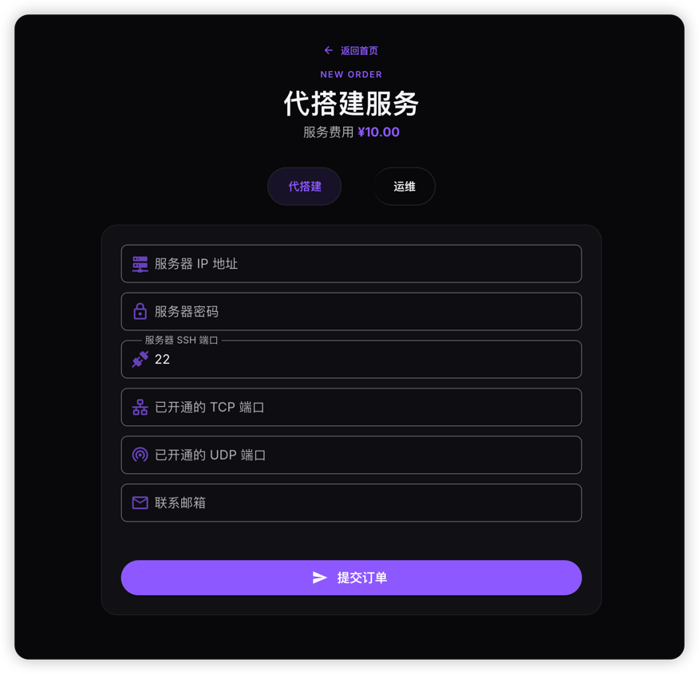
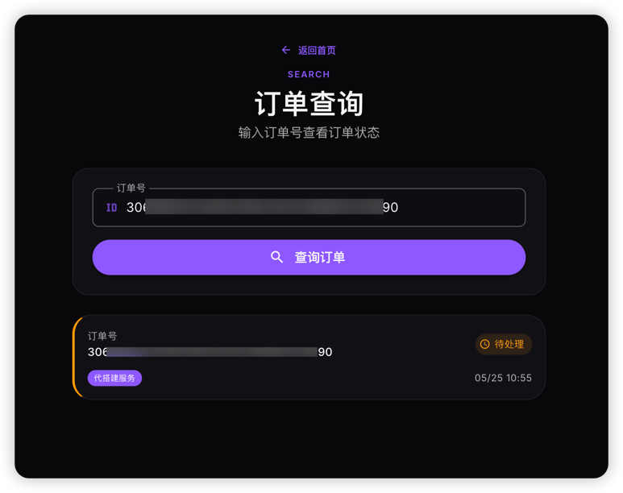
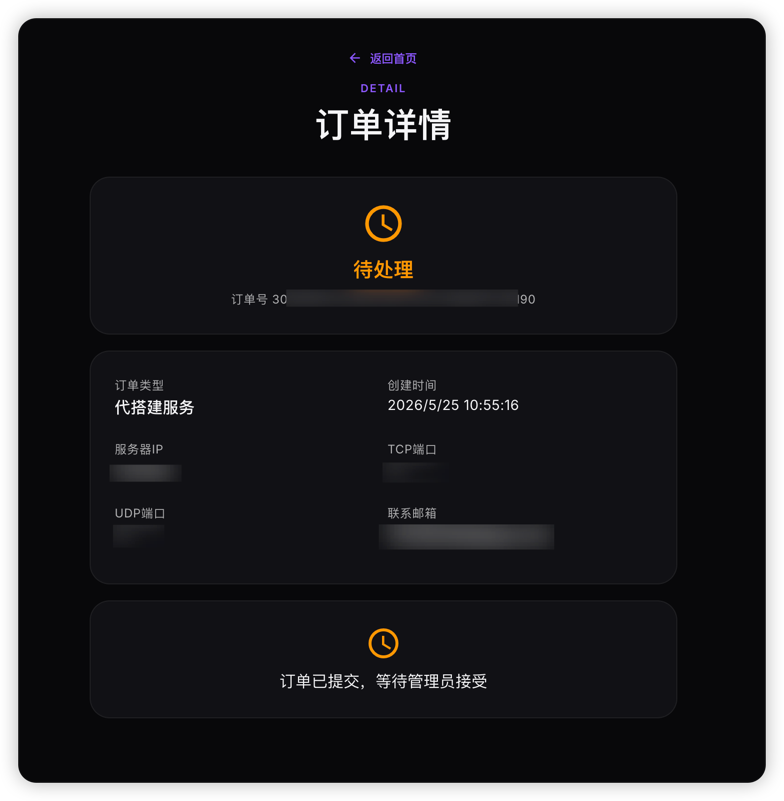
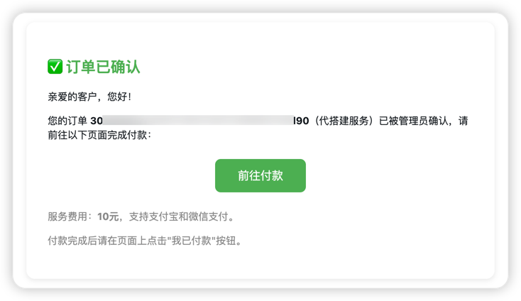
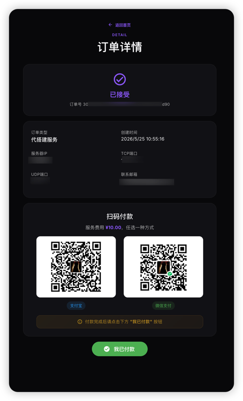
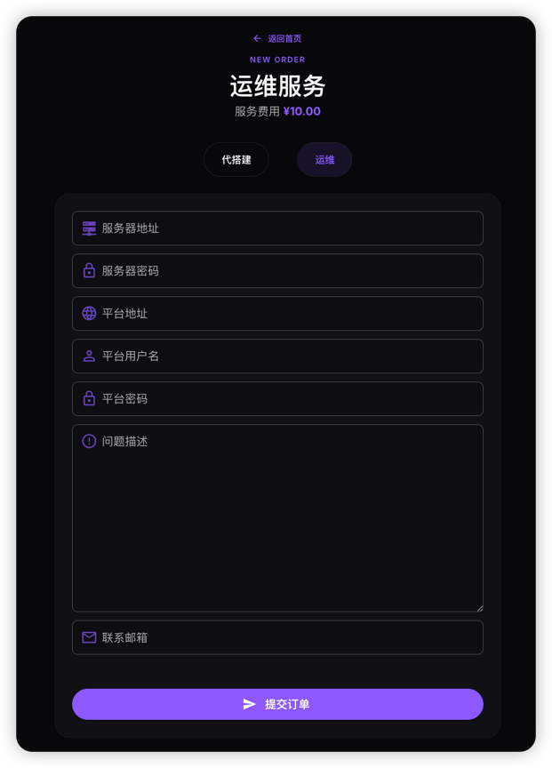

:::info
如果你不想自己搭建饥荒管理平台，或者遇到了不能解决的问题，可以在线下单，让我帮你搭建和解决
:::

增值服务包含**代搭建服务**和**运维服务**，下单地址为[饥荒管理平台增值服务页面](http://8.137.107.46:9876/)

## 代搭建服务

:::tip
该服务将帮你搭建饥荒管理平台，你需要提供服务器
:::

帮你安装部署饥荒管理平台，你只需要像游戏中一样，配置房间，管理房间，进行游戏

本服务`￥10`一次，搭建时间`10分钟`到`1小时`之间，搭建时长取决于你的服务器性能

#### 服务流程

1. 前往[饥荒管理平台增值服务页面](http://8.137.107.46:9876/)，点击**立即下单**

2. 填写必要的信息，选择代搭建，输入下方信息

- 服务器IP地址
  - 公网ip地址
  - **必填**
- 服务器密码
  - root密码
  - **必填**
- 服务器连接端口
  - ssh端口，默认`22`
  - **必填**
- 已开通的TCP端口
  - 饥荒管理平台使用的TCP端口，如果没开建议开通`7777/tcp`端口
  - 选填
- 已开通的TCP端口
  - 饥荒游戏使用的UDP端口，如果没开建议开通`11001/udp`和`11002/udp`端口
  - 选填
- 联系邮箱
  - 你的邮箱，一定不要输错
  - **必填**

3. 点击**提交订单**即可
订单提交后，你会收到一封订单创建成功的回执邮件，邮件内包含订单号，你可以在**订单查询**页面查询该订单的进度

4. 等待帮你代搭建的工程师确认
确认订单后，你会收到一封邮件

5. 付款，单次费用，一次`￥10`
点击右键中的**前往付款**，或通过邮件中的订单号，点击首页的**查询订单**按钮，输入你的订单号，扫码进行支付宝/微信付款
付款完成后，请点击**我已付款**按钮

:::warning
付款完成后，一定要点击**我已付款**，才能通知工程师帮你搭建
:::

6. 工程师帮你搭建饥荒管理平台，搭建完成后订单完成
管理员确认付款无误后，就开始帮你搭建，搭建完成后，会有对应的邮件通知

#### 注意事项

- 管理员有时可能没法第一时间看到你的订单，但在`12`小时内会进行回复

- 该服务为`代搭建`服务，需要你提供云服务器

- 云服务器的架构必须为`amd64(x86_64)`，系统推荐为`Ubuntu24`

- 付款方式为`微信`支付或者`支付宝`支付

- 该服务仅为代搭建饥荒管理平台，为`一次性`费用，`不包含`后续的模组冲突等问题处理

## 运维服务
:::tip
该服务将帮你处理游戏和饥荒管理平台使用中遇到的问题
:::

本服务`￥10`一次，提供的运维服务包括但不限于：
- 游戏无法启动
- 模组冲突
- 游戏坏档
- 平台无法启动
- 平台更新
- ......

#### 服务流程
1. 点击立即下单按钮，选择运维服务，并输入对应的信息，点击提交订单

2. 等待运维工程师确认订单

3. 订单确认后付款

4. 管理员确认付款无误后，开始问题处理

5. 问题处理完成后，运维工程师会将该订单设置为完成，并进行邮件通知

#### 注意事项

- 请尽可能`详细`的描述你所遇到的问题

- 管理员有时可能没法第一时间看到你的订单，但在`12`小时内会进行回复

- 该服务为`运维`服务，需要你提供云服务器和饥荒管理平台账号密码

- 云服务器的架构必须为`amd64(x86_64)`，系统推荐为`Ubuntu24`

- 付款方式为`微信`支付或者`支付宝`支付

- 该服务`仅处理`订单中的问题，为`一次性`费用
