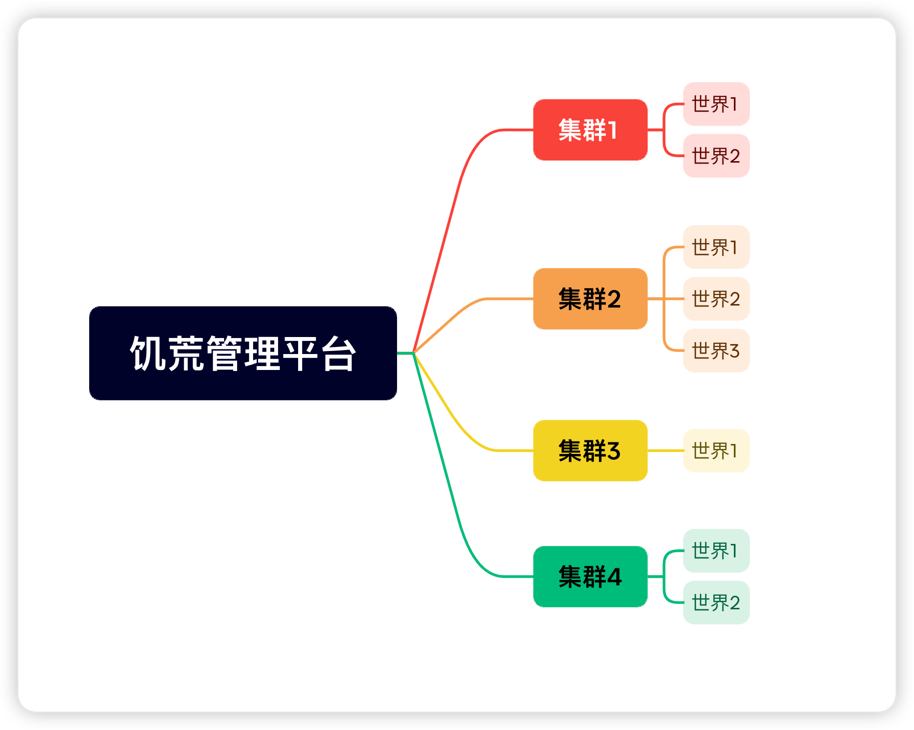
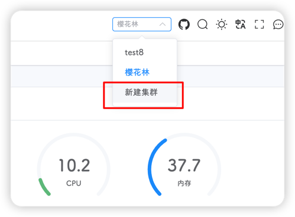
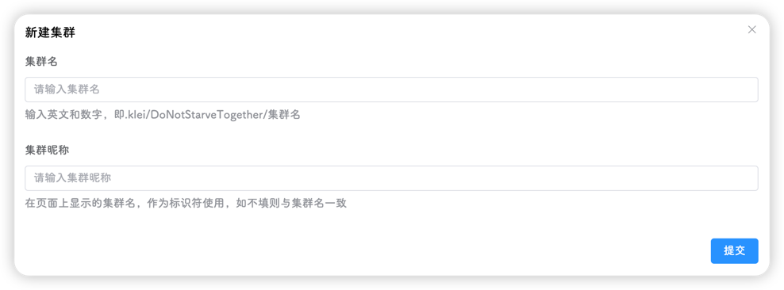
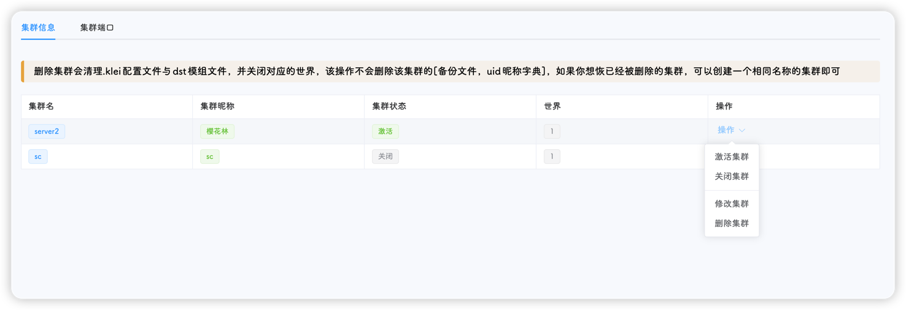
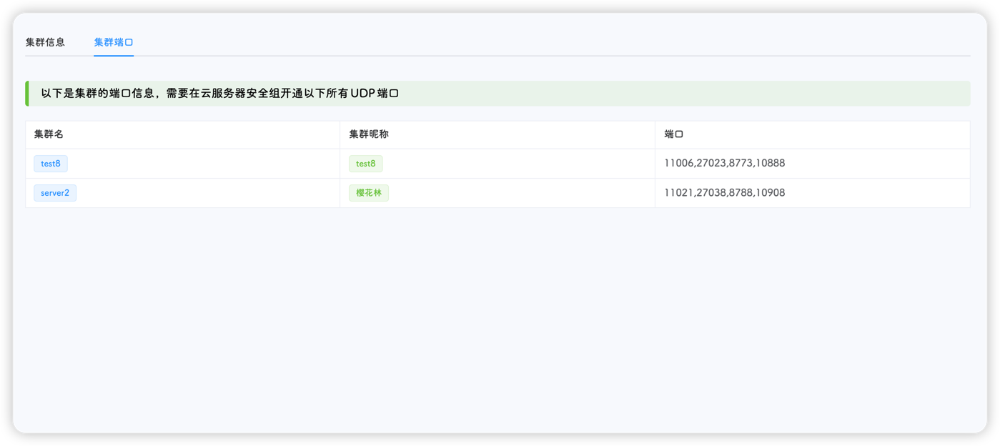
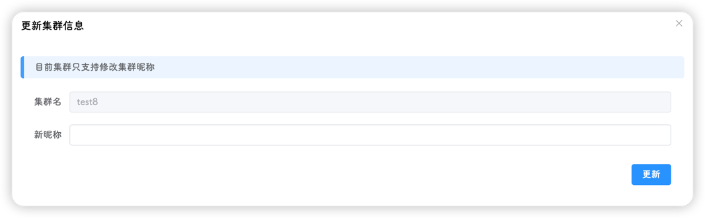

## 集群概念
集群可以简单的理解成一个存档或者房间，集群之间的配置文件、存档文件、模组文件都相互独立，互不影响

多集群即多房间、多存档，一个管理平台开启多个存档同时运行，存档之间互不干涉

饥荒管理平台的底层逻辑为：平台下有多个集群，每个集群下有多个世界，从上到下，分别管理

::: tip
世界即为游戏中的世界，分地面和洞穴
:::

## 集群创建

1. 集群创建在页面右上角的下拉菜单的最后一项，点击即可开始创建

::: tip
管理员和拥有集群创建权限的用户才可以创建集群，详情参阅[用户体系](users.md)
:::

2. 点击新建集群后，会出现一个对话框，分别填入集群名和集群昵称即可完成创建，例如

- **集群名**：sakura
- **集群昵称**：樱花林

::: tip
集群昵称为展示名，可任意填写，但不建议重复；如果不填写，平台会自动添加与集群名相同的集群昵称
:::

::: warning
集群名是唯一标识符，不可重复，且对应`.klei/DoNotStarveTogether/集群名`，即1.x版本中的`MyDediServer`，请勿输入特殊字符或中文
:::

## 集群切换

点击右上角的下拉菜单，选择要切换的集群即可

## 集群管理

::: tip
以下操作均在 **集群管理** 页面，且仅有管理员可操作
:::

集群管理页面包含两个标签页，分别是：

1. **集群信息**页面包含当前创建的所有集群的统一信息，有集群名、集群昵称和所创建的世界数量

2. **集群端口**页面包含所有集群所暴露的端口，如果存在端口冲突，则会在页面上提示

:::tip
冲突的端口会高亮显示
:::

#### 激活、关闭集群

集群的状态有两种，分别是**激活**和**关闭**，关闭的集群不会因为平台的任何自动化操作(自动重启、自动备份、自动保活等)而启动，除非手动启动

- **激活**操作平台会执行以下操作：

  - 将集群的状态标记为激活

  - 将各种定时任务开启(自动重启、自动更新、自动保活等)

  - 启动该集群下的所有世界

- **关闭**操作平台会执行以下操作：

  - 将集群的状态标记为关闭

  - 将各种定时任务禁用(自动重启、自动备份、自动保活等)

  - 关闭该集群下的所有世界

::: tip
自动、手动更新游戏后，激活的集群会启动所有的世界，关闭的集群不会
:::

#### 集群修改

点击右侧的**修改**按钮，即可对集群进行修改，目前只支持修改集群昵称

#### 集群删除

点击右侧的**删除**按钮，即可删除对应的集群，该操作涉及多个操作，包含：

- 删除非管理员对应的集群权限
- 关闭集群包含的所有世界
- 删除生成的配置文件和存档文件，即删除`.klei/DoNotStarveTogether/集群名`这个目录
- 删除游戏自动下载的ugc模组文件，即删除`dst/ugc_mods/集群名`这个目录
- 删除对应集群的玩家统计信息

::: tip
删除集群操作**不会删除**定时备份的存档文件和历史玩家信息，如需清理请手动删除；如果想要使用未删除的存档文件进行恢复，创建一个同名集群，再到**工具-备份管理**页面进行恢复即可
:::
