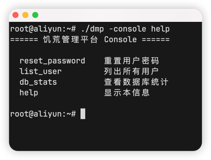
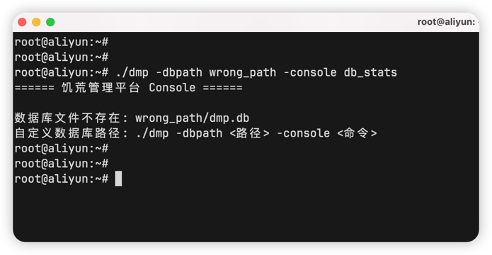
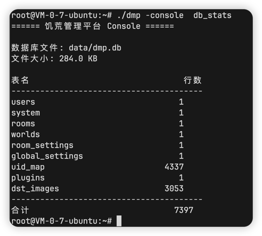

:::info
即Console，可以在后台执行一些快捷命令
:::

## 所有用法

| 命令               | 说明                                        |
|------------------|-------------------------------------------|
| `reset_password` | 重置用户密码，需要输入用户名和新密码，忘记用户名可以通过`list_user`获取 |
| `list_user`      | 列出所有用户，包含一些简要信息                           |
| `db_stats`       | 查看数据库统计，显示数据库文件大小及各表数据情况                  |
| `help`           | 显示帮助信息                                    |

可以输入下方命令查看所有用法

```shell
./dmp -console help
```



:::warning
如果出现以下报错，是dmp无法读取到默认路径(`data/dmp.db`)下的数据库，需要指定数据库路径



```shell
./dmp -dbpath 路径 -console 命令
```
:::

## 重置用户密码

```shell
./dmp -console reset_password
```

输入用户名，新密码即可


::: tip
输入的密码不会显示
就像你登录Linux时，输入密码也不会显示
::: 

## 列出所有用户

```shell
./dmp -console list_user
```


## 查看数据库统计

```shell
./dmp -console db_stats
```



