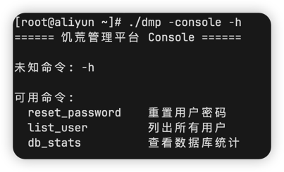
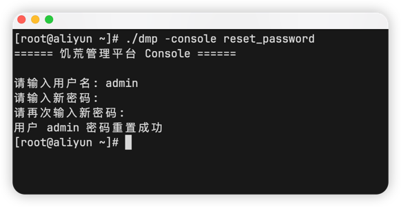
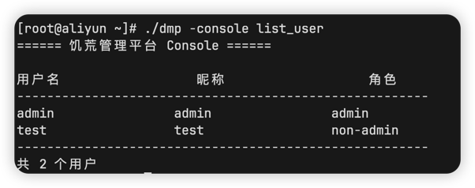
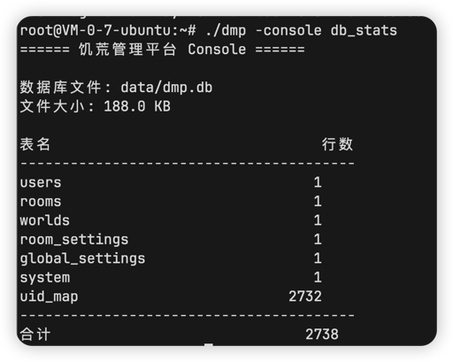

饥荒管理平台提供对应的后台管理操作

## 查看所有用法

```shell
./dmp -console -h
```



## 重置用户密码

```shell
./dmp -console reset_password
```

输入用户名，新密码即可



::: tip
输入的密码不会显示
就像你登录Linux时，输入密码也不会显示
::: 

## 列出所有用户

```shell
./dmp -console list_user
```



## 查看数据库统计

```shell
./dmp -console db_stats
```



