控制面板是对选择的房间展示信息和各种操作的集合页面

未选择房间时会提示前往[房间总览](./rooms.md)页面，选择房间

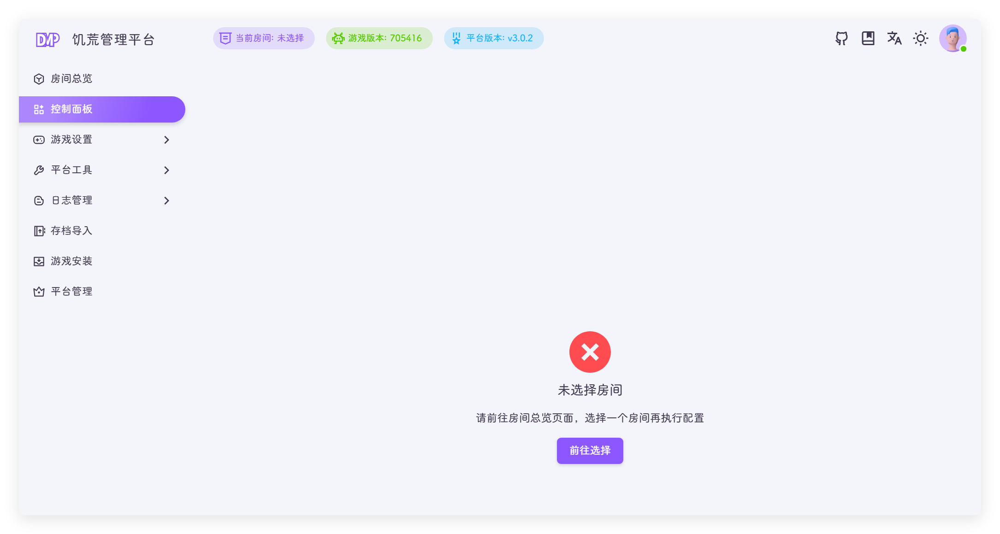

选择房间后会展示对应的功能

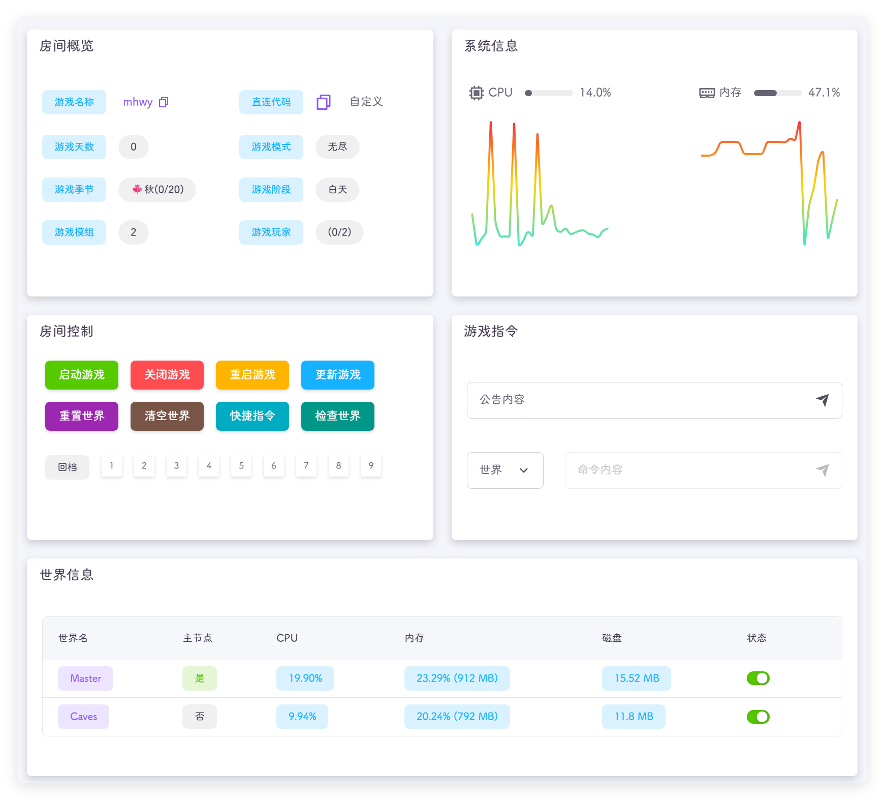

## 房间概览
展示房间的游戏内信息

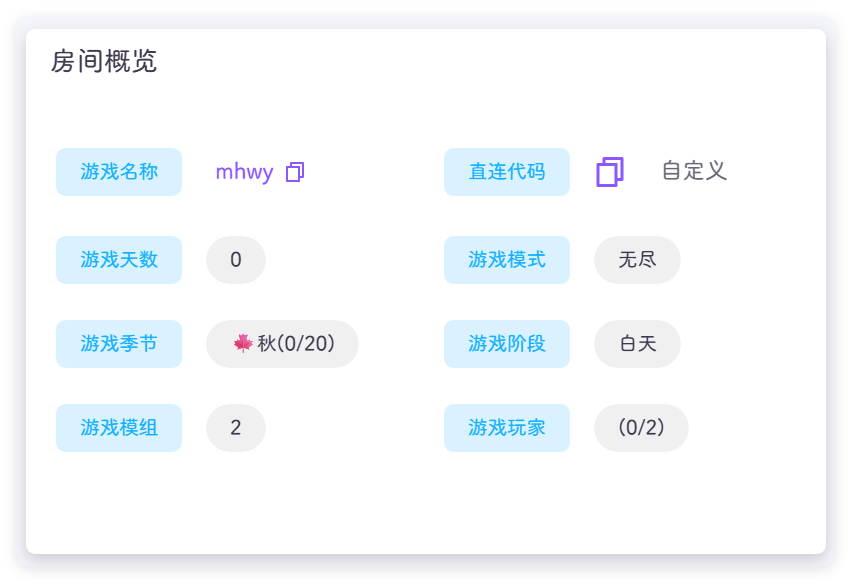

::: tip
如果是新档，部分数据会获取失败，因为游戏还没有更新元数据
请手动保存一次或者等待游戏自动保存，即可正常显示信息
:::

- 游戏名称：展示房间创建时的房间名，点击房间名可以复制名称
- 游戏天数：展示房间当前天数
- 游戏季节：展示房间当前季节
- 游戏模组：展示房间添加的模组，点击右边数量会展示添加的模组详细信息
- 直连代码：展示房间用于直连的代码，具体查看 [如何使用直连代码](../faq/dst.md#如何使用直连代码) 
  - 自定义：使用了内网穿透或端口映射可能展示的直连地址不正确，可以自己修改
- 游戏模式：展示房间使用的模式
- 游戏阶段：展示房间当前的阶段
- 游戏玩家：展示房间当前玩家数量/最大玩家数量

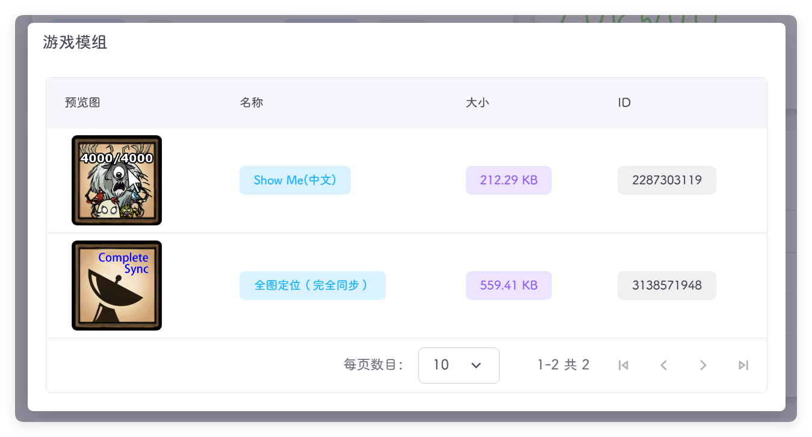

- 预览图：模组的图片
- 名称：模组的名称
- 大小：模组的大小
- ID：模组的ID

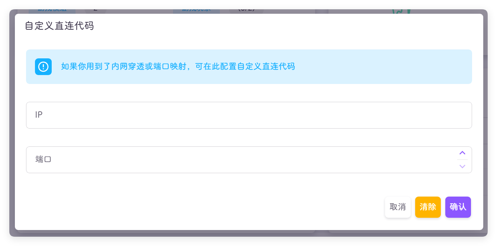

- IP：外部访问的地址
- 端口：外部访问的端口

## 系统信息
展示服务器的 CPU 和内存状态

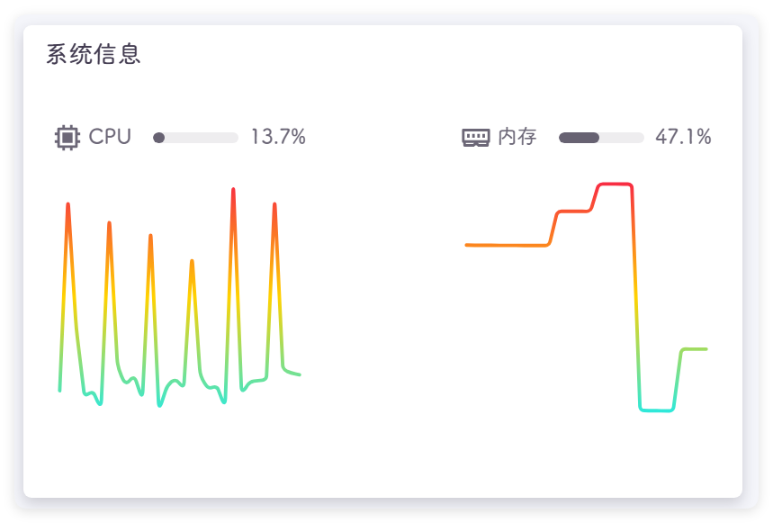

::: tip
游戏刚启动时 CPU 和内存占用会升高，等启动完成后 CPU 会降低，但是内存不会
:::

## 房间控制
控制游戏的一些功能

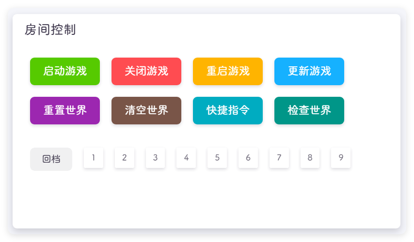

- 启动游戏：启动当前房间饥荒服务器
- 关闭游戏：关闭当前房间饥荒服务器
- 重启游戏：重新启动当前饥荒服务器
- 更新游戏：更新服务器饥荒游戏版本
- 重置世界：重置房间内的存档，**还你一个🍁秋0**，点击后会让选择重置方式
  - 普通重置：普通重置需要游戏正常运行，各个世界都正常连接到主世界
  - 强制重置：强制重置会删除存档数据并重启游戏；注意：如果是多台云服合并开服，此功能无法重置所有的世界，需多台云服同时执行强制重置操作
- 清空世界：删除指定世界的存档数据(不包含配置数据)，类似于强制重置指定世界
- 快捷指令：一些常用的功能 `lua` 代码
- 检查世界：检查世界能否在游戏大厅中看到 !!锦上添花的功能，无法保证准确，如果多次未搜索到，请到游戏中搜索!!
- 回档：回退世界到之前保存的位置，次数是在[房间设置](./setting/room.md)设置的存档次数

### 快捷指令
提供对玩家和世界的一些常用指令操作，类似于游戏内 T 键的功能

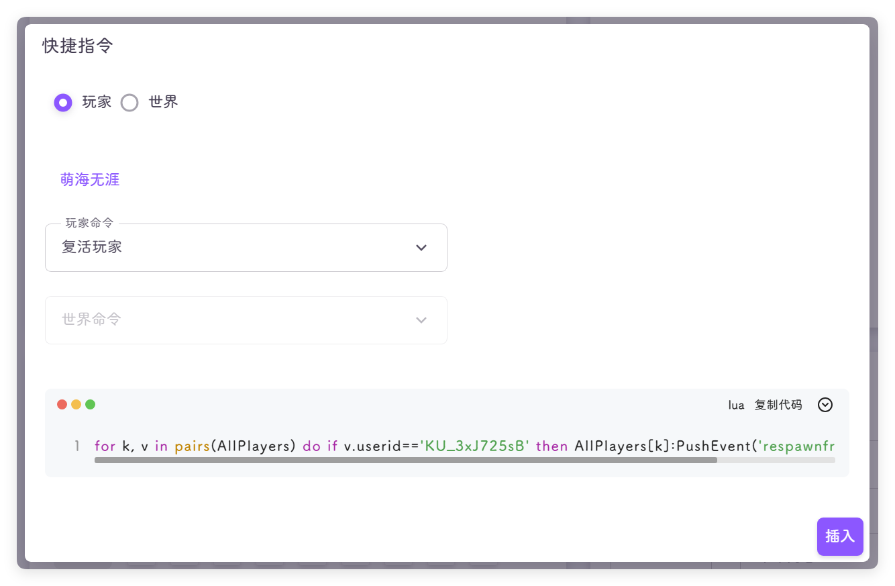

- 玩家：只能对在线玩家进行操作，在线玩家会展示在界面
  - 玩家命令：点击玩家，可以在下拉框选择对应的玩家命令，选择后点击右下角插入按钮
- 世界：对游戏的某个世界进行操作
  - 世界命令：对世界执行操作的命令

::: tip
这里只是提供了命令的展示，和命令插入，并不提供操作，点击了插入后会在[游戏指令](#游戏指令)位置插入对应的游戏命令
:::

## 游戏指令
提供公告发送和游戏控制台功能

### 公告
在游戏中发送公告信息，输入要发送的内容后，点击右侧小飞机按钮或按下回车键进行发送

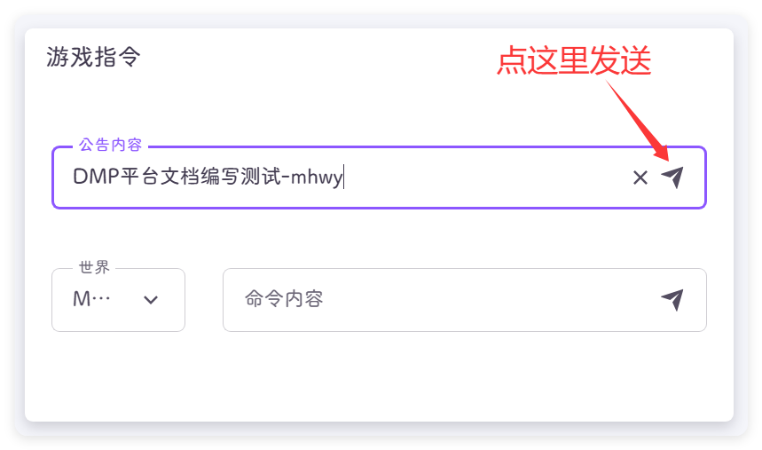

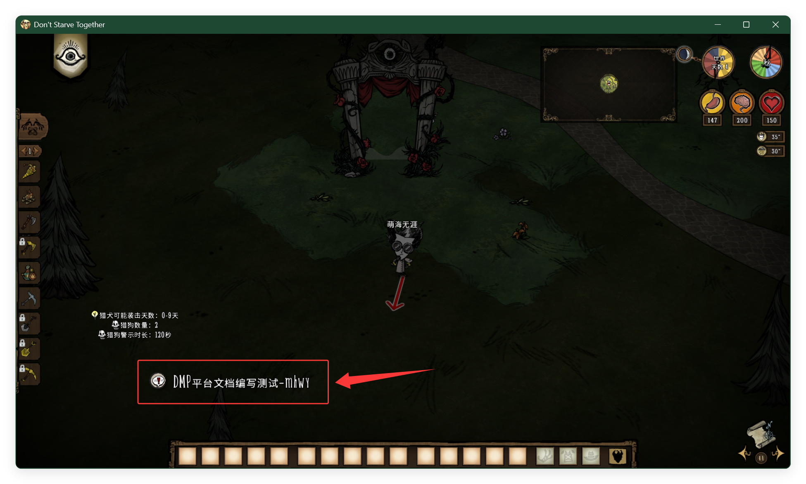

### 命令
可以执行命令，达到在游戏中使用控制台通用的效果，可以使用[快捷指令](#快捷指令)来快速输入常用命令

把下面的命令复制到，命令内容中，世界选择地面，我这里地面的名称是 `Master` ，点击小飞机或按下回车键执行这个命令

```lua
TheNet:Announce('杀人蜂巢：'..c_countprefabs('wasphive')..'个')
TheNet:Announce('海象巢：'..c_countprefabs('walrus_camp')..'个')
TheNet:Announce('活木树：'..c_countprefabs('livingtree')..'棵')
TheNet:Announce('月岩矿：'..c_countprefabs('rock_moon')..'块')
TheNet:Announce('牛牛：'..c_countprefabs('beefalo')..'只')
TheNet:Announce('战车：'..c_countprefabs('rook')..'只')
TheNet:Announce('主教：'..c_countprefabs('bishop')..'只')
TheNet:Announce('猎犬巢：'..c_countprefabs('houndmound')..'窝')
TheNet:Announce('电羊：'..c_countprefabs('lightninggoatherd')..'群（需选角色进图才可查询）')
```

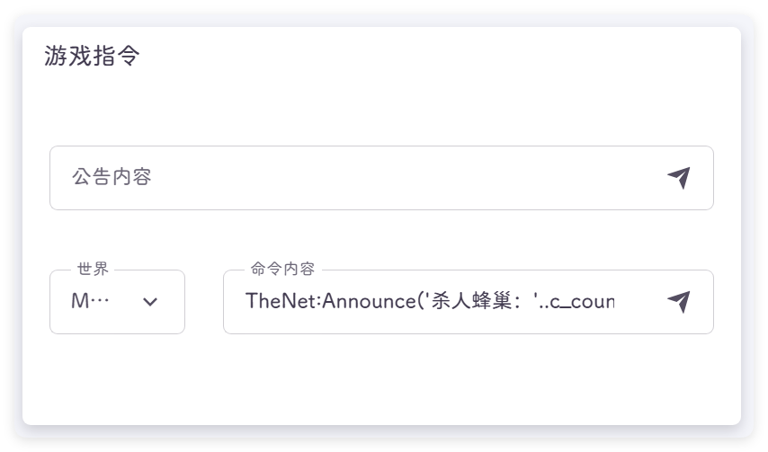

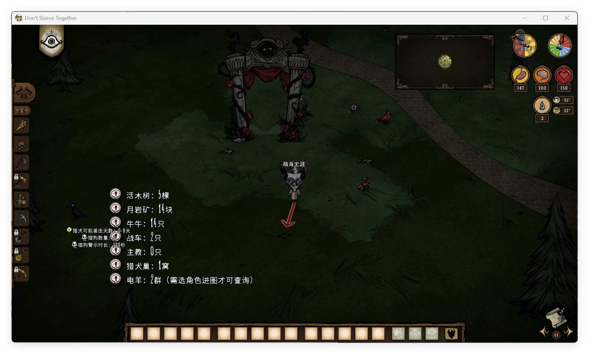

::: tip
个别世界命令是不区分世界的，如保存游戏，回档游戏，无论在那个世界执行都会对所有世界产生影响
:::

## 世界信息
展示房间内的世界，可以对世界进行启动、关闭操作

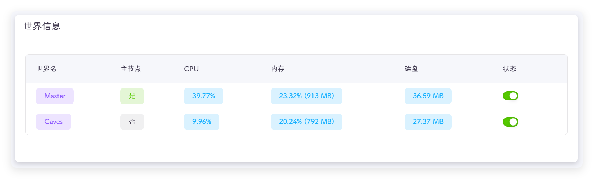

- 世界名：标准存档分为地面（Master）和洞穴（Caves）
- 主节点：一个房间只能有一个主节点其他都是从节点，标注 `是` 就是主节点，`否` 是从节点
- CPU：CPU 的占用率
- 内存：内存的占用率和实际使用量
- 磁盘：世界所占空间大小
- 状态：启动或关闭，可以进行手动操作

::: tip
如果服务器内存较小，可以在不下洞穴的时候关闭洞穴，节省服务器资源
:::
