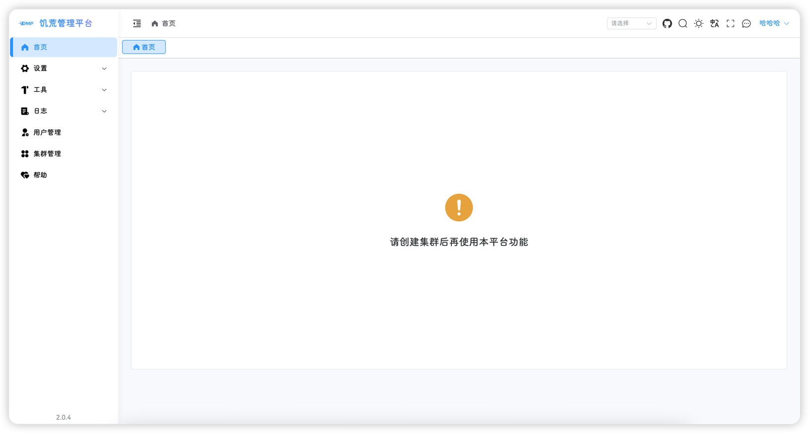
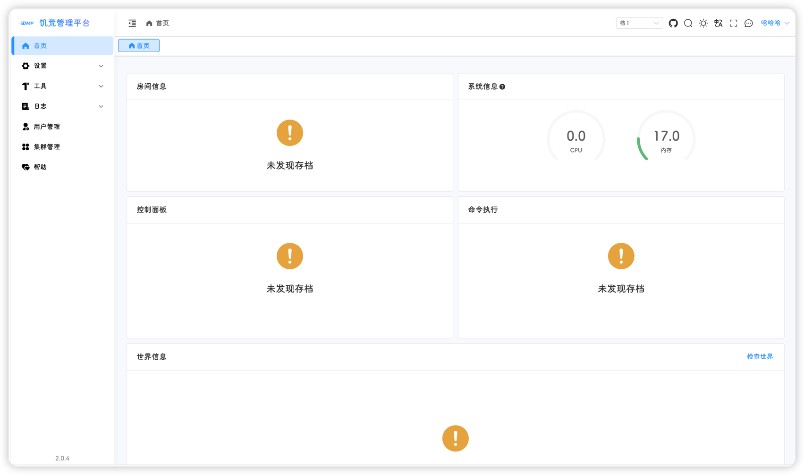
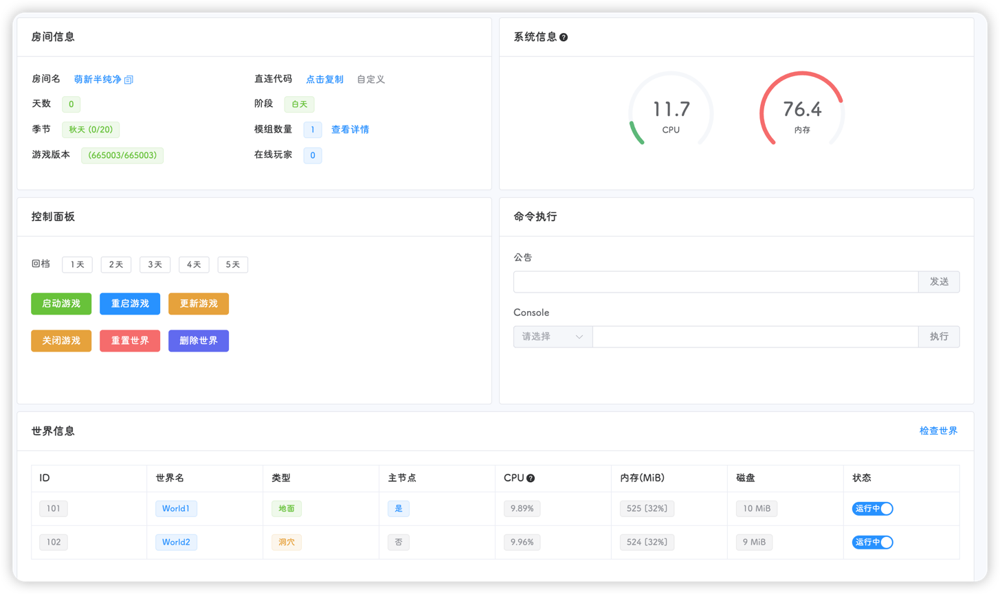
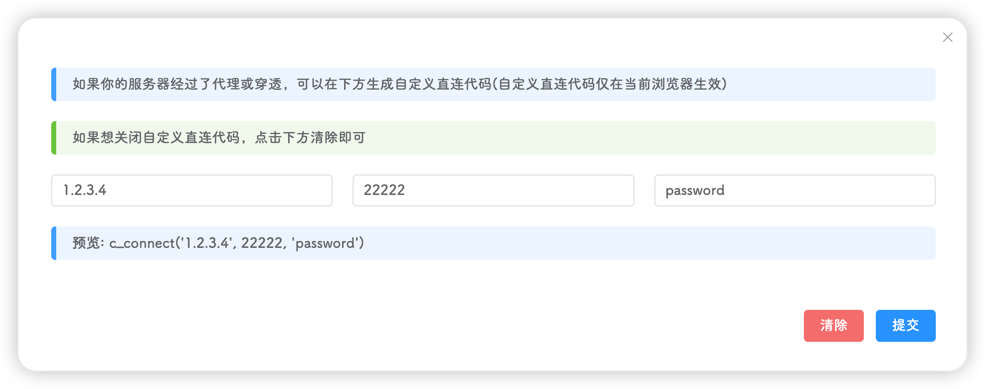
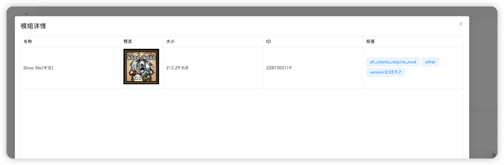
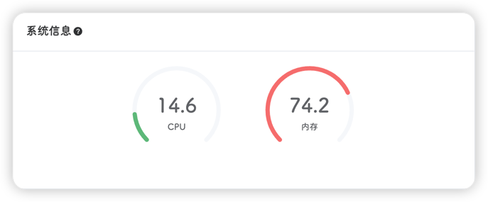
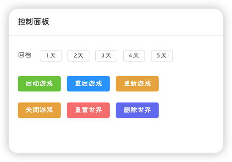
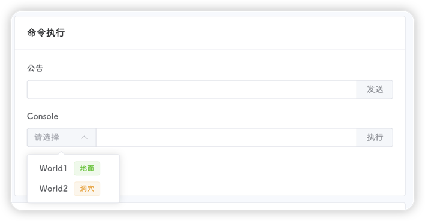
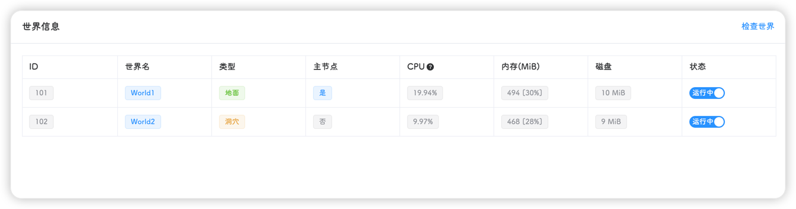
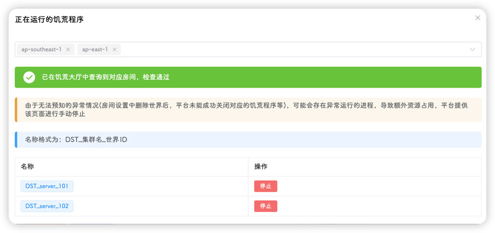

## 未创建集群

如果未创建集群，首页会显示该页面

## 未创建存档

如果当前集群未创建存档，会显示该页面

## 正常显示

如果创建了集群和存档，将会展示存档的基本信息，并提供一些基础的操作入口

#### 存档信息

- **房间名**：指游戏中显示的存档名
- **直连代码**：服务端获取当前机器的公网ip，然后拼接形成的一串代码，复制后在游戏中按<code>\`</code>输入即可连接进入存档；有些存档使用了`frp`，导致生成的直连代码异常，可以点击自定义按钮来生成自定义的直连代码

::: warning
自定义直连代码使用浏览器缓存，更换浏览器后需要重新配置
:::
- **天数**：即游戏天数，可能存在1天误差
- **阶段**：白天、黄昏、夜晚
- **季节**：春夏秋冬，后面的(x/y)代表当前季节共有y天，当前是该季节的第x天，可能存在1天误差
- **模组数量**：即当前集群(存档)启用的模组个数，点击右边的查看详情按钮即可查看模组信息

- **游戏版本**：x/y，x代表本地饥荒版本，y代表最新饥荒版本
- **在线玩家**：指当前此存档中的玩家数

::: tip
新存档可能会出现天数、阶段等信息获取失败的情况，手动存档或等待饥荒服务器自动存档后便可正确获取
:::

#### 系统信息
显示系统的CPU和内存使用率

系统信息每2秒更新一次

::: tip
当饥荒管理平台使用容器部署并限制了CPU和内存，当前信息会显示容器的使用率，否则显示宿主机的使用率
:::

#### 控制面板

提供饥荒服务器的快捷操作

- **回档**：点击1-5进行1-5天的回档
- **启动游戏**：启动游戏
- **重启游戏**：重启游戏
- **更新游戏**：仅管理员有更新游戏的权限
- **关闭游戏**：关闭游戏
- **重置世界**：发送`c_regenerateworld()`指令到饥荒服务器，因此，该功能需要饥荒服务器正常运行
- **删除世界**：此功能将删除当前集群下所有世界的`save`目录，不会删除存档配置，因此，`该功能+重启游戏=强制重置世界`

#### 命令执行
分为公告和Console

- **公告**：直接输入要公告的文字，点击发送即可，游戏中的玩家便可看到公告内容
- **Console**：执行饥荒内部的命令，需要选择一个世界

::: tip
没有运行的世界无法执行命令；饥荒有些命令会自动同步至其他世界，例如`c_save()`、`c_regenerateworld()`命令等
:::

#### 世界信息
显示当前集群下的所有世界的信息和状态，并提供开启和关闭的快捷切换按钮

世界信息每10秒更新一次

::: tip
CPU使用率为当前世界100毫秒内的平均使用率，仅供参考
:::

点击右侧的切换按钮即可 开启/关闭 对应的世界

右上角的**检查世界**按钮提供世界检查功能，点击此按钮后会弹出一个窗口，上方会自动的在饥荒游戏大厅搜索该存档，并返回搜索结果，也可以自定义搜索区域，默认为东亚区和东南亚区

下方提供当前集群正在运行的饥荒进程，如果有异常进程，可点击停止按钮关闭

