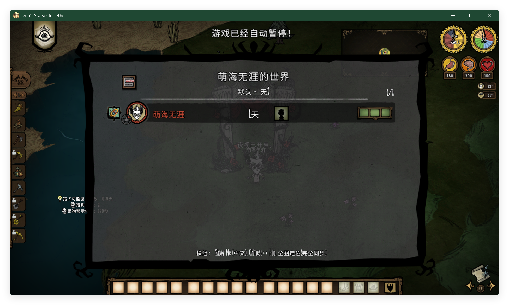
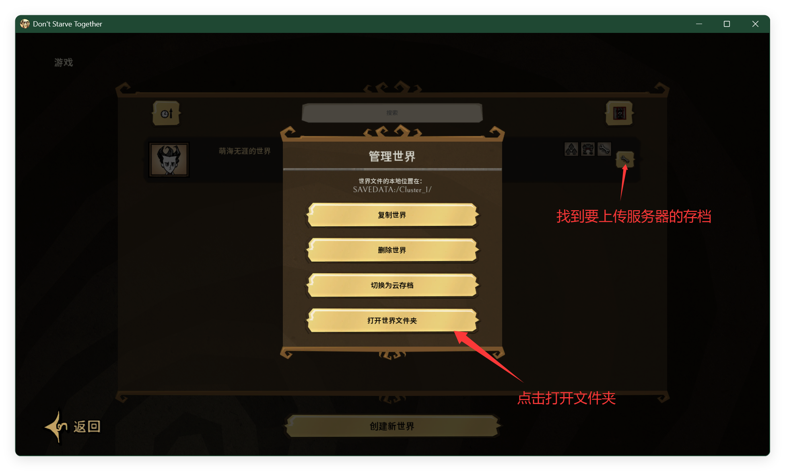
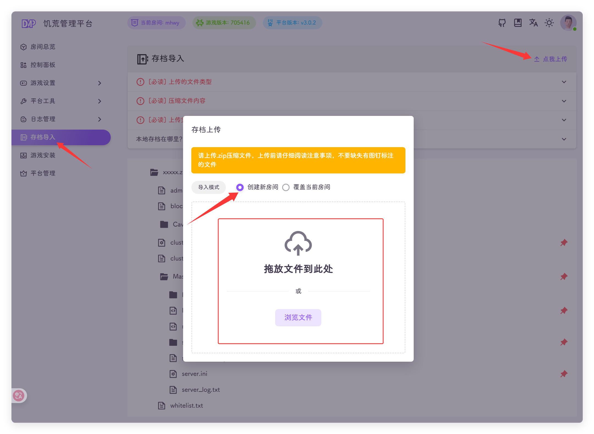
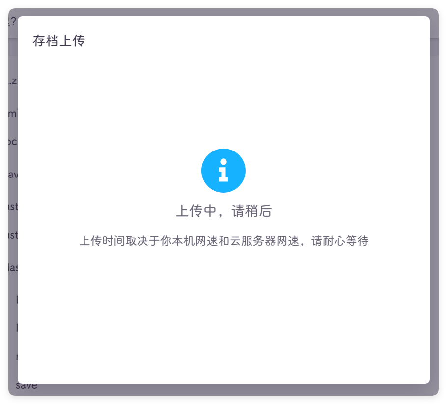
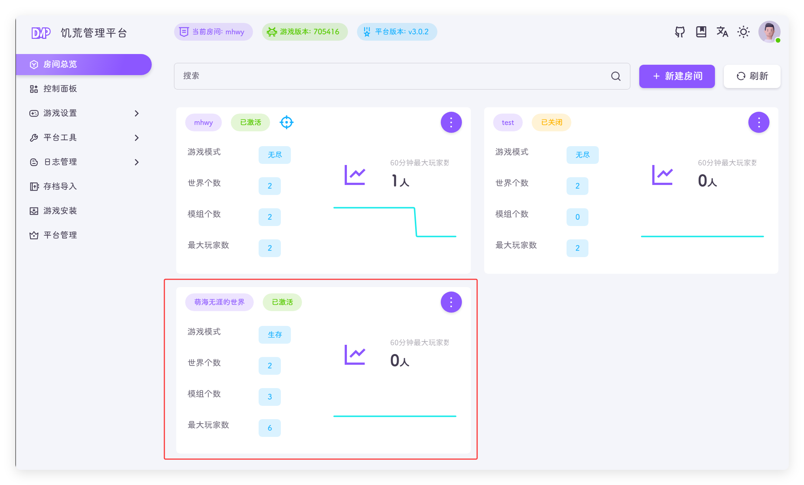

把本地的游戏存档导入到饥荒管理平台，实现小伙伴流畅联机体验！

::: tip
我说的流程是你的服务器和网络要够好，不是用了饥荒管理平台就能流畅了！😏 -mhwy
:::

## 本地导入示例
我在本地新建一个存档，导入到饥荒管理平台中

1. 本地新建存档（跳过），大家都会不浪费流量
   1. 包含地面和洞穴
   2. 模组两个：`showme`，`全球同步(完全同步)`
   
2. 回到创建游戏界面，点击设置，点击打开世界文件夹
   
3. 选择所有文件，压缩成 zip 文件，名称随意你开心就好
   1. win11 折叠菜单，选择全部文件后右键选择压缩到
   2. win10 非折叠菜单，选择全部文件后右键选择压缩到
   3. Mac 你应该自己会搞了
4. 转到 DMP 的存档导入页面，点击**点我上传**按钮，至于是**创建新房间**，还是**覆盖当前房间**看你情况，我这里选择创建新房间，把刚刚的文件拖到提示的位置
   
5. 等待导入成功
   
6. 导入完成后，转到房间总览查看
   
7. 模组相关的可以查看👉[模组设置](./setting/mod.md)
8. 设置完后，点击启动游戏，等待启动完成就可以开始玩了
::: tip
优化了MacOS自动生成的`__MACOSX`目录，导入时无需处理
:::

::: tip
可以压缩存档文件夹，例如鼠标右键Cluster_1 --> 压缩为zip
:::