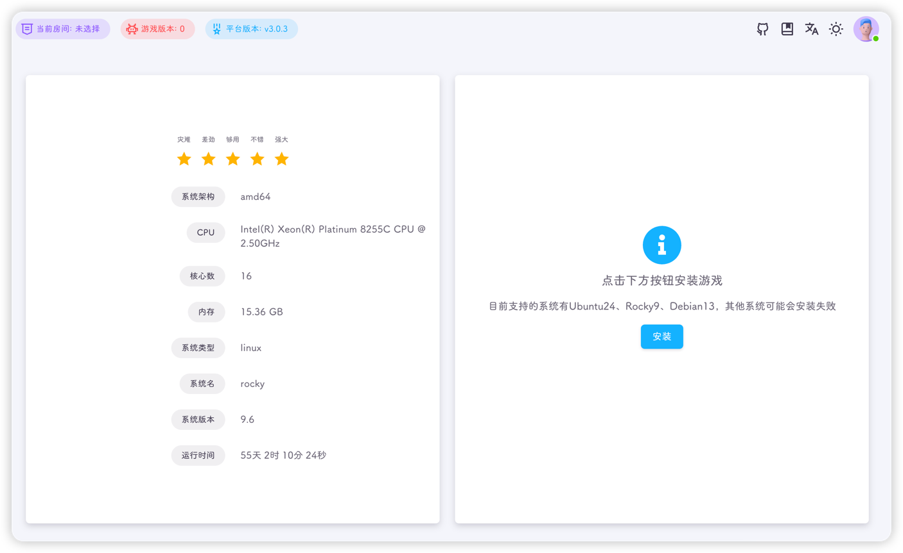
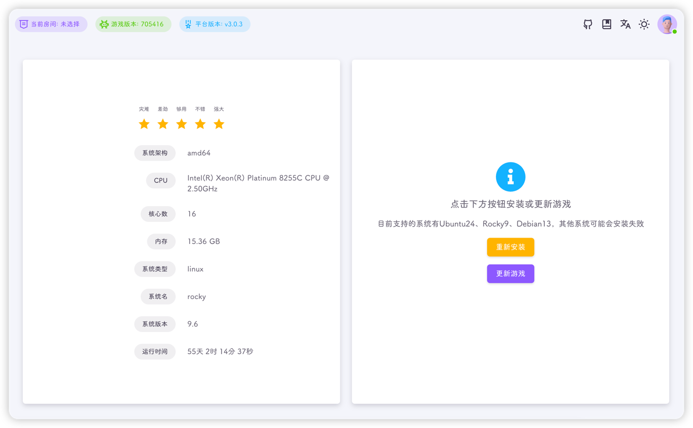
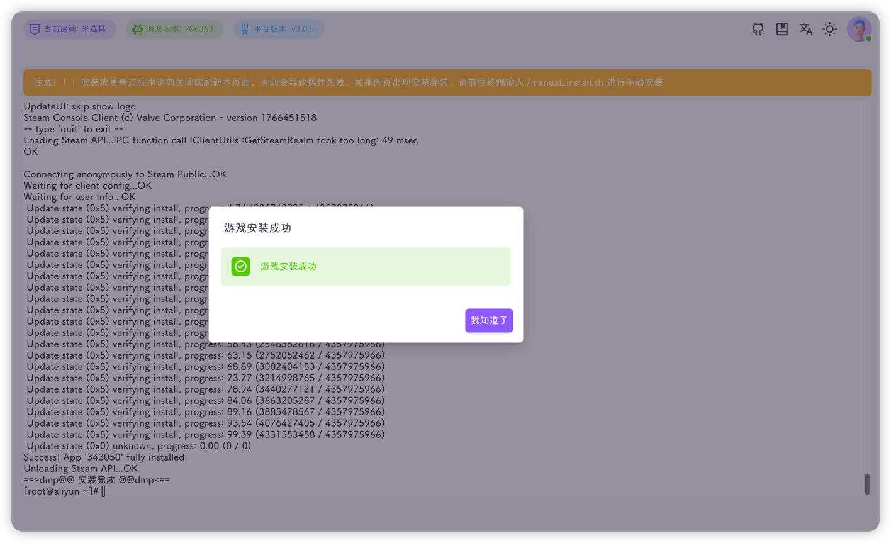
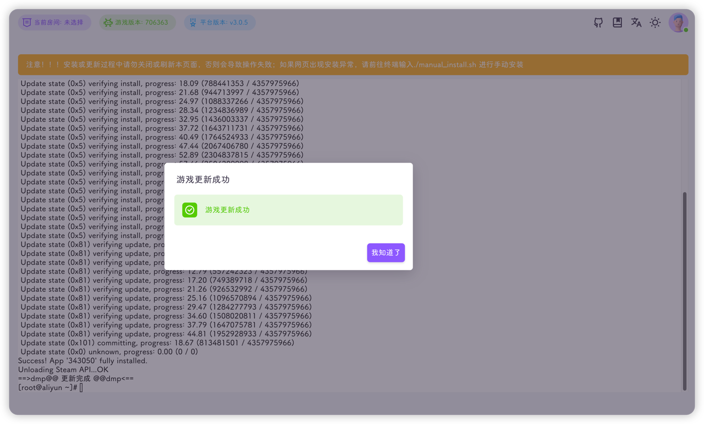

进入安装游戏页面，会显示左右两部分内容



左侧为当前服务器的配置信息，如CPU、内存、运行时间等信息

右侧如果未安装会提示安装

如果系统名为`ubuntu`、`Debian`、`rocky`其中的一个，即可进行安装

::: tip
推荐系统版本 `Ubuntu24`、`Rocky9`、`Debian13`
:::

如果平台检测到饥荒已经安装，则会显示重新安装和更新游戏



点击安装或重新安装按钮后，平台会在当前页面开启一个终端，并执行安装脚本

平台安装进行的操作：

1. 生成安装脚本

```shell  title="manual_install.sh"
**#!/bin/bash

# 设置错误处理
set -e

# 定义变量
STEAM_DIR="$HOME/steamcmd"
DST_DIR="$HOME/dst"

# 错误处理函数
function error_exit() {
    echo -e "==>dmp@@ 安装失败 @@dmp<=="
    exit 1
}

# 设置trap捕获所有错误
trap error_exit ERR

# 工具函数
function install_ubuntu() {
    dpkg --add-architecture i386
    apt update -y
    apt install -y screen wget
    apt install -y lib32gcc1 || true
    apt install -y lib32gcc-s1 || true
    apt install -y libcurl4-gnutls-dev:i386 || error_exit
    apt install -y libcurl4-gnutls-dev || true
}

function install_rhel() {
    yum update -y
    yum -y install glibc.i686 libstdc++.i686 libcurl.i686
    yum -y install glibc libstdc++ libcurl
    yum -y install screen wget
    ln -s /usr/lib/libcurl.so.4 /usr/lib/libcurl-gnutls.so.4
}

function check_screen() {
    if ! which screen > /dev/null 2>&1; then
        echo -e "screen命令安装失败"
        error_exit
    fi
}

function check_wget() {
    if ! which wget > /dev/null 2>&1; then
        echo -e "wget命令安装失败"
        error_exit
    fi
}

# 安装依赖
OS=$(grep -P "^ID=" /etc/os-release | awk -F'=' '{print($2)}' | sed "s/['\"]//g")
if [[ "${OS}" == "ubuntu" || "${OS}" == "debian" ]]; then
    install_ubuntu
else
    if grep -P "^ID_LIKE=" /etc/os-release | awk -F'=' '{print($2)}' | sed "s/['\"]//g" | grep rhel > /dev/null 2>&1; then
        install_rhel
    else
        echo -e "系统不支持"
        error_exit
    fi
fi

# 检查screen命令
check_screen

# 检查wget命令
check_wget

# 下载安装包
cd "$HOME" || error_exit
rm -f steamcmd_linux.tar.gz
wget https://steamcdn-a.akamaihd.net/client/installer/steamcmd_linux.tar.gz

# 清理，容器中不删除steamcmd
if [[ "${DMP_IN_CONTAINER}" != "1" ]] ;then
	rm -rf "$STEAM_DIR"
fi
mkdir -p "$STEAM_DIR"

# 解压安装包
tar -zxvf steamcmd_linux.tar.gz -C "$STEAM_DIR"

# 安装DST
cd "$STEAM_DIR" || error_exit
./steamcmd.sh +force_install_dir "$DST_DIR" +login anonymous +app_update 343050 validate +quit || true
# 第一次安装dst可能会失败
./steamcmd.sh +force_install_dir "$DST_DIR" +login anonymous +app_update 343050 validate +quit

# PR77 清理可能损坏的acf文件
rm -rf "$DST_DIR/steamapps/appmanifest_343050.acf"

# 一些必要的so文件
cd "$HOME" || error_exit
cp steamcmd/linux32/libstdc++.so.6 dst/bin/lib32/
if [[ "${OS}" == "ubuntu" || "${OS}" == "debian" ]]; then
	[ ! -L "dst/bin64/lib64/libcurl-gnutls.so.4" ] && ln -s /usr/lib/x86_64-linux-gnu/libcurl-gnutls.so.4 dst/bin64/lib64/libcurl-gnutls.so.4
	[ ! -L "dst/bin/lib32/libcurl-gnutls.so.4" ] && ln -s /usr/lib/i386-linux-gnu/libcurl-gnutls.so.4 dst/bin/lib32/libcurl-gnutls.so.4
else
	[ ! -L "dst/bin64/lib64/libcurl-gnutls.so.4" ] && ln -s /usr/lib64/libcurl.so.4 dst/bin64/lib64/libcurl-gnutls.so.4
	[ ! -L "dst/bin/lib32/libcurl-gnutls.so.4" ] && ln -s /usr/lib/libcurl.so.4 dst/bin/lib32/libcurl-gnutls.so.4
fi

# luajit
cd "$HOME" || error_exit
cp dmp_files/luajit/* dst/bin64/
cat >dst/bin64/dontstarve_dedicated_server_nullrenderer_x64_luajit <<-"EOF"
export LD_PRELOAD=./libpreload.so
./dontstarve_dedicated_server_nullrenderer_x64 "$@"
unset LD_PRELOAD
EOF
chmod --reference=dst/bin64/dontstarve_dedicated_server_nullrenderer_x64 dst/bin64/dontstarve_dedicated_server_nullrenderer_x64_luajit

# 清理
cd "$HOME" || error_exit
rm -f steamcmd_linux.tar.gz

# 安装完成
echo -e "==>dmp@@ 安装完成 @@dmp<=="**
```

2. 安装对应依赖

3. 检查`screen`命令与`wget`命令

4. 下载`steamcmd`: **耗时操作，耐心等待😘👉🤳**

5. 安装`steamcmd`

6. 安装`steam`

7. 下载饥荒联机版: **耗时操作，耐心等待😘👉🤳**

8. 安装饥荒联机版

9. 链接一些必要的库文件

10. 生成`LuaJIT`启动脚本

11. 执行安装清理


::: tip
安装速度取决于当前的网络环境以及服务器的性能，请耐心等待
:::

::: warning
安装过程中请勿刷新页面或者重复安装
:::

::: important
如果出现安装失败，请手动执行`manual_install.sh`脚本，需要root用户(不推荐sudo)
```shell
cd && ./manual_install.sh
```
:::

安装完成后会有相应的提示



更新完成也会有相应的提示


