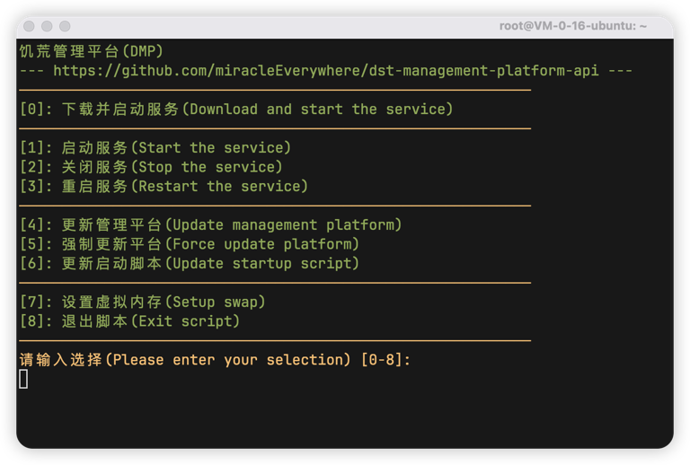

::: important
注意，以下所有操作，均使用root用户执行
注意，以下所有操作，均使用root用户执行
注意，以下所有操作，均使用root用户执行
:::

## 下载启动脚本

1. 复制下方命令到服务器终端并执行

```shell
# 执行以下命令，下载脚本（不使用加速节点）
cd ~ && wget https://github.com/miracleEverywhere/dst-management-platform-api/raw/refs/heads/master/run.sh && chmod +x run.sh
```

如果下载失败，可以通过加速节点下载

::: tip
注意，加速节点可能会失效，如果出现无法下载的情况，前往 https://github.akams.cn 更换加速节点
:::
```shell
# 执行以下命令，下载脚本（使用加速节点）
cd ~ && wget https://github.acmsz.top/https://github.com/miracleEverywhere/dst-management-platform-api/raw/refs/heads/master/run.sh && chmod +x run.sh
```

## 配置启动脚本(可选)

使用任意文本编辑器(例如vim)打开run.sh脚本，前几行供用户自定义配置

```shell
#!/bin/bash

###########################################
# 用户自定义设置请修改下方变量，其他变量请不要修改 #
###########################################

# --------------- ↓可修改↓ --------------- #
# dmp暴露端口，即网页打开时所用的端口
PORT=80

# 数据库文件所在目录，例如：./config
CONFIG_DIR="./"

# 虚拟内存大小，例如 1G 4G等
SWAPSIZE=2G

# 加速站点，最后一个加速站点为空代表从Github直接下载
# 可在 https://github.akams.cn/ 自行添加，但要保证Github(空的那个)在最后一行，不然会出现错误
GITHUB_PROXYS=(
    "https://github.acmsz.top/" # 主加速站点
    "https://ghproxy.cn/"       # 备用加速站点
    ""                          # Github
)
# --------------- ↑可修改↑ --------------- #
```

#### 修改启动端口

如果将启动端口修改为8080，即`PORT=8080`
::: warning
注意，端口号最大值为65535，如果超过最大值会导致启动失败
:::

#### 修改数据库文件路径

默认为当前目录，即`/root/`，如果修改为当前目录下的config目录，则 `CONFIG_DIR="./config"`

数据库的文件名为`DstMP.sdb`，是一个未加密的纯字符，如果不清楚运行逻辑，请勿手动修改该文件

#### 修改虚拟内存大小

默认为2G，请按需修改字段`SWAPSIZE`

#### 修改加速节点

`GITHUB_PROXYS`是一个数组，默认含有3个元素，前两个分别是加速节点，最后一个为空字符串，表示不使用加速节点，直接通过Github进行下载

你可以在最后一个元素之前任意添加加速节点，脚本会从第一个节点尝试下载，如果下载失败则会按照顺序尝试下一个节点，如果所有节点都下载失败(包含Github)，启动脚本则会报错

::: warning
请勿删除加速节点数组的最后一个元素，即空字符串，否则会出现报错
:::

## 启动脚本功能

输入 `./run.sh` 即可运行启动脚本



#### [0] 下载并启动服务
1. 脚本会自动检查使用到的系统依赖是否正确安装，如果缺失的话，会进行自动安装并给出相应的提示

2. 自动从Github下载最新版本的饥荒管理平台安装包

3. 根据定义好的端口(`PORT`变量)启动平台

4. 自动检查平台是否正常启动，并给出相应的提示

#### [1] 启动服务
1. 脚本会检测是否含有`dmp`二进制文件，如果没有的话，会执行[0]操作

2. 如果含有`dmp`二进制文件则会据定义好的端口(`PORT`变量)启动平台

3. 自动检查平台是否正常启动，并给出相应的提示

#### [2] 关闭服务
1. 脚本会关闭正在运行的饥荒管理平台

#### [3] 重启服务
1. 脚本执行[2]

2. 脚本执行[1]

#### [4] 更新管理平台
1. 脚本获取Github上饥荒管理平台的最新版本

2. 脚本获取当前运行平台的版本

3. 如果上述两步获取到的版本不一致，则会关闭正在运行的平台并给出相应的提示，清理 `dmp`，`dmp.log`，`dmpProcess.log`这三个文件

4. 下载最新版本并及启动，即[0]

#### [5] 更新更新平台
1. 脚本不检查最新版本与当前运行版本，直接执行清理、下载和启动

#### [6] 更新启动脚本
1. 下载最新版本的启动脚本到`/tmp/run.sh`

2. 如果上一步成功，则会将新下载的脚本替换当前运行的脚本

3. 运行新脚本

#### [7] 设置虚拟内存
1. 检查 `/swapfile` 文件是否存在，如果存在则跳过设置

2. 创建虚拟内存文件并启用

3. 将 虚拟内存分区写入 `/etc/fstab` 实现开机自动挂载

4. 自动设置内核参数
```shell
# 以下命令会自动执行，无需手动执行
sysctl -w vm.swappiness=20
sysctl -w vm.min_free_kbytes=100000
```

## 部署饥荒管理平台
执行 `run.sh`脚本并输入 `0` 即可

## 设置开机自启
::: caution
使用此功能会覆盖启动脚本的 [0] [1] [2] [3] 项功能，如果需要启动或关闭饥荒管理平台，请使用Linux命令行
:::

#### 创建系统服务文件
创建文件 `/usr/lib/systemd/system/dmp.service`

```ini
[Unit]
Description=dmp.service
After=network.target
[Service]
WorkingDirectory=/root
User=root
Group=root
Type=simple
ExecStart=/root/dmp -c -l 80
TimeoutStopSec=20s
Restart=always
[Install]
WantedBy=multi-user.target
```

::: tip
上述文件第9行中的80为启动端口，请自行修改，如果还需修改数据库文件路径，则添加 `-s ./config` 参数
:::

#### 设置开机自启
::: tip
设置开机自启并立即启动： `systemctl enable --now dmp`
:::

```shell
systemctl enable dmp
```

#### 启动服务
```shell
systemctl start dmp
```

#### 关闭服务
```shell
systemctl stop dmp
```

#### 重启服务
```shell
systemctl restart dmp
```
