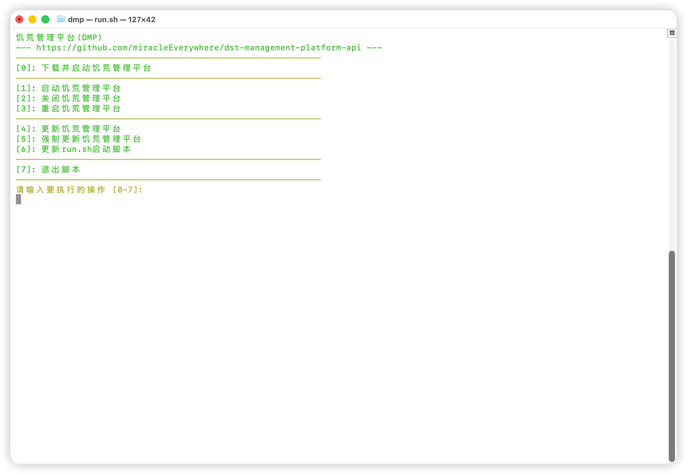
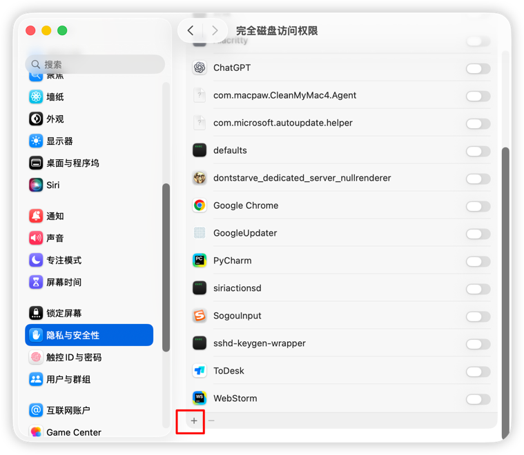
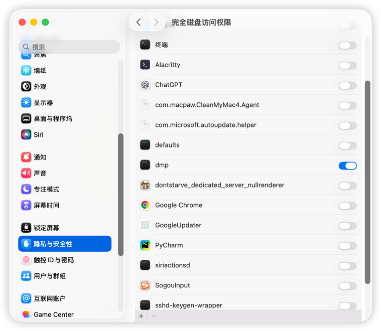
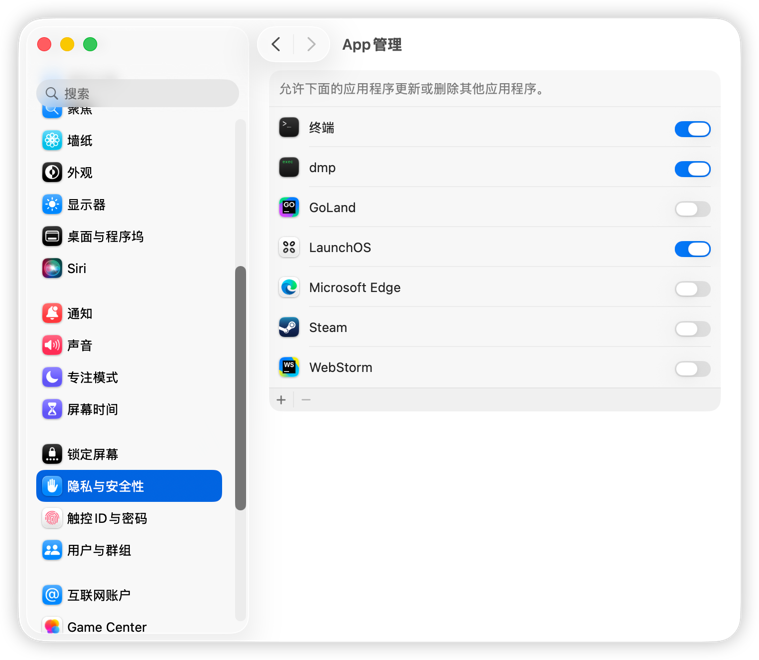

::: info
在`v3`版本中，饥荒管理平台从`v3.2.0`开始支持MacOS
:::

MacOS开服过程与Linux开服没有区别，仅`run.sh`脚本中删除了一些选项

上图中的功能与Linux一致

::: important
下方操作要记得做
:::

当饥荒管理平台安装完成后，你需要在

**系统设置 - 隐私与安全性 - 完全磁盘访问权限** 中添加dmp

点击`+`，添加dmp程序即可

**系统设置 - 隐私与安全性 - App管理** 中添加dmp

添加方式同上

以上操作完成后，使用`run.sh`脚本重启饥荒管理平台即可 (`echo 3 | ./run.sh`)

接下载就是注册账号、安装游戏等，这里就不讲了

::: tip
MacOS会对新安装的应用进行完整性检查，如果你在应用第一次启动前，就修改了应用中的内容，MacOS会报应用已损坏的错误

饥荒管理平台会在安装游戏和更新游戏过程中，启动一次饥荒专用服务器，以避免应用损坏的错误，你无需做额外的操作

这里只是提示你，在安装或更新过程中，游戏会自动启动，不必在意

MacOS安装、更新游戏的速度理论上比Linux慢1分钟
:::
