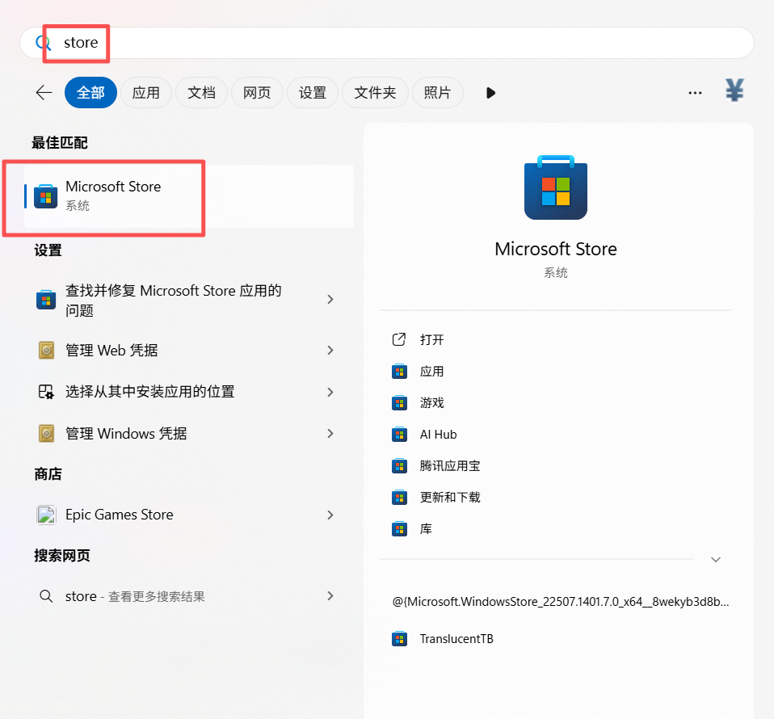
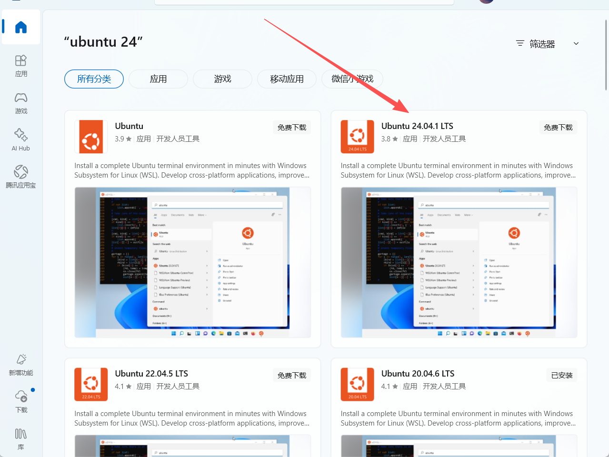
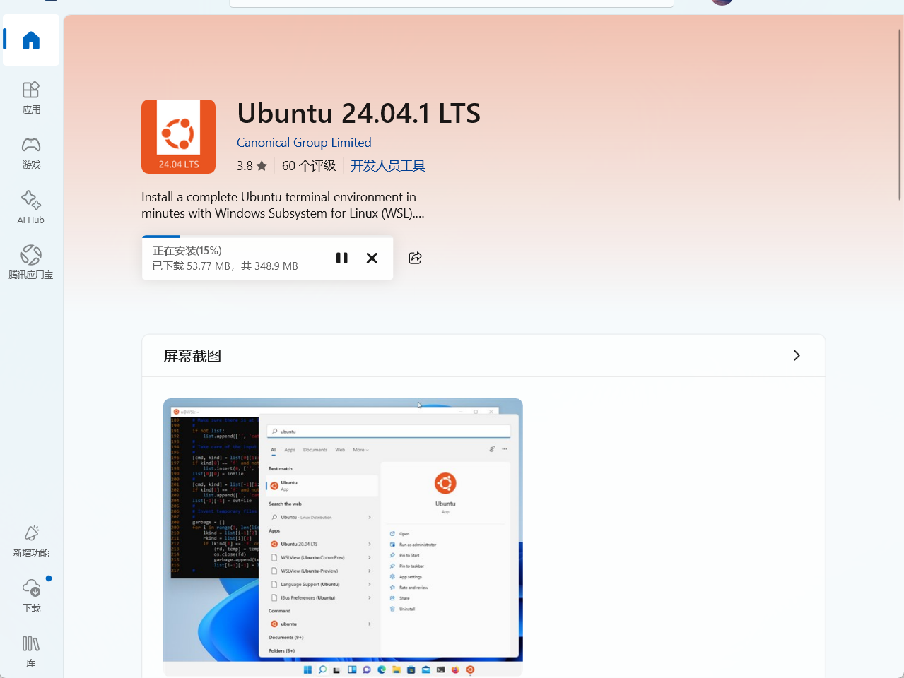
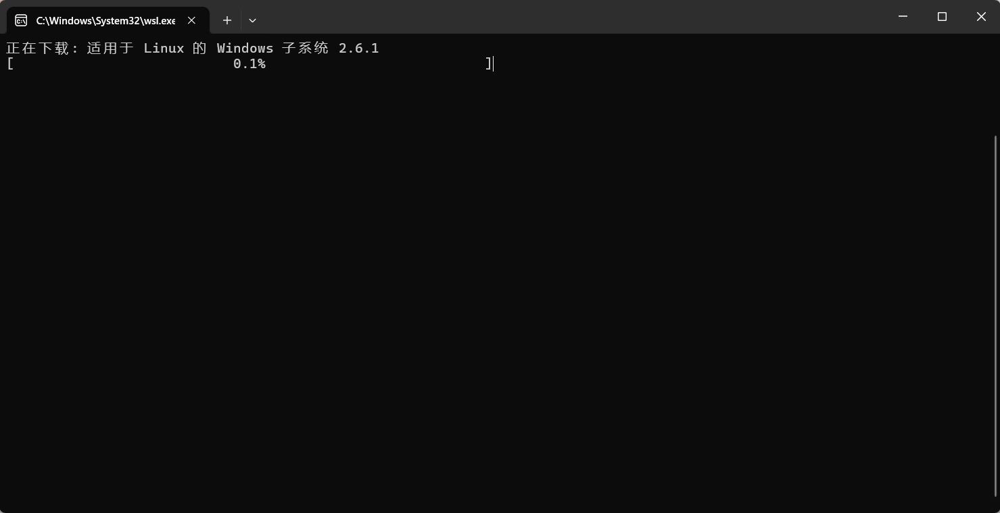

::: important
目前作者只测试过Windows 11，其他版本的Windows没有测试过，该功能依赖`WSL`
:::

如果你有一台Windows 11 的电脑，长期开机，并且在使用，想安装**饥荒管理平台**又不想安装Ubuntu，那么你可使用此方法安装并开服

1. 打开Windows商店，可以在开始菜单搜索

2. 在商店搜索`ubuntu 24`，选择**Ubuntu 24**，必须是24版本，24以下版本可能会存在依赖问题

3. 进入详情页面点击**获取**，即可开始安装

4. 安装完成后，在开始菜单中找到安装好的`Ubuntu 24`，点击打开，系统会自动安装一些`WSL`所需的组件，请耐心等待

5. 安装完成后，你就拥有一个Ubuntu的子系统了，剩余操作与[启动脚本部署](bin.md)一致
