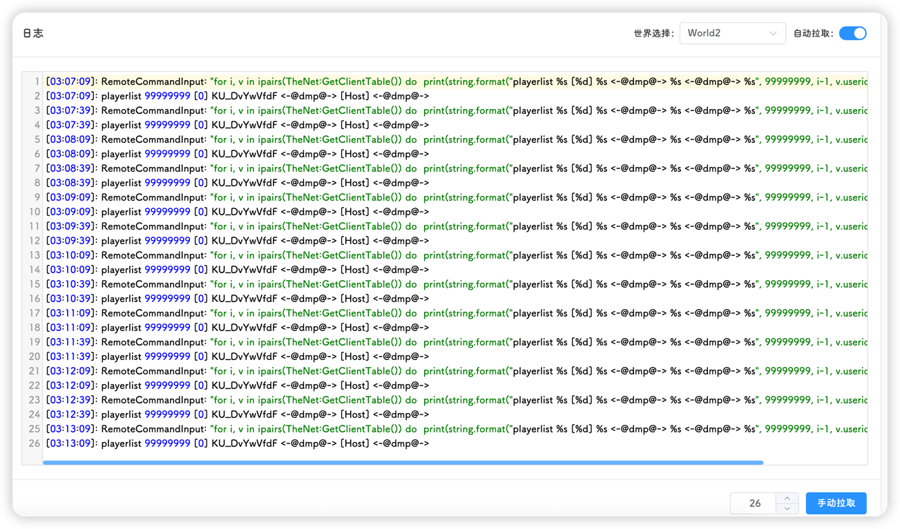
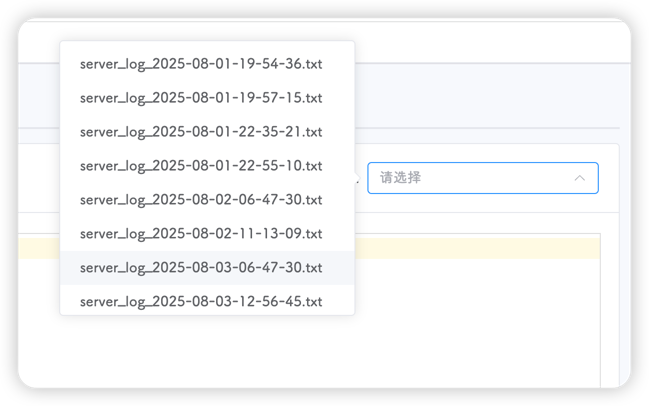
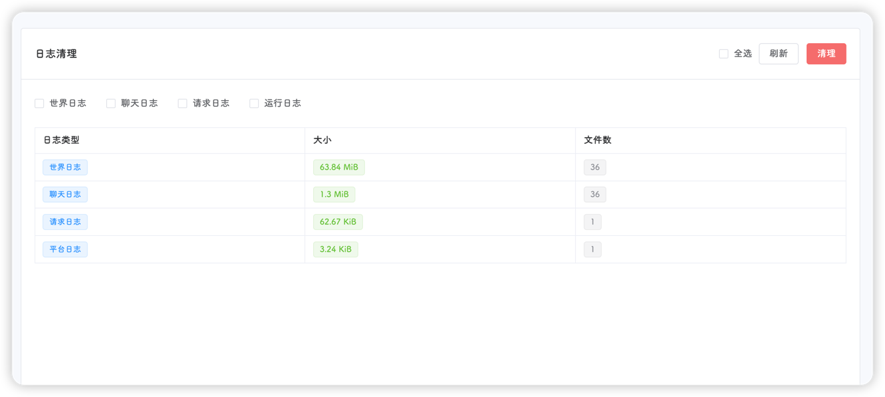

在日志页面，可以更便捷的查看和管理日志

::: tip
所有日志查看页面，均有自动拉取(默认打开)和手动拉取，并包含每次获取行数(根据浏览器页面大小自动调整)设置
:::

## 游戏日志

进入游戏日志页面，即可查看实时的游戏日志

首先需要选择一个房间，可以在右上角选择查看那个**世界**的日志，在右下角可以选择展示的**行数量**

::: tip
世界日志是饥荒产生的日志，可以查看当前世界的运行状态，如果出现异常，也可从该日志进行排查
:::

点击第二个标签页：历史日志，即可查看所有的历史世界日志，在右上角的下拉菜单中进行选择

## 聊天日志

聊天日志与世界日志类似

在该页面，可以查看游戏中玩家的对话，也分为实时日志和历史日志，通过页面上方标签页进行切换

## Steam日志

包含一些游戏下载、模组下载的日志

## 请求日志

该日志为后台调用日志，包含调用时间，响应code，调用时长，请求IP，调用方法和接口路径

::: tip
开发者日志，玩家无需关注该日志
:::

## 运行日志

该日志为平台执行任务结果

::: tip
开发者日志，玩家无需关注该日志
:::

## 清理日志

日志过多会占用大量的磁盘空间，可以使用本页面功能对日志进行清理

该页面会对日志进行统计，统计日志总大小

选择要清理的日志，也可以选择右上角**全选**按钮，点击右上角**删除**按钮即可
