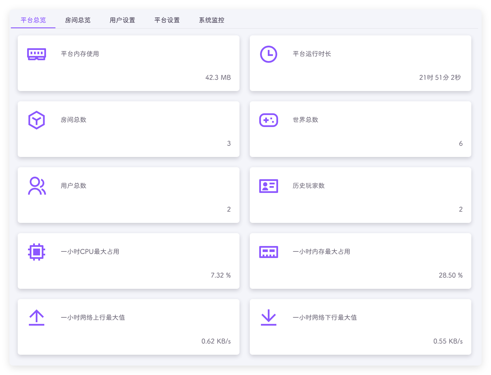
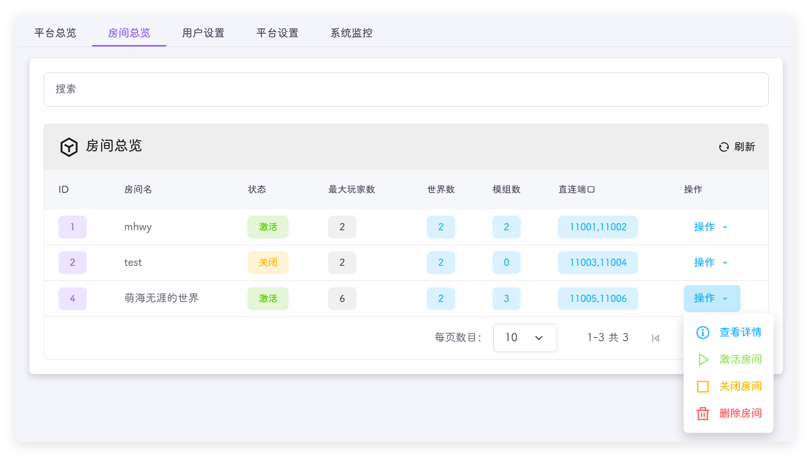
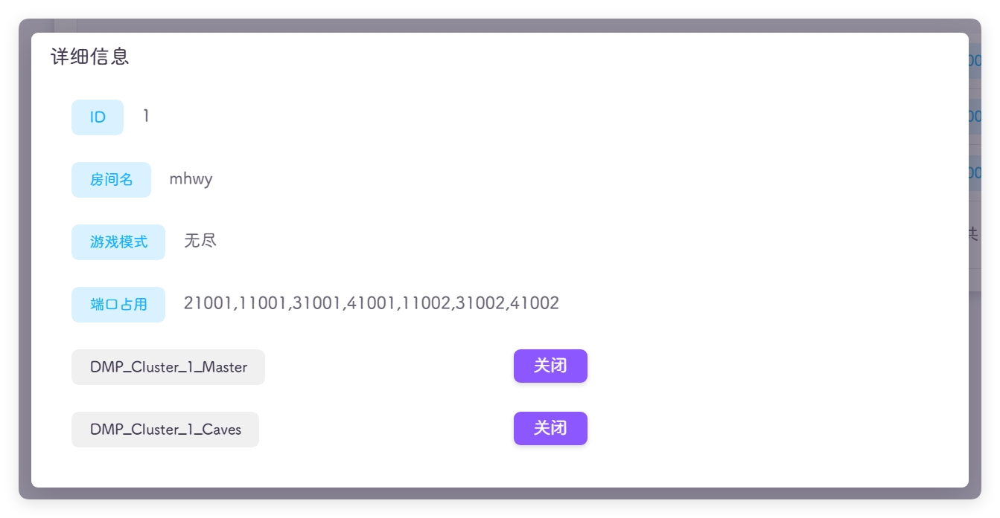
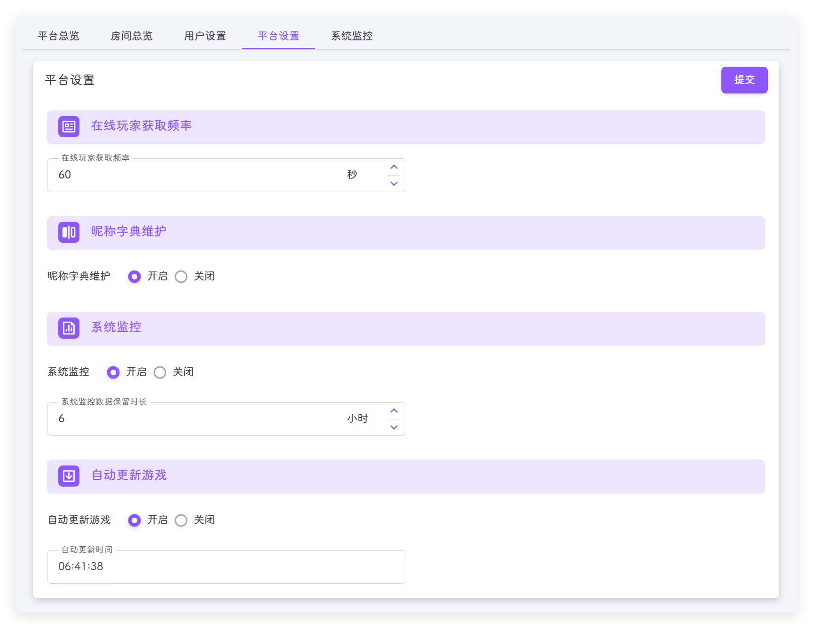
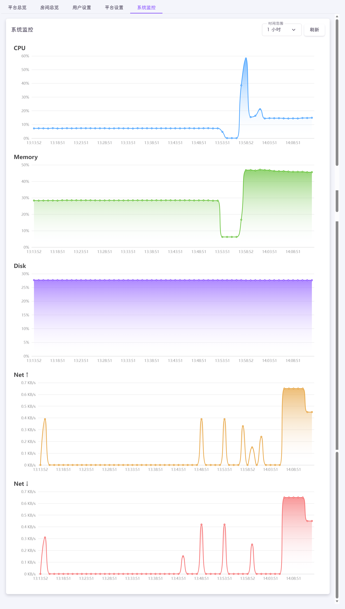

平台的功能管理中心，设置房间、用户、平台和监控的功能

## 平台总览
查看平台和服务器的资源占用情况

## 房间总览
查看和管理平台的所有房间

- ID：平台中唯一编号
- 房间名：房间名称
- 状态：是否激活
- 最大玩家数：房间设置的最大玩家数量
- 世界数：房间内的世界数量
- 模组数：房间内的模组数量
- 直连端口：外部连接的端口号，防火墙需要开发这里显示的端口号
- 操作：对房间的操作
  - 查看详情：查看房间端口号的详细信息，可以关闭房间内指定的世界
  - 激活房间：启动房间所有的世界
  - 关闭房间：关闭房间所有的世界
  - 删除房间：删除这个存档 !!删除我也找不回来记得备份！备份！备份！!!

::: tip
关闭的房间不会执行任何定时任务，包含自动重启，自动备份，自动保活等
:::

### 查看详情
展示更多信息 !!其实也不多!!

- ID：平台中唯一编号
- 房间名：房间名称
- 游戏模式：房间的游戏模式
- 端口占用：使用的端口号，不需要全部开放
- DMP_Cluster_房间ID_世界名：平台启动的 `Screen` 的名称，即正在运行的世界；点击关闭，可以关闭对应的世界

## 用户设置
创建和修改用户信息，详情查看👉[用户管理](./users.md#用户管理)

## 平台设置
其他功能的设定

- 在线玩家获取频率：相隔多久进行一次获取，频率越小获取越频繁，对服务器造成一定的负担
- 昵称字典维护：在后台记录进入房间的玩家昵称，关闭只能看到科雷ID
- 系统监控：打开后可以在系统监控中查看系统的 CPU、内存等资源的使用信息，关闭可以节省服务器资源 !!其实用处不大，可以关掉的!!
- 自动更新游戏：定时检测游戏是否有更新，有的话在指定时间自动更新游戏

## 系统监控
可以查看 CPU、内存、硬盘、网络的使用情况

::: tip
如果在平台管理 - 平台设置 没有启用系统监控，这里是无法查看的
:::