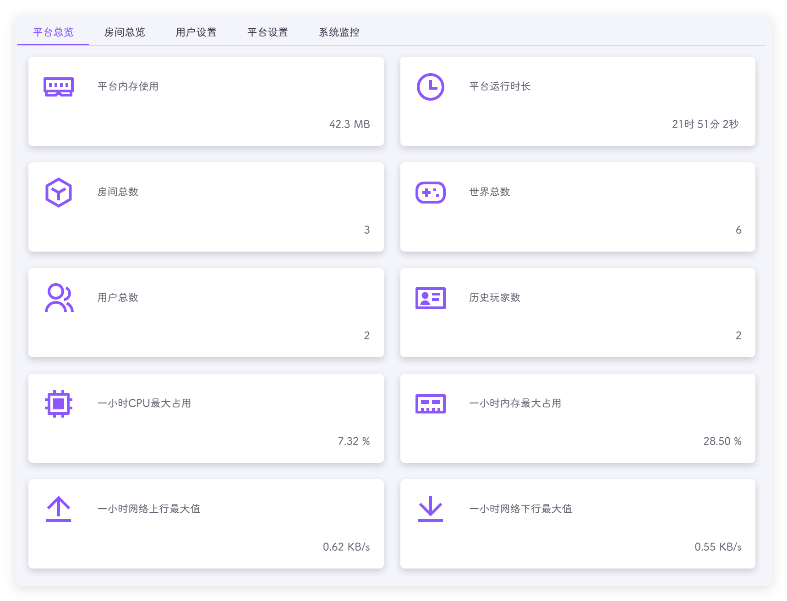
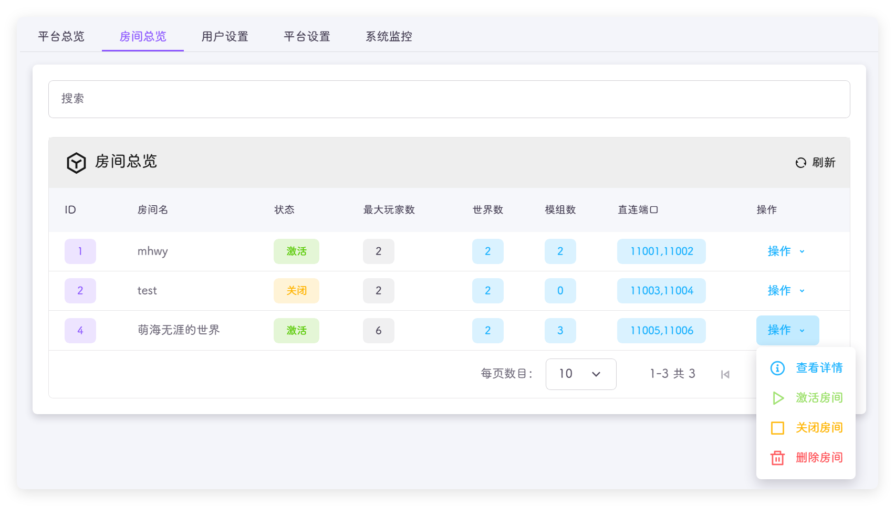
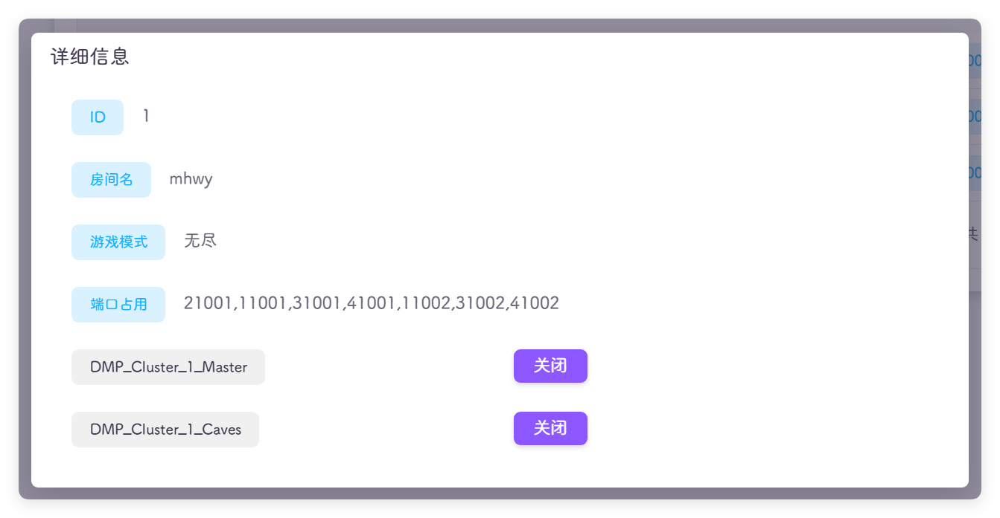
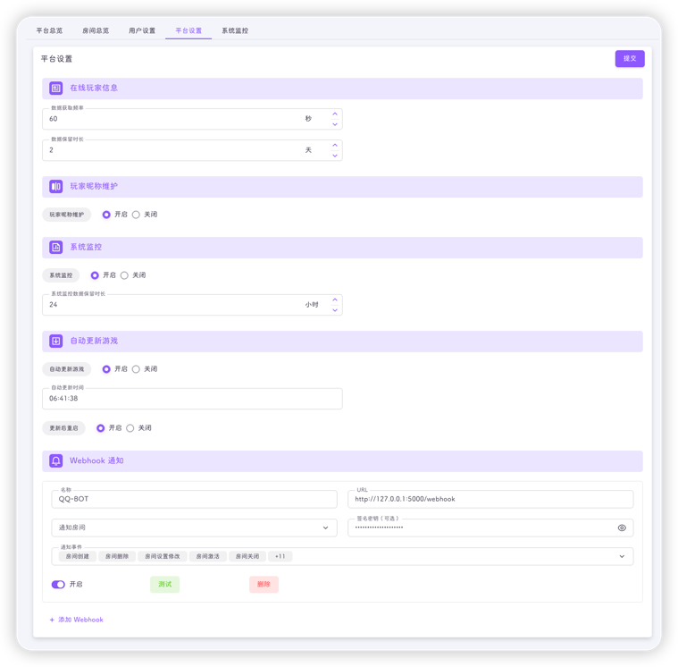
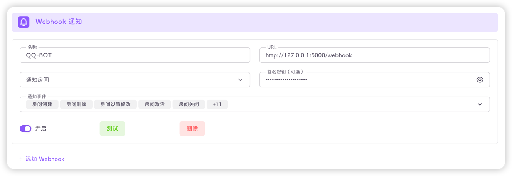
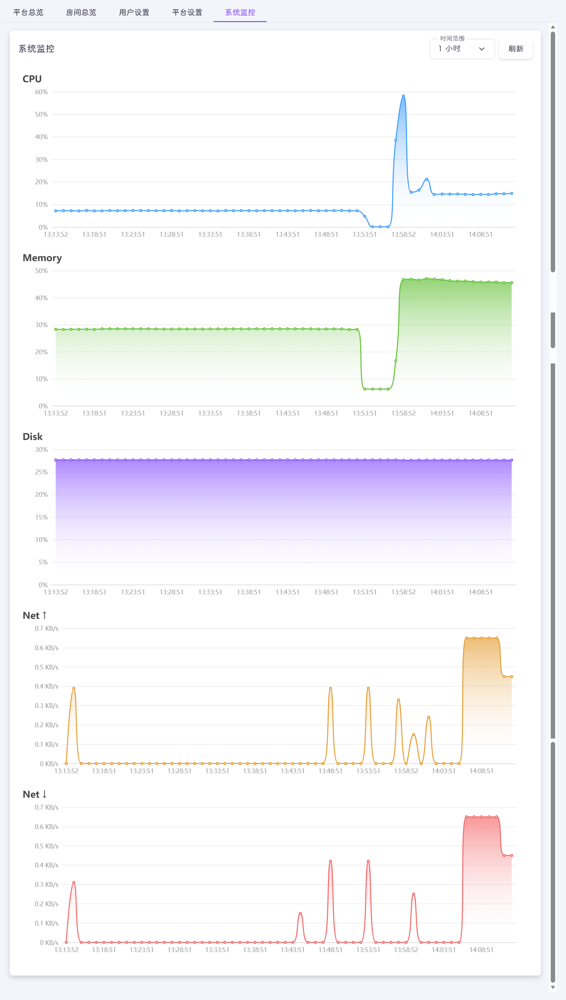

::: info
平台的功能管理中心，设置房间、用户、平台和监控的功能
:::

## 平台总览
查看平台和服务器的资源占用情况



::: tip
平台内存占用会根据你最近一段时间执行的操作(打开页面、调用接口等)增加而增加，无操作后会回落
:::

## 房间总览
查看和管理平台的所有房间



- ID：平台中唯一编号
- 房间名：房间名称
- 状态：是否激活
- 最大玩家数：房间设置的最大玩家数量
- 世界数：房间内的世界数量
- 模组数：房间内的模组数量
- 直连端口：外部连接的端口号，防火墙需要开发这里显示的端口号
- 操作：对房间的操作
  - 查看详情：查看房间端口号的详细信息，可以关闭房间内指定的世界
  - 激活房间：启动房间所有的世界
  - 关闭房间：关闭房间所有的世界
  - 删除房间：删除这个存档

::: tip
关闭的房间不会执行任何定时任务，包含自动重启，自动备份，自动保活等
:::

右侧查看详情展示更多信息，可在此页面手动关闭饥荒进程对应的`screen`



- ID：平台中唯一编号
- 房间名：房间名称
- 游戏模式：房间的游戏模式
- 端口占用：使用的端口号，不需要全部开放
- DMP_Cluster_房间ID_世界名：平台启动的 `Screen` 的名称，即正在运行的世界；点击关闭，可以关闭对应的世界

## 用户设置
创建和修改用户信息，详情查看👉[用户管理](./users.md#用户管理)

## 平台设置

一些影响全局功能的设置



### 在线玩家信息
- 相隔多久进行一次获取，频率越小获取越频繁，对服务器造成一定的负担
- 数据保留的天数越大，占用服务器内存越多

### 玩家昵称维护
- 在后台记录进入房间的玩家昵称，关闭只能看到科雷ID

### 系统监控
- 打开后可以在系统监控中查看系统的 CPU、内存等资源的使用信息
- 数据保留时长越长，占用服务器内存越多

### 自动更新游戏
- 定时检测游戏是否有更新，有的话在指定时间自动更新游戏
- 更新后重启，字面意思，更新完成后重启游戏，让玩家可以加入

### Webhook 通知

::: info
该功能由`v3.1.5`版本加入
:::

当你的饥荒管理平台主动或自动执行了一些操作后，你希望能够收到通知，那么你可以使用此功能

::: tip
你可以配置一个或多个webhook
:::

你需要输入此webhook的名称，URL，选择需要通知的事件和密钥

- **名称**
  - 必填项
  - 好的名称能够体现此webhook的用途，例如QQ-Mail、DingTalk、Wechat等
- **URL**
  - 必填项，例如：`https://my-webhook.test/webhook`
  - 只支持`http`或`https`
  - `POST`方法
  - 不允许传递`query`参数
  - 不允许传递`fragment`参数
- **通知房间**
  - 有哪些房间可以收到订阅的事件
  - 如果`不选择`，则`通知所有房间`
  - 如果选择房间后，则`无法收到房间创建`事件
- **通知事件**
  - 该webhook订阅的事件，`至少选择一项`
  - 房间创建
  - 房间删除
  - 房间修改
  - 房间激活
  - 房间关闭
  - 游戏备份
  - 游戏重置
  - 游戏启动
  - 游戏关闭
  - 游戏更新
  - 自动保活
  - 玩家管理
  - 平台设置修改
  - 虚拟终端连接
  - 在线玩家变化
- 签名密钥
  - 可选项
  - 你的webhook可能暴露在公网上，需要鉴权，不能让所有人都能调用
  - 使用`HMAC-SHA256`加密算法
  - 配置后会携带`X-DMP-Signature`请求头



输入名称和URL后，可以点击测试按钮进行测试

```json title="接收到的测试消息" :collapsed-lines=10
{
  "event": {
    "type": "test",
    "zh": "测试",
    "en": "Test"
  },
  "timestamp": 1782805255008,
  "data": "这是一条测试消息 / This is a test message"
}
```

下面是一个使用`python`语言编写的webhook脚本，并附带签名校验

```python title="一个简单的带验证的webhook脚本" :collapsed-lines=10
from flask import Flask, request, jsonify
import hmac
import hashlib
import json
import logging
import os


app = Flask(__name__)

def setup_logging():
    logger = logging.getLogger(__name__)
    logger.setLevel(logging.DEBUG)
    
    if logger.hasHandlers():
        logger.handlers.clear()
        
    formatter = logging.Formatter(
        '%(asctime)s - %(levelname)s - %(message)s',
        datefmt='%Y-%m-%d %H:%M:%S'
    )
    
    console_handler = logging.StreamHandler()
    console_handler.setLevel(logging.DEBUG)
    console_handler.setFormatter(formatter)
    logger.addHandler(console_handler)

    file_handler = logging.FileHandler('webhook.log', encoding='utf-8')
    file_handler.setLevel(logging.INFO)
    file_handler.setFormatter(formatter)

    class BodyFilter(logging.Filter):
        def filter(self, record):
            return '请求体' in record.getMessage()

    file_handler.addFilter(BodyFilter())
    logger.addHandler(file_handler)

    return logger

logger = setup_logging()

SECRET = os.environ.get('WEBHOOK_SECRET', 'your-secret-key-here')
if not SECRET or SECRET == 'your-secret-key-here':
    logger.warning("⚠️ SECRET 未配置或使用默认值，请设置环境变量 WEBHOOK_SECRET")


def verify_signature(data: bytes, signature: str) -> bool:
    if not signature:
        logger.warning("请求头缺少 X-DMP-Signature")
        return False

    mac = hmac.new(SECRET.encode('utf-8'), data, hashlib.sha256)
    expected_signature = mac.hexdigest()

    return hmac.compare_digest(expected_signature, signature)


@app.route('/webhook', methods=['POST'])
def webhook():
    body = request.get_data()

    print("=" * 50)
    print(f"收到 webhook 请求")
    print(f"客户端 IP: {request.remote_addr}")
    print(f"User-Agent: {request.headers.get('User-Agent', 'Unknown')}")

    # 打印请求体原始数据到屏幕（调试用）
    print(f"请求体原始数据: {body}")

    # 尝试解析 JSON 并打印格式化内容到屏幕
    try:
        json_data = json.loads(body.decode('utf-8'))
        print(f"请求体 JSON 内容:\n{json.dumps(json_data, indent=2, ensure_ascii=False)}")
        # 同时记录到文件（只记录 body 内容）
        logger.info(f"请求体 JSON 内容:\n{json.dumps(json_data, indent=2, ensure_ascii=False)}")
    except (json.JSONDecodeError, UnicodeDecodeError) as e:
        print(f"请求体不是有效的 JSON: {e}")
        # 如果是非 JSON，记录原始内容到文件
        try:
            body_str = body.decode('utf-8')
            logger.info(f"请求体原始内容: {body_str}")
        except:
            logger.info(f"请求体二进制内容: {body.hex()}")

    # 获取签名
    signature = request.headers.get('X-DMP-Signature', '')
    print(f"请求头 X-DMP-Signature: {signature}")

    # 强制验证签名
    if not verify_signature(body, signature):
        print("❌ 签名验证失败 - 请求被拒绝")
        logger.error("签名验证失败")
        return jsonify({
            'code': 401,
            'message': 'Unauthorized: Invalid or missing signature',
            'error': 'Signature verification failed'
        }), 401

    print("✅ 签名验证成功")

    # 返回成功响应
    return jsonify({
        'code': 200,
        'message': 'Webhook received successfully',
        'data': {
            'received': True,
            'timestamp': request.headers.get('X-DMP-Timestamp', '')
        }
    }), 200


@app.errorhandler(404)
def not_found(error):
    """404 错误处理"""
    print(f"404 错误: {request.path}")
    return jsonify({
        'code': 404,
        'message': 'Not Found'
    }), 404


@app.errorhandler(405)
def method_not_allowed(error):
    """405 错误处理"""
    print(f"405 错误: {request.method} {request.path}")
    return jsonify({
        'code': 405,
        'message': 'Method Not Allowed'
    }), 405


@app.errorhandler(500)
def internal_error(error):
    """500 错误处理"""
    print(f"500 内部错误: {error}")
    return jsonify({
        'code': 500,
        'message': 'Internal Server Error'
    }), 500


if __name__ == '__main__':
    print("=" * 50)
    print("Webhook 服务启动")
    print(f"监听地址: 0.0.0.0:5000")
    print(f"请求 body 将记录到: webhook.log")
    print("=" * 50)
    # 启动服务
    app.run(host='0.0.0.0', port=5000, debug=False)
```

下方是饥荒管理平台调用webhook的请求体示例

```json title="平台设置修改" :collapsed-lines=100
{
  "event": {
    "type": "global_setting_updated",
    "zh": "平台设置修改",
    "en": "Platform Settings Updated"
  },
  "timestamp": 1782802623354,
  "name": "QQ-BOT",
  "data": {
    "dbUpdated": true
  }
}
```

```json title="在线玩家变化 加入1 离开0" :collapsed-lines=100
{
  "event": {
    "type": "online_player_updated",
    "zh": "在线玩家变化",
    "en": "Online Player Updated"
  },
  "timestamp": 1782762705716,
  "name": "QQ-BOT",
  "data": {
    "current": [
      {
        "uid": "KU_********",
        "nickname": "花花",
        "prefab": "wx78"
      },
      {
        "uid": "KU_********",
        "nickname": "小布尔乔亚",
        "prefab": ""
      },
      {
        "uid": "KU_********",
        "nickname": "x_x",
        "prefab": "wendy"
      },
      {
        "uid": "KU_********",
        "nickname": ">=<",
        "prefab": "wx78"
      }
    ],
    "exited": null,
    "gameID": 1,
    "gameName": "测试房间",
    "joined": [
      {
        "uid": "KU_********",
        "nickname": "小布尔乔亚",
        "prefab": ""
      }
    ]
  }
}
```

## 系统监控
可以查看 CPU、内存、硬盘、网络的使用情况



::: tip
如果在平台管理 - 平台设置 没有启用系统监控，这里是无法查看的
:::