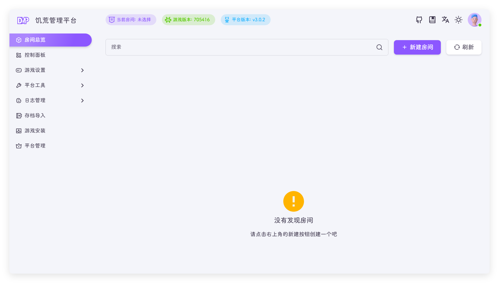
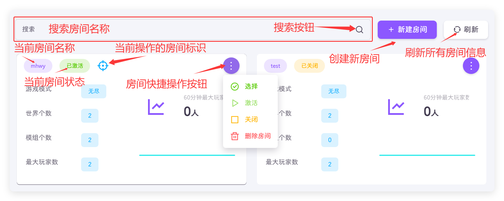

## 房间概念
房间也可以叫存档，平台房间的配置文件、存档文件、模组文件都相互独立，互不影响，一个管理平台开启多个存档同时运行，存档之间互不干涉

饥荒管理平台的底层逻辑为：平台下有多个房间，每个房间下有多个世界，从上到下，分别管理

````markmap
---
markmap:
  colorFreezeLevel: 2
---

# 饥荒管理平台

## 房间/存档1

- 地面/世界
- 洞穴/世界

## 房间/存档2

- 地面/世界
- 洞穴/世界
- 地面/世界
- 洞穴/世界

## 房间/存档3

- 地面/世界

## 房间/存档4

- 地面/世界
- 洞穴/世界

````

::: tip
世界中的地面和洞穴都是世界
:::

## 界面说明

如果房间不存在会提示创建房间，如果存在房间会展示房间的简要信息





- 搜索：房间较多时可以搜索指定房间名称，输入要搜索的房间名称，点击搜索按钮
- 新建房间：创建一个新的存档/房间
- 刷新：刷新房间展示的信息
- 房间名称：展示房间名称
- 房间状态：展示房间是否有存档开启
  - 已激活：房间有世界是开启状态，新创建的房间默认为激活状态
  - 已关闭：关闭的房间不会执行任何定时任务，包含自动重启，自动备份，自动保活等
- 房间操作标识：标识当前操作的房间
- 房间快捷操作菜单：对房间进行快捷操作
  - 选择：更换操作的房间
  - 激活：启动房间所有的世界
  - 关闭：关闭房间所有的世界
  - 删除房间：删除这个存档 !!删除我也找不回来记得备份！备份！备份！!! `v3.0.2` 新功能(仅管理员)

::: tip
房间总览只会展示有权限的房间
:::