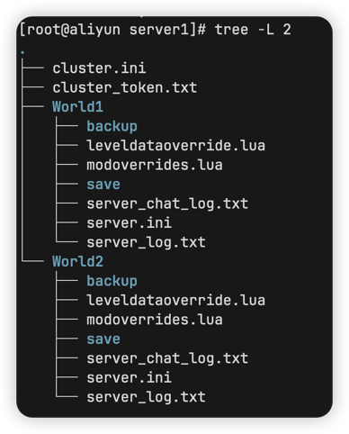

存档导入功能可以算是饥荒管理平台最复杂的功能了 !!后端的代码有大概有700行!!

## 文件类型要求

需要导入一个压缩文件

以下列出的文件均为必须

- `cluster.ini`
- `cluster_token.txt`
- `世界目录`，可以是任意名，例如`Master`，`Caves`等，可以有任意多个世界，但不能小于1
  - `leveldataoverride.lua`(也可以是`worldgenoverride.lua`)
  - `server.ini`

将上述文件和目录压缩为`zip`格式后即可上传

::: caution
生成的压缩文件的内容就是上图的文件，不能在上层添加目录，例如打开压缩文件后显示一个server目录，打开server目录后才是`cluster.ini`，即：`/server/cluster.ini`，如果出现这种情况是无法导入的
:::

::: tip
优化了MacOS自动生成的`__MACOSX`目录，导入时无需处理
:::

## 文件内容要求

以下列出的字段均为必须

- `cluster.ini`
  - `cluster_name`
  - `game_mode`
  - `max_players`
  - `master_ip`

- `cluster_token.txt`
  - `令牌` (使用游戏开的服务器通常会缺失这个文件，需要手动创建)

- `leveldataoverride.lua`或`worldgenoverride.lua`
  - `正确的世界设置`

- `server.ini`
  - `is_master`

::: warning
如果没有`{server}/save`目录，将导入一个秋0存档
如果没有`{server}/modoverrides.lua`文件，将导入一个纯净存档
:::

