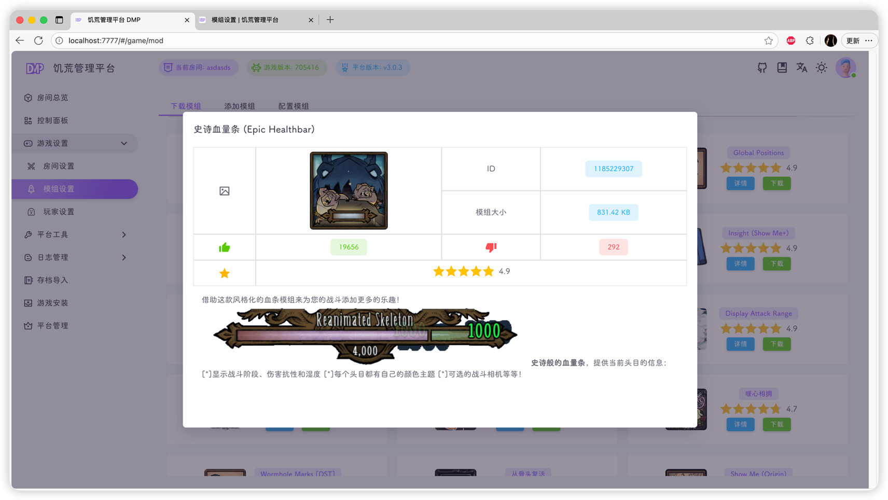
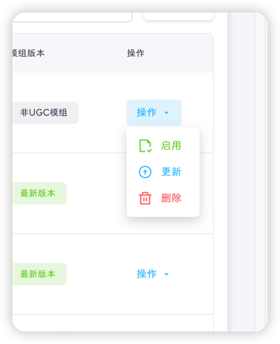
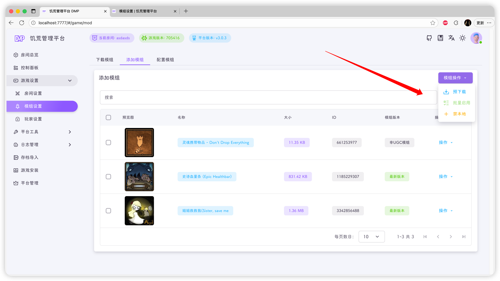
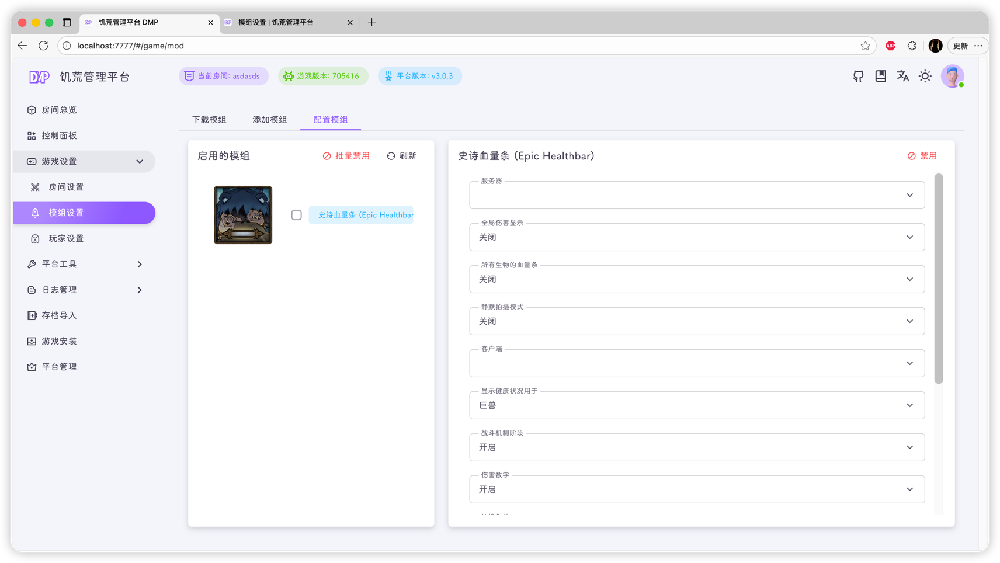

::: important
模组配置的三个步骤： **下载，启用，配置**
:::

::: tip
模组配置完成后，需要重启游戏才能生效
:::

## 下载模组

和你用游戏开服一样，默许也是需要提前订阅的，饥荒管理平台的下载模组就对应着订阅模组

点击**下载**按钮可以进行下载，下载完成后会有弹窗提醒

点击**详情**可以查看模组的介绍页

## 添加模组

下载好的模组会在这个表格中显示

点击右侧操作菜单可以执行：
- **启用**：将这个模组添加到你的房间中，类似于游戏中开服时的勾选操作
- **更新**：顾名思义，旧版本模组升级到新版本
- **删除**：嗯，没用的删除功能，不知道为什么都想要这个功能

右上角的模组操作菜单提供了三项功能：
- **预下载**：将你模组配置文件(modoverride.lua)用到的模组下载下来，否则无法配置，进游戏还要下载，下载不成功你的游戏就缺模组啦🥳
- **批量启用**：多个模组同时启用
- **禁本地**：不想让别人开挂的最好方法就是禁本地模组

::: tip
禁本地不是一个模组，是一个配置
添加后可在**配置模组**页面禁用
:::

## 配置模组

选择一个模组即可进行配置

::: important
仅下载好的模组才能进行可视化配置
:::

::: tip
修改模组的配置后，需要重启饥荒专用服务器才能生效
在[控制面板](../dashboard.md)页面点击**重启游戏**按钮即可
:::

::: warning
模组越多，资源占用越多，游戏崩溃的风险越大
:::

你不要用某一个模组时，可以点击该模组，然后点击右上角的禁用，即可禁用该模组

也可以点击左侧复选框，批量禁用模组

::: tip
禁用模组后，需要重启饥荒专用服务器才能生效
在[控制面板](../dashboard.md)页面点击**重启游戏**按钮即可
:::
