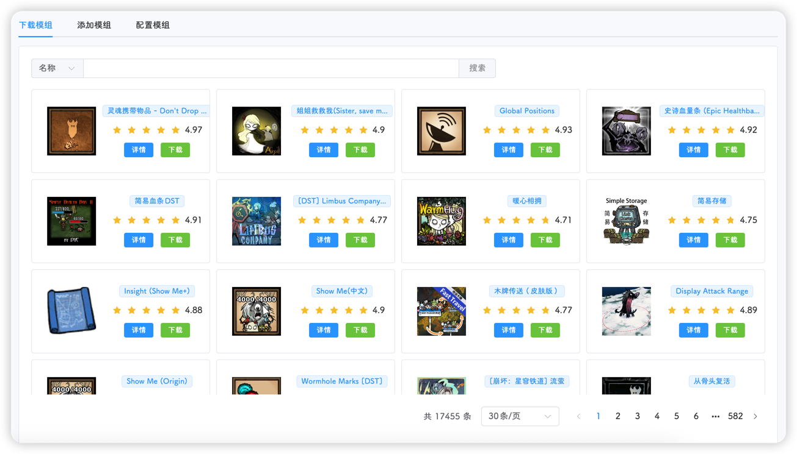

::: important
模组配置的三个步骤： **下载，启用，配置**
:::

::: tip
模组配置完成后，需要重启游戏才能生效
:::

## 下载模组

和你用游戏开服一样，默许也是需要提前订阅的，饥荒管理平台的下载模组就对应着订阅模组

点击**下载**按钮可以进行下载，下载完成后会有弹窗提醒

点击**详情**可以查看模组的介绍页

## 添加模组

下载好的模组会在这个表格中显示

点击右侧操作菜单可以执行：
- **启用**：将这个模组添加到你的房间中，类似于游戏中开服时的勾选操作
- **更新**：顾名思义，旧版本模组升级到新版本
- **删除**：嗯，没用的删除功能，不知道为什么都想要这个功能

右上角的模组操作菜单提供了三项功能：
- **预下载**：将你模组配置文件(modoverride.lua)用到的模组下载下来，否则无法配置，进游戏还要下载，下载不成功你的游戏就缺模组啦🥳
- **批量启用**：多个模组同时启用
- **禁本地**：不想让别人开挂的最好方法就是禁本地模组

::: tip
禁本地不是一个模组，是一个配置
添加后可在配置模组页面禁用
:::

## 配置模组

真没啥好说的了，页面上的功能我相信你都看得懂，加油宝贝

