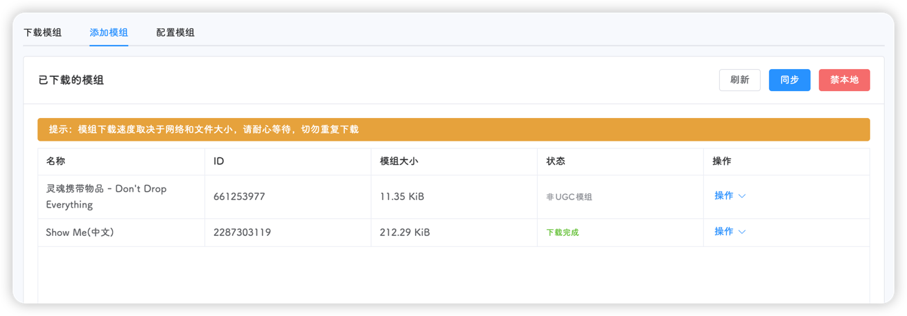

::: tip
该页面位于 **设置-模组**，包含**下载模组**、**添加模组**、**配置模组**三个标签页
:::

## 下载模组

下载模组页面可下载创意工坊的所有公开模组

页面上方的搜索栏可通过模组名进行模糊搜索，也可通过模组ID进行精确搜索

例如通过名称搜索`show me`

搜索结果按照模组名的相关度以及模组的评分进行排序

::: tip
通过ID搜索的结果不会显示模组的评分
:::

点击**详情**按钮即可查看模组的详细信息

点击**下载**按钮即可进行后台下载

::: warning
可多个模组同时下载，但不要重复下载模组；下载模组的速度取决于模组的大小和当前的网络状态，请耐心等待
:::

## 添加模组

在**下载模组**标签页中下载好的模组会展示在这里

::: tip
此表格会展示`dmp_files/mod/steamapps/workshop/content/322330`和`dmp_files/mod/not_ugc`这两个目录的所有模组，上述目录中的模组与游戏自动下载和使用的模组**毫无关系**，因此更新此处的模组对游戏来说没有任何意义。也可以看出，该页面显示的模组是多个集群共用的。为什么要这么设计？主要是为了不污染游戏的目录，不能因为平台的一些操作，导致游戏无法正常启动。为什么只有下载了模组才能添加？添加模组本质上是修改世界目录中的`modoverrides.lua`文件，需要往这个文件里面添加配置，如何获取模组的配置呢，就只能下载模组，从模组的源码中获取了。
:::

::: caution
按理来说，模组配置的`configuration_options`字段是一些变量，但有些模组会搞一些table进去，平台没有对这些模组进行适配，所以会出现添加失败，就比如前面在房间设置提到的多层世界模，本平台统称这些含有table的模组为**复杂模组**，需要手动添加。 !!未来可能会优化这个功能，由于代码复杂，目前不想动，所以，欢迎PR!!
:::

值得注意的是，模组一共有三种状态，分别是：

- **下载完成**：字面意思，即模组下载完成，并且是最新版本
- **非UGC模组**：平台无法判断模组是否为最新
- **正在下载或需更新**：字面意思

::: tip
平台判断模组是否为最新的依据是调用SteamAPI获取该模组的大小，单位是字节，然后计算本地模组的大小，如果两者不相同，则定为**正在下载或需更新**
:::

右侧操作菜单可进行模组的启用和删除

点击**启用**，即可将模组的**默认**配置写入模组配置文件

点击**删除**，即可删除对应的模组文件

::: tip
模组启用操作是即时生效的，无需进行额外的保存操作
:::

右上角提供三个快捷操作按钮，分别是

- **刷新**：刷新下方表格信息
- **同步**：将游戏自动下载的模组同步至`dmp_files/mod/steamapps/workshop/content/322330`或`dmp_files/mod/not_ugc`，并显示在下方表格
- **禁本地**：添加禁用本地模组配置

## 配置模组

该标签页会显示模组配置中所有的模组，即当前集群已启用的模组

可点击左侧任意模组进行配置

::: tip
此处更改模组配置也是即时生效的，无需进行额外的保存操作
:::

点击右上角的更新按钮即可更新模组，该操作会更新游戏内部模组，如果游戏内提示模组需要更新，可点击该按钮进行更新

点击右上角的禁用按钮即可删除对应模组的配置

::: warning
如果需要更新模组，平台更建议使用重启游戏的方式进行自动更新。本页面所有操作即时生效，是指会自动修改数据库和对应的饥荒配置文件，如需在游戏中生效，还要重启游戏。
:::
