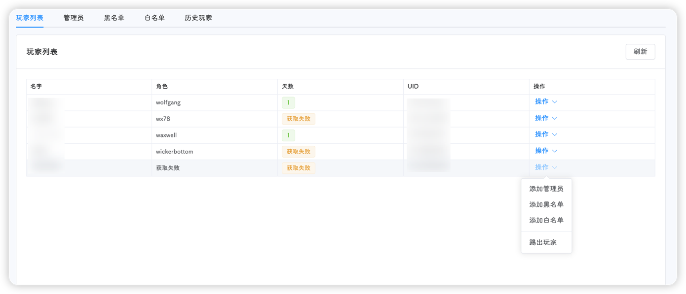
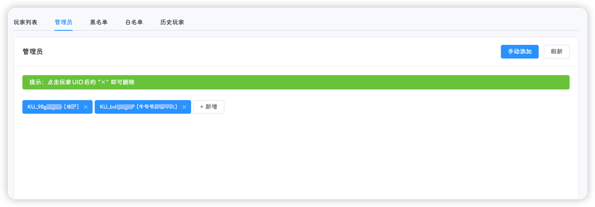
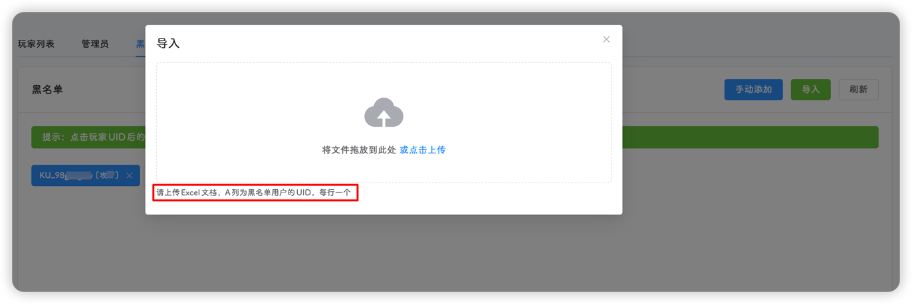
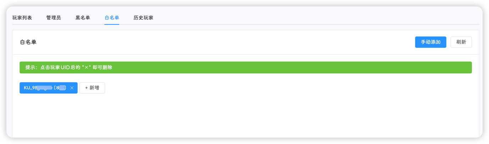
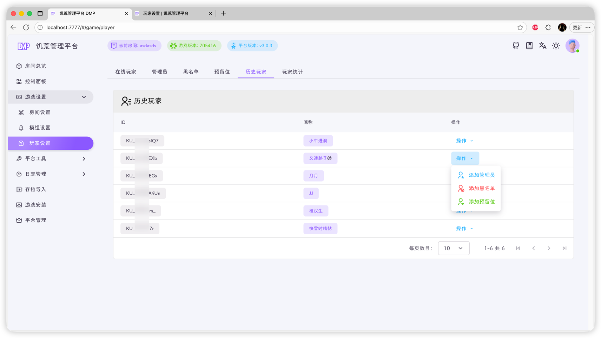

::: tip
该页面位于 **设置-玩家**，包含**玩家列表**、**管理员**、**黑名单**、**白名单**和**历史玩家**五个标签页
:::

## 玩家列表

显示当前存档中，正在游戏的玩家列表

玩家列表依次显示玩家的名字、角色、天数和UID，并提供添加管理员、白名单、黑名单和提出的快捷操作

::: tip
如上图所示，可能会出现**获取失败**的情况，原因为该玩家刚刚加入游戏，饥荒服务器没有为他创建对应的`meta`存档文件，因此获取失败；
如果出现玩家天数不对的情况，原因可能为：饥荒管理平台会优先从主节点(默认为地面)获取玩家的存档信息，如果该玩家在洞穴很长时间 !!穴居人不知道在干嘛!!，并没有回到地面过，则会造成这种情况。
:::

表格右侧提供一些快捷操作

- **添加管理员**：将指定玩家添加到`adminlist.txt`管理员名单中
- **添加黑名单**：将指定玩家添加到`blocklist.txt`黑名单中
- **添加白名单**：将指定玩家添加到`whitelist.txt`白名单中，并在`cluster.ini`文件中自动添加`whitelist_slots`预留位
- **踢出该玩家**：将指定的玩家踢出游戏
- **杀死该玩家**：将指定的玩家杀死
- **复活该玩家**：将指定的玩家复活

::: tip
添加三个名单的操作需要重启饥荒服务器才能生效，后三个操作即时生效
:::

## 管理员

此页面展示当前集群的管理员名单，可手动输入玩家UID进行添加，也可点击管理员右侧的 ::xmark:: 进行删除

::: tip
平台会自动搜索当前集群的历史玩家，如果在历史玩家中找到了对应的UID，就会将玩家昵称显示在UID后方
:::

## 黑名单

此页面布局与管理员页面相似，点击右上角导入可以批量插入黑名单

::: warning
导入黑名单时需要上传Excel文件，第一列为玩家的UID
:::

## 白名单

白名单页面与管理员页面类似

## 历史玩家

当进入游戏后，平台会自动将玩家的UID和昵称进行保存，如果玩家更换了昵称，平台也会对应的更新

进入该页面后，平台会在当前集群的饥荒存档文件中搜索角色、天数等信息，如果存档有重置过，则会出现获取失败的情况

右侧的操作按钮与 **玩家列表** 页面一致

点击右上角的清空则会清除当前集群的所有历史玩家信息，清空该列表

::: tip
该列表的数据获取会有大量的CPU和IO消耗，请不要频繁刷新
:::
