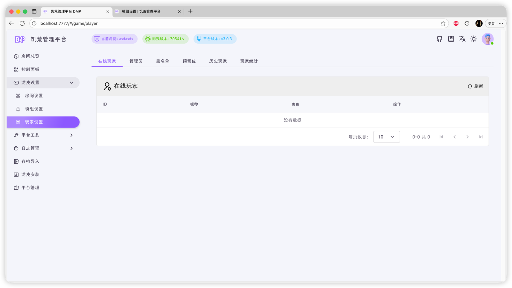
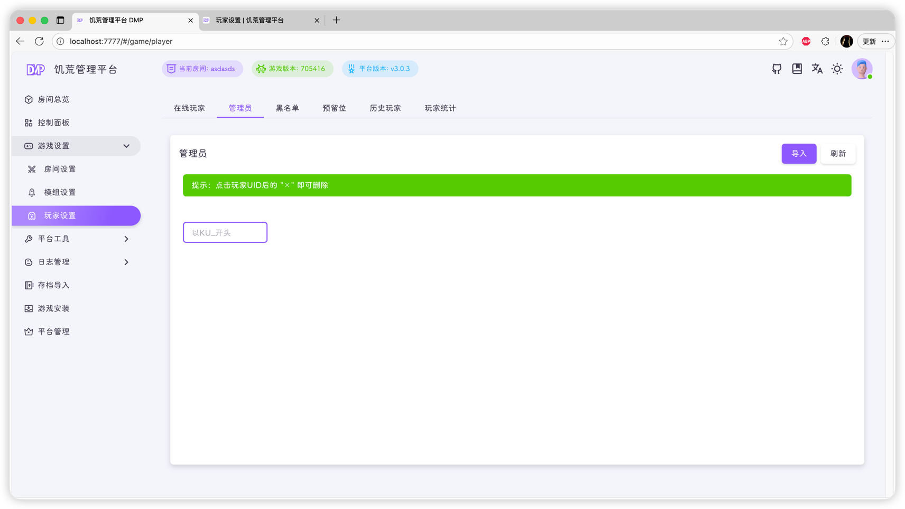
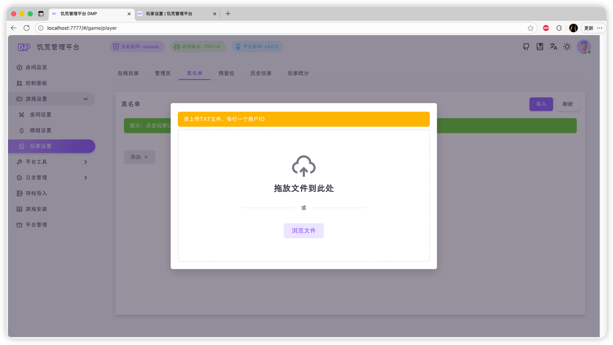
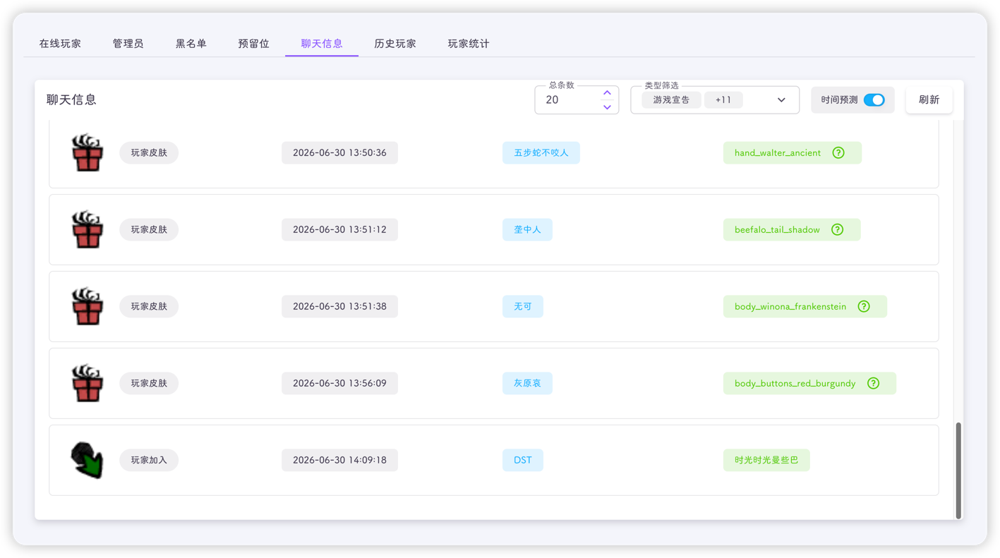
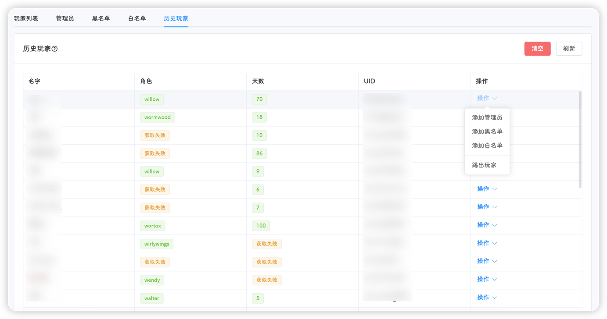
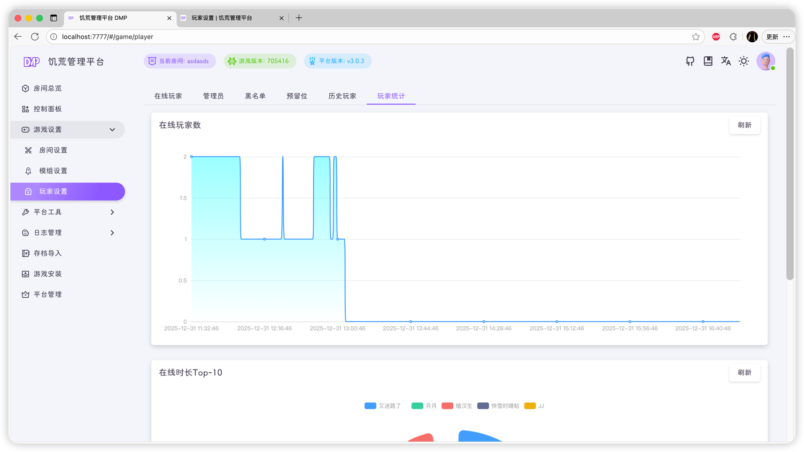
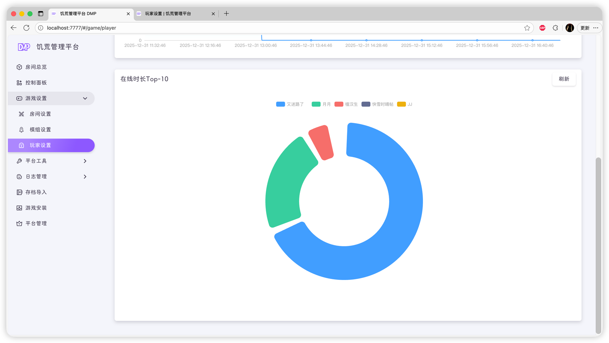

::: important
需要注意的就是：添加完管理员、黑名单、预留位，需要重启游戏服务器才能生效
:::

## 在线玩家

该页面会展示当前在游戏中的玩家，右侧操作按钮可快捷添加管理员、黑名单、预留位

## 管理员

可以手动输入`科雷ID`或批量导入，导入文件的格式为`TXT`，每行一个`科雷ID`

此页面添加的管理员玩家在游戏中拥有管理员权限

::: tip
添加或删除后，需要重启游戏才能生效
::: 

## 黑名单

可以手动输入`科雷ID`或批量导入，导入文件的格式为`TXT`，每行一个`科雷ID`

该页面添加的玩家无法进入游戏

::: tip
添加或删除后，需要重启游戏才能生效
:::

## 预留位

可以手动输入`科雷ID`或批量导入，导入文件的格式为`TXT`，每行一个`科雷ID`

该页面添加n个玩家后，可进入游戏的陌生玩家为玩家数-n，预留位中的玩家可以在任意时间加入游戏

::: tip
添加或删除后，需要重启游戏才能生效
:::

## 聊天信息

该页面可以显示玩家的聊天记录及系统通知等信息

可以在右上角进行消息类型筛选及时间预测

## 历史玩家

在你存档游玩过的玩家会显示在这个页面，，右侧操作按钮可快捷添加管理员、黑名单、预留位

## 玩家统计

展示当前房间最近的玩家数量

自平台开始运行到现在，当前存档玩家在线时长top-10，8分钟算一天

::: tip
可能存在玩家进游戏后没有选择角色情况，所以会出现统计显示的天数大于游戏的实际天数
:::
