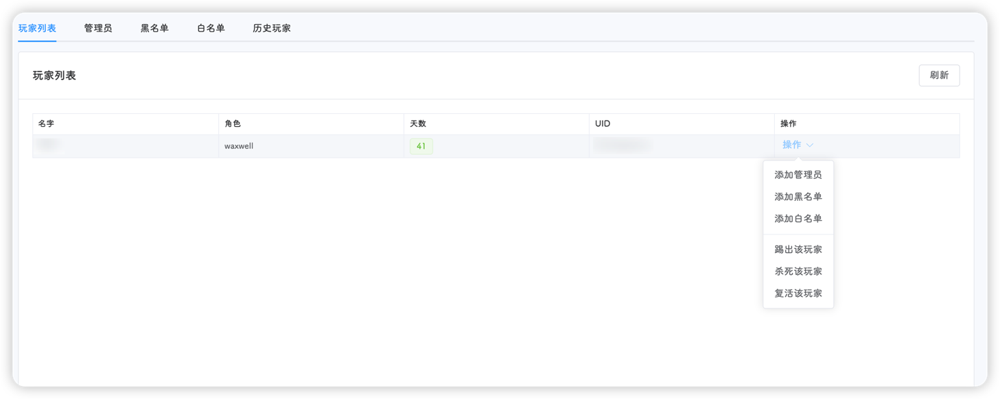

::: tip
该页面位于 **设置-玩家**，包含**玩家列表**、**管理员**、**黑名单**、**白名单**和**历史玩家**五个标签页
:::

## 玩家列表

显示当前存档中，正在游戏的玩家列表

玩家列表依次显示玩家的名字、角色、天数和UI，并提供添加管理员、白名单、黑名单和提出的快捷操作

::: tip
如上图所示，可能会出现**获取失败**的情况，原因为该玩家刚刚加入游戏，饥荒服务器没有为他创建对应的`meta`存档文件，因此获取失败；
如果出现玩家天数不对的情况，原因可能为：饥荒管理平台会优先从主节点(默认为地面)获取玩家的存档信息，如果该玩家在洞穴很长时间 !!穴居人不知道在干嘛!!，并没有回到地面过，则会造成这种情况。
:::