:::tip 
该页面位于 **游戏设置-房间设置**
:::

## 房间设置

房间设置需要用户输入一些必填项和非必填项

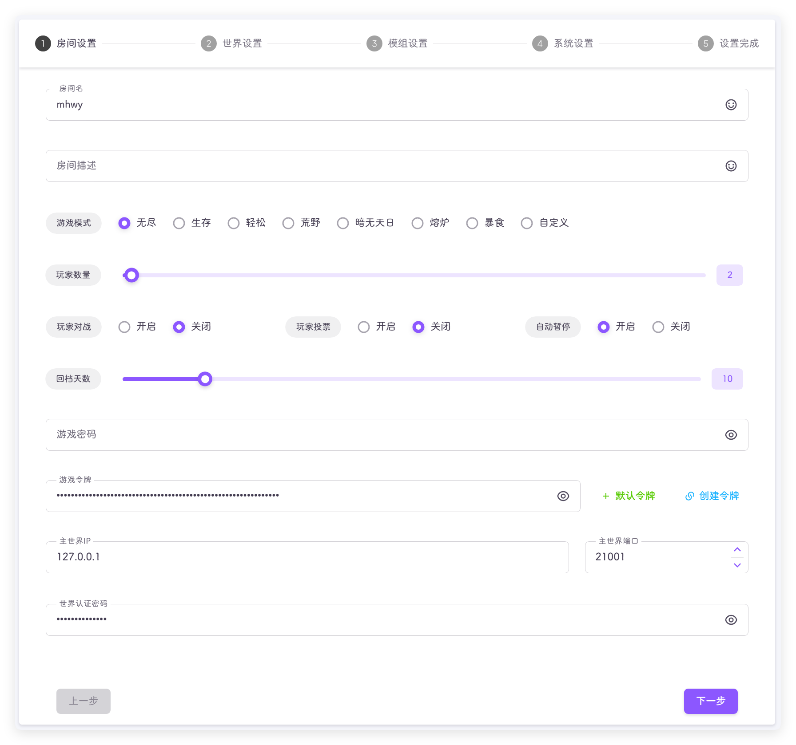

以下加粗项为为必填

- **房间名**：即存档名，可在游戏中的浏览游戏页面搜索房间名来进入游戏，右侧可以插入饥荒游戏表情😘，对应`cluster_name`
- 房间描述：描述字段，会在游戏的详情中展示，对应`cluster_description`
- 游戏模式：目前分为无尽、生存、轻松、荒野、暗无天日、熔炉、暴食和自定义默认无尽，对应`game_mode`
- 玩家数量：游戏中的最大玩家数，对应`max_players` !!该设置的最小值为2，真的不想让你一个人玩《饥荒==联机版==》啊!!
- 玩家对战：默认为关闭，开启后玩家之间可进行攻击，对应`pvp` !!什么大乱斗!!
- 玩家投票：默认否，玩家能否在游戏中发起投票，如果开启，玩家可在游戏中投票踢人、回档、重置世界，对应`vote_enabled`与`vote_kick_enabled`
- 自动暂停：游戏中没有玩家时是否暂停游戏，对应`pause_when_empty`
- 回档天数：也就是最大可回档的天数，即配置文件中的 `snapshot`，该值越大，你的存档文件就越大，回档天数越多，回档代码 `c_rollback(15)` 回15天
- 房间密码：进入你的存档是否要输入密码，无密码就不填，对应`cluster_password`
- **令牌**：饥荒服务器的令牌，需要去klei官网申请，详细步骤在[快速上手-令牌申请](../../quick-start/token.md)页面，也可以使用默认令牌，对应`cluster_token.txt`
- 主世界IP：主节点不允许修改，默认为127.0.0.1，如果是从节点，且主节点也在当前服务器，填写127.0.0.1，如果主节点不在当前服务器，则需要填写主节点的公网IP，对应`master_ip`
- 主节点端口：不建议修改，一个集群中的主节点端口必须一致，配置文件中的 `master_port`
- 世界认证密码：任意字符串，整个集群的认证密码必须一致，否则从节点无法连接主节点，整个集群的认证密码必须一致，否则从节点无法连接主节点 平台使用随机字符作为认证密码，自己设置需要强密码，对应`cluster_key` !!小心被攻击，存档没咯!!
- 局域网模式：顾名思义，将网络模式设置为局域网模式，对应`lan_only_cluster` `>=v3.0.6`
- 离线模式：顾名思义，将网络模式设置为离线模式，对应`offline_cluster` `>=v3.0.6`
- Steam群组ID：顾名思义，对应`steam_group_id` `>=v3.0.6`
- 仅Steam群组：只有填写了Steam群组ID才能修改，指仅群组内的玩家才能加入该房间，游戏中会显示**私人群组服务器**，对应`steam_group_only` `>=v3.0.6`
- 群组默认管理：群组成员在游戏内默认为饥荒管理员，对应`steam_group_admins` `>=v3.0.6`

以上配置输入完成后，点击下一步即可

::: important
所有必填项会经过验证，如填写内容不符合要求，则无法进入下一步

请勿滥用默认令牌，仅限测试
:::

上述所有配置对应的文件为：
```text
.klei/DoNotStarveTogether/Cluster_{房间ID}/cluster.ini
.klei/DoNotStarveTogether/Cluster_{房间ID}/cluster_token.txt
```

## 世界设置

该步骤将对当前存档的世界进行配置

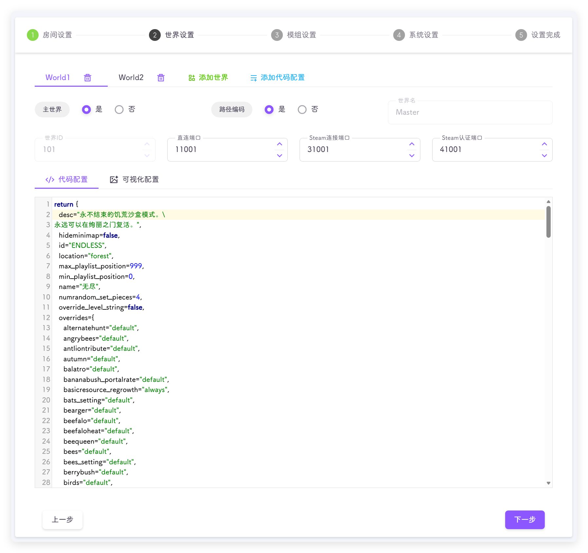

### 基本配置

下图中的基本配置平台会自动填入，不建议修改，否则可能产生冲突

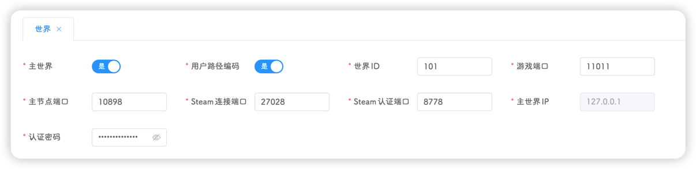

- **主世界**：是否为主世界，请注意，一个集群中，只能包含一个主世界，对应`is_master`
- **用户路径编码**：建议打开，饥荒会对用户的存档路径目录进行编码，降低识别失败的概率，对应`encode_user_path`
- **世界名**：世界文件夹的名称，后面在日志查询也是同样的名称，禁止修改，对应`name`
- **世界ID**：世界的ID，禁止修改，对应`id`
- **直连端口**：玩家连接游戏的UDP端口，即直连代码的端口项，对应`server_port`
- **Steam连接端口**：不建议修改，配置文件中对应 `server_master_port`
- **Steam认证端口**：不建议修改，配置文件中对应 `authentication_port`

### 添加世界

点击右上角的**添加世界**按钮，即可完成世界的添加，代码配置需要使用[世界设置](#世界设置)完成添加

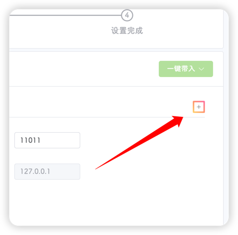

::: warning
如果是手动从本地复制，平台会自动检测输入的配置是否合法，并给出相应的提示
非管理员用户可能会受到世界创建数量的限制，具体请查看[用户体系](../users.md)
:::

::: tip
[多台云服务器串联开服](../../faq/dmp/multi-server.md)
:::

### 世界设置

添加新的世界**代码配置**是空的，点击上方的添加配置代码，选择对应的选项，会自动填入世界设置的`lua`配置文件，

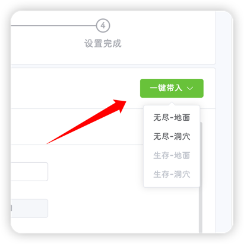

正确填入配置后，**可视化配置**标签页出现，可以进行可视化配置

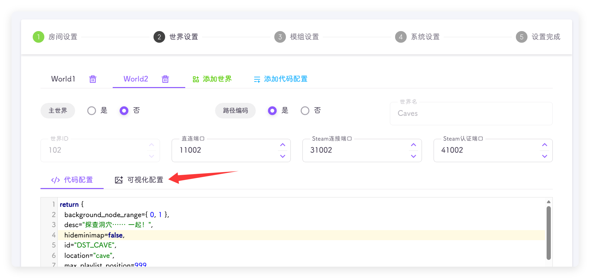

点击标签页切换后，即可进行可视化配置

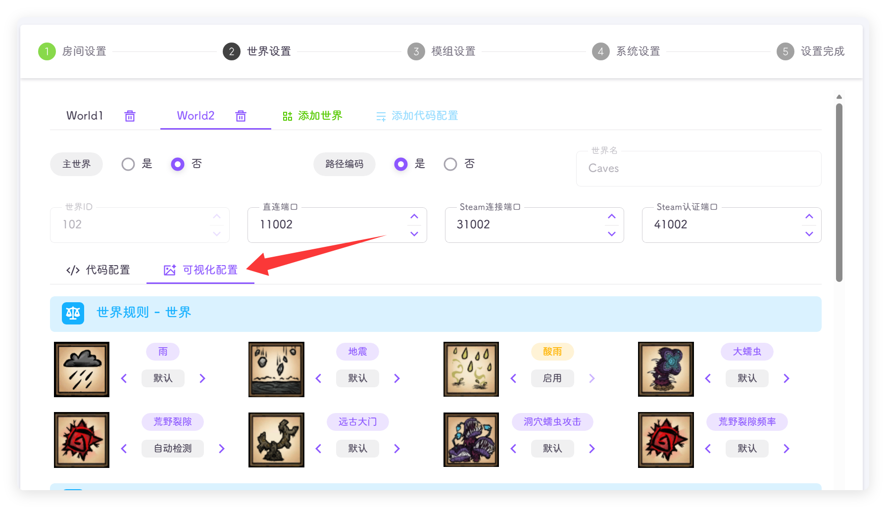

可视化配置中，与默认生存不一样的配置项会高亮显示

### 删除世界

点击世界标签页右边的 ::trash-can:: 即可

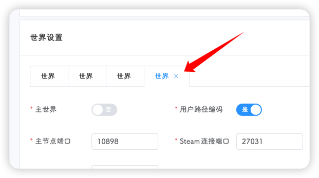

::: tip
删除世界会有二次确认
:::

上述所有配置对应的文件为：
```text
.klei/DoNotStarveTogether/Cluster_{房间ID}/{世界名}/server.ini
.klei/DoNotStarveTogether/Cluster_{房间ID}/{世界名}/leveldataoverride.lua
```

当所有世界都配置完成后，点击下一步即可

## 模组设置

此配置项用于配置模组，如果不添加任何模组，保持该输入框为空，点击下一步即可，如果需要添加，则复制游戏自动生成的模组配置文件


如果不想通过游戏进行设置，也可保持为空，通过[模组设置](mod.md)页面进行配置

### 统一设置
是大家常用的设置，所有世界模组配置相同，如果你不知道选那个，那就是用这个

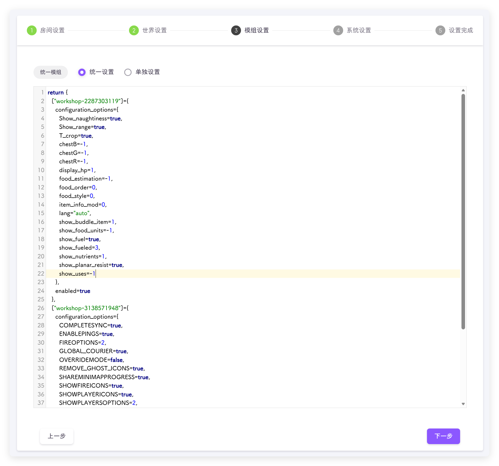


### 单独设置
针对有特殊需求的玩家，需要单独设置世界的模组功能选项，使用单独设置会改变[模组设置](mod.md)页面的样式，详细可以查看文档说明

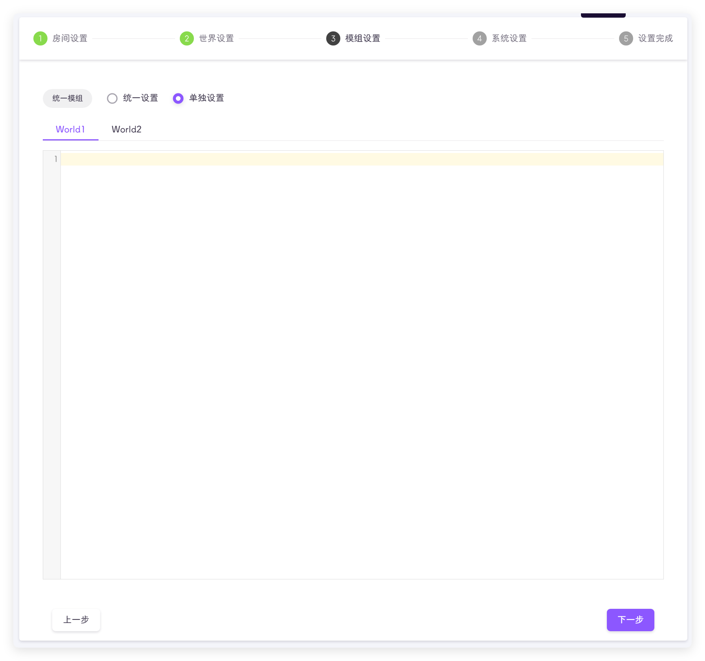

::: tip
如果你添加了模组配置，平台会自动校验模组配置的格式，并给出对应的提示
:::

上述所有配置对应的文件为：
```text
.klei/DoNotStarveTogether/Cluster_{房间ID}/{世界名}/modoverrides.lua
```

## 系统设置
平台针对房间的一些功能设置

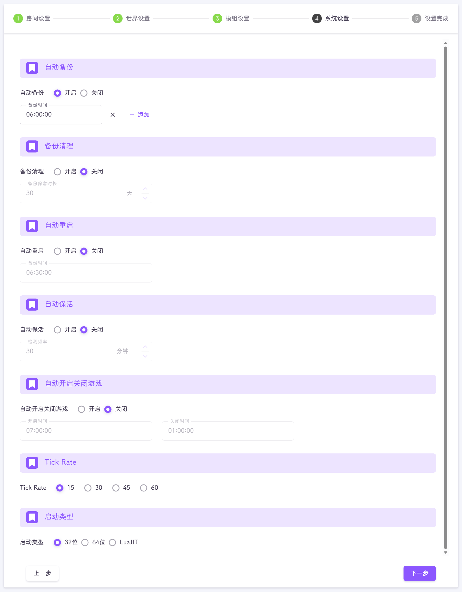

### 自动备份
在指定时间，备份当前饥荒服务器，该功能默认开启

默认的备份时间为每天 `06:00:00`

::: tip
你可以添加多个备份时间
:::

生成的备份会将该文件保存在 `dmp_files/backup/房间ID/` 文件夹中

备份文件可以直接恢复为饥荒本地存档

### 备份清理

该功能默认关闭，会定时清理自动、手动创建的存档备份文件

如果开启此功能，需要设置大于0的数字，如设置30，则会删除30天前创建的备份文件

### 自动重启

该功能默认关闭，开启后会在设置时间重启饥荒服务器

自动重启是为了自动更新模组，建议重启时间设置为无人游戏的时候

### 自动保活
该功能会自动恢复异常的饥荒服务器

该功能默认开启，检测频率默认为30分钟

::: warning
此功能的运行对**检测频率**十分敏感

---

举个例子，如果设置频率为30分钟，平台在13:00分检测到服务器正常，平台将13:00记录为正常；13:14分服务器崩溃，平台在13:30分进行检测时，会获取到上次正常获取玩家列表的时间为13:14分，13:14≠13:00，因此会判断服务器正常，不会重启服务器，应记录13:14为正常；14:00平台再一次获取玩家列表的时间是13:14，该记录与13:30记录的13:14一致，所以平台会标记当前饥荒服务器为异常，执行重启。

- 上述文字对应的时间线： 

| 实际时间  |                           饥荒服务器状态                           | 平台标记的正常时间 | 平台是否重启饥荒服务器 |
|:-----:|:-----------------------------------------------------------:|:---------:|:-----------:|
| 13:00 | <span style="color: #67C23A; font-weight: bolder">正常</span> |   12:30   |    **否**    |
| 13:14 | <span style="color: #F56C6C; font-weight: bolder">异常</span> |   13:00   |    **否**    | 
| 13:30 | <span style="color: #F56C6C; font-weight: bolder">异常</span> |   13:14   |    **否**    |
| 14:00 | <span style="color: #F56C6C; font-weight: bolder">异常</span> |   13:14   |    **是**    |

---

可以看到，将检测频率这是为30分钟的局限性是：服务器13:14分就异常了，但是平台执行重启操作在14:00，中间间隔了46分钟，理论上检测频率为30分钟的最大间隔为59分钟

**如果对饥荒服务器是否正常运行比较在意的同学，可以适当将检测频率调小一点，但注意不要过小(1分钟)，否则会导致异常重启**
:::

### 自动开启关闭游戏

顾名思义，在指定的时间开启或关闭饥荒服务器

### Tick Rate

Tick Rate是一个核心参数，直接影响游戏的响应速度、同步精度、网络流量和服务器负载

::: info
**响应速度与流畅度**
- 高 Tick Rate
    - 动作更即时：玩家操作到服务器响应的延迟更低
    - 战斗更精准：伤害判定、命中检测更细腻
- 低 Tick Rate
    - 可能出现"打中但未命中"的同步问题

---

**网络流量与带宽**
- 高 Tick Rate
    - 数据包更频繁 → 占用更多带宽(每个玩家上行/下行流量增加)；30 tick服务器 vs 60 tick服务器，后者流量接近翻倍
- 低 Tick Rate
    - 节省带宽，适合网络条件差或玩家数量多的场景

---

**服务器性能消耗**
- 高 Tick Rate
    - CPU需更频繁处理游戏逻辑 → 服务器负载更高，可能需更强硬件
    - 若硬件不足，会导致Tick丢失(实际更新率低于设定值)
- 低 Tick Rate
    - 对CPU压力小，低成本服务器也能支持更多玩家

---

**同步精度**
- 高 Tick Rate
    - 玩家间位置、状态同步更实时，减少"瞬移"、"穿墙"等同步问题
- 低 Tick Rate
    - 同步间隔大，高速移动单位可能表现不连贯
:::

::: warning
如果玩家本身的延迟就很高，饥荒服务器的高Tick Rate反而会放大抖动，降低玩家体验
:::

::: important
Tick Rate还需客户端同步配置，如果服务器为60tick，客户端为15tick，那么将以15tick进行通信
:::

### 启动类型

共有3种饥荒服务器启动类型，分别是：
- **32位**
- **64位**
- **LuaJIT**

::: tip
如果你不是很懂，那就默认32位
:::

::: info
- 64位
    - 更高效的CPU指令集（如SSE/AVX）和寄存器利用，提升计算性能（如物理模拟、生物逻辑）
    - 减少内存分页切换，降低延迟（对高负载服务器重要）
- 32位
    - 内存占用略低（指针和数据类型更小），但对DST服务器影响微乎其微

- LuaJIT
  - 大部分代码比标准 Lua 快 5-20 倍
  - 更小的内存占用(相对)
  - 更高效的垃圾回收
:::

### Webhook 通知

::: info
该功能由`v3.1.5`版本加入
:::

当你的饥荒管理平台主动或自动执行了一些操作后，你希望能够收到通知，那么你可以使用此功能

::: tip
你可以配置一个或多个webhook
:::

你需要输入此webhook的名称，URL，选择需要通知的事件和密钥

- **名称**
  - 必填项
  - 好的名称能够体现此webhook的用途，例如QQ-Mail、DingTalk、Wechat等
- **URL**
  - 必填项，例如：`https://my-webhook.test/webhook`
  - 只支持`http`或`https`
  - `POST`方法
  - 不允许传递`query`参数
  - 不允许传递`fragment`参数
- **通知事件**
  - 该webhook订阅的事件，`至少选择一项`
  - 房间创建
  - 房间删除
  - 房间修改
  - 房间激活
  - 房间关闭
  - 游戏备份
  - 游戏重置
  - 游戏启动
  - 游戏关闭
  - 游戏更新
  - 自动保活
  - 玩家管理
  - 平台设置修改
  - 虚拟终端连接
  - 在线玩家变化
- 签名密钥
  - 可选项
  - 你的webhook可能暴露在公网上，需要鉴权，不能让所有人都能调用
  - 使用`HMAC-SHA256`加密算法
  - 配置后会携带`X-DMP-Signature`请求头

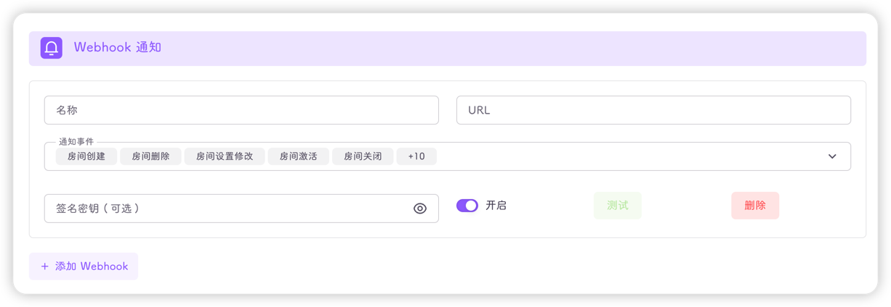

可以点击测试按钮进行测试

```json title="接收到的测试消息" :collapsed-lines=10
{
  "event": {
    "type": "test",
    "zh": "测试",
    "en": "Test"
  },
  "timestamp": 1782805255008,
  "data": "这是一条测试消息 / This is a test message"
}
```

下面是一个使用`python`语言编写的webhook脚本，并附带签名校验

```python title="一个简单的带验证的webhook脚本" :collapsed-lines=10
from flask import Flask, request, jsonify
import hmac
import hashlib
import json
import logging
import os


app = Flask(__name__)

def setup_logging():
    logger = logging.getLogger(__name__)
    logger.setLevel(logging.DEBUG)
    
    if logger.hasHandlers():
        logger.handlers.clear()
        
    formatter = logging.Formatter(
        '%(asctime)s - %(levelname)s - %(message)s',
        datefmt='%Y-%m-%d %H:%M:%S'
    )
    
    console_handler = logging.StreamHandler()
    console_handler.setLevel(logging.DEBUG)
    console_handler.setFormatter(formatter)
    logger.addHandler(console_handler)

    file_handler = logging.FileHandler('webhook.log', encoding='utf-8')
    file_handler.setLevel(logging.INFO)
    file_handler.setFormatter(formatter)

    class BodyFilter(logging.Filter):
        def filter(self, record):
            return '请求体' in record.getMessage()

    file_handler.addFilter(BodyFilter())
    logger.addHandler(file_handler)

    return logger

logger = setup_logging()

SECRET = os.environ.get('WEBHOOK_SECRET', 'your-secret-key-here')
if not SECRET or SECRET == 'your-secret-key-here':
    logger.warning("⚠️ SECRET 未配置或使用默认值，请设置环境变量 WEBHOOK_SECRET")


def verify_signature(data: bytes, signature: str) -> bool:
    if not signature:
        logger.warning("请求头缺少 X-DMP-Signature")
        return False

    mac = hmac.new(SECRET.encode('utf-8'), data, hashlib.sha256)
    expected_signature = mac.hexdigest()

    return hmac.compare_digest(expected_signature, signature)


@app.route('/webhook', methods=['POST'])
def webhook():
    body = request.get_data()

    print("=" * 50)
    print(f"收到 webhook 请求")
    print(f"客户端 IP: {request.remote_addr}")
    print(f"User-Agent: {request.headers.get('User-Agent', 'Unknown')}")

    # 打印请求体原始数据到屏幕（调试用）
    print(f"请求体原始数据: {body}")

    # 尝试解析 JSON 并打印格式化内容到屏幕
    try:
        json_data = json.loads(body.decode('utf-8'))
        print(f"请求体 JSON 内容:\n{json.dumps(json_data, indent=2, ensure_ascii=False)}")
        # 同时记录到文件（只记录 body 内容）
        logger.info(f"请求体 JSON 内容:\n{json.dumps(json_data, indent=2, ensure_ascii=False)}")
    except (json.JSONDecodeError, UnicodeDecodeError) as e:
        print(f"请求体不是有效的 JSON: {e}")
        # 如果是非 JSON，记录原始内容到文件
        try:
            body_str = body.decode('utf-8')
            logger.info(f"请求体原始内容: {body_str}")
        except:
            logger.info(f"请求体二进制内容: {body.hex()}")

    # 获取签名
    signature = request.headers.get('X-DMP-Signature', '')
    print(f"请求头 X-DMP-Signature: {signature}")

    # 强制验证签名
    if not verify_signature(body, signature):
        print("❌ 签名验证失败 - 请求被拒绝")
        logger.error("签名验证失败")
        return jsonify({
            'code': 401,
            'message': 'Unauthorized: Invalid or missing signature',
            'error': 'Signature verification failed'
        }), 401

    print("✅ 签名验证成功")

    # 返回成功响应
    return jsonify({
        'code': 200,
        'message': 'Webhook received successfully',
        'data': {
            'received': True,
            'timestamp': request.headers.get('X-DMP-Timestamp', '')
        }
    }), 200


@app.errorhandler(404)
def not_found(error):
    """404 错误处理"""
    print(f"404 错误: {request.path}")
    return jsonify({
        'code': 404,
        'message': 'Not Found'
    }), 404


@app.errorhandler(405)
def method_not_allowed(error):
    """405 错误处理"""
    print(f"405 错误: {request.method} {request.path}")
    return jsonify({
        'code': 405,
        'message': 'Method Not Allowed'
    }), 405


@app.errorhandler(500)
def internal_error(error):
    """500 错误处理"""
    print(f"500 内部错误: {error}")
    return jsonify({
        'code': 500,
        'message': 'Internal Server Error'
    }), 500


if __name__ == '__main__':
    print("=" * 50)
    print("Webhook 服务启动")
    print(f"监听地址: 0.0.0.0:5000")
    print(f"请求 body 将记录到: webhook.log")
    print("=" * 50)
    # 启动服务
    app.run(host='0.0.0.0', port=5000, debug=False)
```

下方是饥荒管理平台调用webhook的请求体示例

```json title="平台设置修改" :collapsed-lines=100
{
  "event": {
    "type": "global_setting_updated",
    "zh": "平台设置修改",
    "en": "Platform Settings Updated"
  },
  "timestamp": 1782802623354,
  "name": "QQ-BOT",
  "data": {
    "dbUpdated": true
  }
}
```

```json title="在线玩家变化 加入1 离开0" :collapsed-lines=100
{
  "event": {
    "type": "online_player_updated",
    "zh": "在线玩家变化",
    "en": "Online Player Updated"
  },
  "timestamp": 1782762705716,
  "name": "QQ-BOT",
  "data": {
    "current": [
      {
        "uid": "KU_********",
        "nickname": "花花",
        "prefab": "wx78"
      },
      {
        "uid": "KU_********",
        "nickname": "小布尔乔亚",
        "prefab": ""
      },
      {
        "uid": "KU_********",
        "nickname": "x_x",
        "prefab": "wendy"
      },
      {
        "uid": "KU_********",
        "nickname": ">=<",
        "prefab": "wx78"
      }
    ],
    "exited": null,
    "gameID": 1,
    "gameName": "测试房间",
    "joined": [
      {
        "uid": "KU_********",
        "nickname": "小布尔乔亚",
        "prefab": ""
      }
    ]
  }
}
```

## 设置完成

到这一步，代表配置已经完成了，可以执行不同的操作；如果直接退出该页面，平台不会保存任何内容

点击 **保存** 才会保存当前的配置，保存完后会跳转到 **房间设置** 页面，这是可以去 **模组设置** 添加模组，或者去 **控制面板** 启动游戏


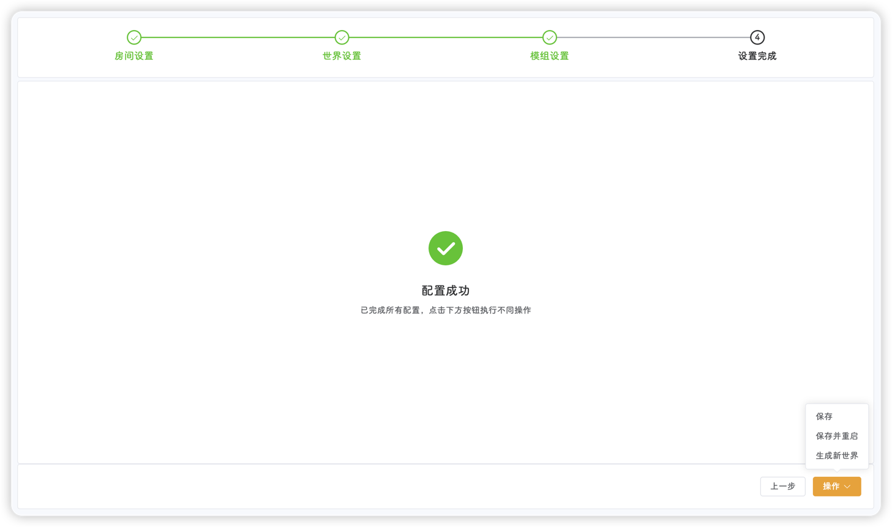

