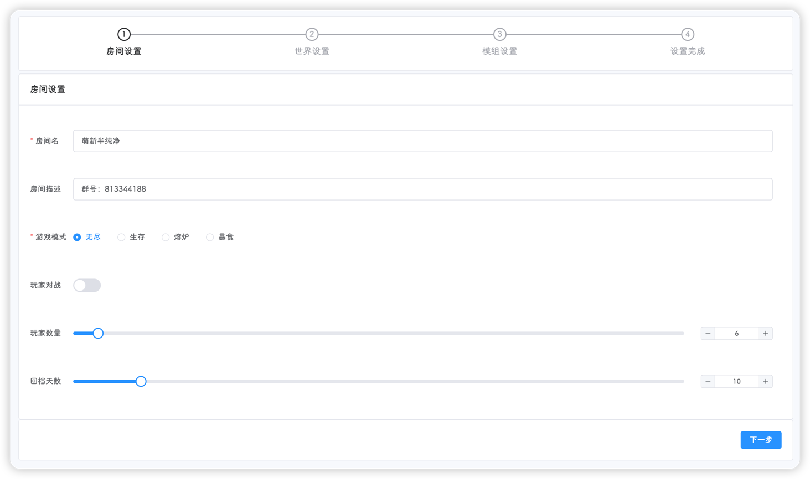
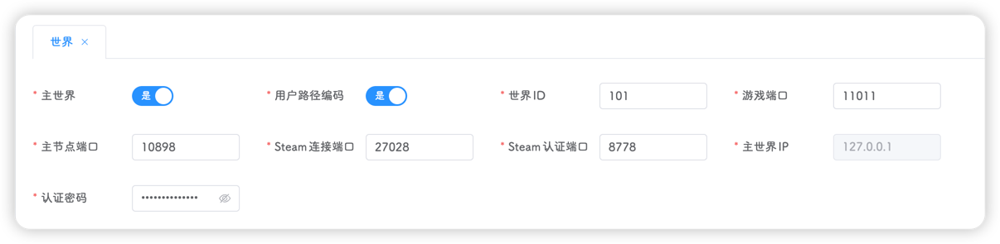
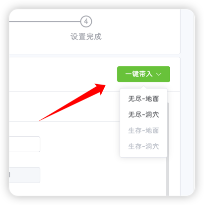
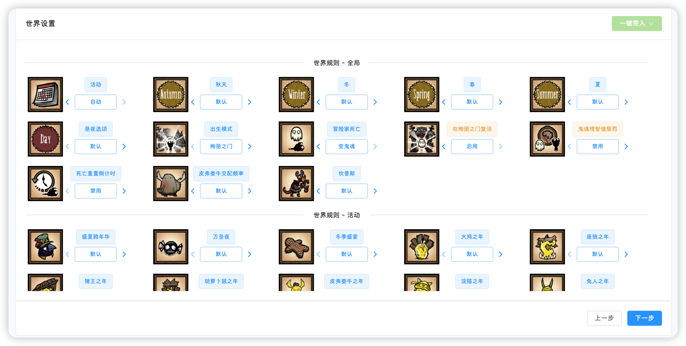
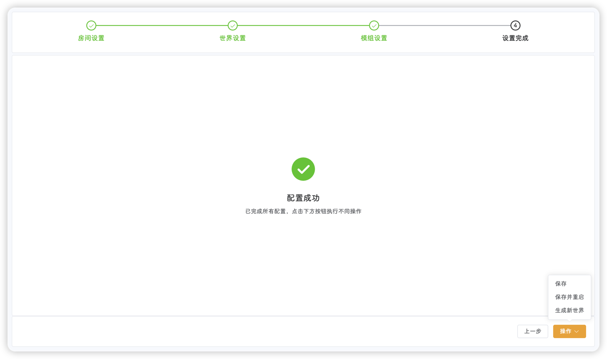

:::tip 
该页面位于 **设置-房间**
:::

## 房间设置

房间设置需要用户输入一些必填项和非必填项

以下加粗项为为必填

- **房间名**：即存档名，可在游戏中的浏览游戏页面搜索房间名来进入游戏
- 房间描述：描述字段，会在游戏的详情中展示
- **游戏模式**：目前分为无尽、生存、熔炉、暴食
- 玩家对战：默认为关闭，开启后玩家之间可进行攻击 !!什么大乱斗!!
- 玩家数量：游戏中的最大玩家数 !!该设置的最小值为2，真的不想让你一个人玩《饥荒==联机版==》啊!!
- 回档天数：也就是最大可回档的天数，即配置文件中的snapshot，该值越大，你的存档文件就越大，回档天数越多`c_rollback(15) 回15天`
- 玩家投票：默认否，玩家能否在游戏中发起投票，如果开启，玩家可在游戏中投票踢人、回档、重置世界
- 房间密码：进入你的存档是否要输入密码，无密码就不填
- **令牌**：饥荒服务器的令牌，需要去klei官网申请，详细步骤在[快速上手-令牌申请](../../quick-start/token.md)页面

以上配置输入完成后，点击下一步即可

::: tip
所有必填项会经过验证，如填写内容不符合要求，则无法进入下一步
:::

## 世界设置

该步骤将对当前存档的世界进行配置

#### 基本配置

下图中的基本配置平台会自动填入，不建议修改，否则可能产生冲突

- **主世界**：是否为主世界，请注意，一个集群中，只能包含一个主世界
- **用户路径编码**：建议打开，饥荒会对用户的存档路径目录进行编码，降低识别失败的概率
- **世界ID**：世界的ID，不建议修改，一个集群中所有的世界ID不能重复，且世界ID不能小于2
- **游戏端口**：玩家连接游戏的UDP端口，即直连代码的端口项
- **主节点端口**：不建议修改，配置文件中的`master_port`，一个集群中的主节点端口必须一致
- **Steam连接端口**：不建议修改，配置文件中对应`server_master_port`
- **Steam认证端口**：不建议修改，配置文件中对应`authentication_port`
- **主世界IP**：主节点不允许修改，默认为127.0.0.1，如果是从节点，且主节点也在当前服务器，填写127.0.0.1，如果主节点不在当前服务器，则需要填写主节点的公网IP
- **认证密码**：任意字符串，整个集群的认证密码必须一致，否则从节点无法连接主节点

#### 世界设置

点击右上角的一键带入按钮，选择地面或者洞穴，会自动填入世界设置的`lua`配置文件

正确填入配置后，**可视化配置**标签页出现，可以进行可视化配置

点击标签页切换后，即可进行可视化配置

可视化配置中，与默认生存不一样的配置项会高亮显示

#### 添加世界

点击右上角的 ::plus:: 按钮，即可完成世界的添加，平台也会自动填写基本配置

::: tip
平台会自动检测输入的配置是否合法，并给出相应的提示
非管理员用户可能会受到世界创建数量的限制，具体请查看[用户体系](../users.md)
:::

#### 删除世界

点击世界标签页右边的 ::xmark:: 即可

当所有世界都配置完成后，点击下一步即可

#### 加入其他虚拟机世界

如果需要加入大型模组，2C2G的配置不够用，可以通过多台机器创建同一个世界，由此来分担虚拟机性能压力

例如，有两台虚拟机，**公网IP**分别为`1.1.1.1`和`2.2.2.2`

1. 在`1.1.1.1`和`2.2.2.2`分别安装饥荒管理平台，并分别创建相同的集群，在房间设置的第一步填写的内容一致

2. `1.1.1.1`上创建一个主世界，操作步骤与前面一致

3. `2.2.2.2`上创建一个从世界，其中主世界IP填写`1.1.1.1`即可

4. `1.1.1.1`和`2.2.2.2`的模组配置保持一致

## 模组设置

此配置项用于配置模组，如果不添加任何模组，保持该输入框为空，点击下一步即可，如果需要添加，则复制游戏自动生成的模组配置文件

如果不想通过游戏进行设置，也可保持为空，通过[设置-模组](mod.md)页面进行配置

::: tip
如果你添加了模组配置，平台会自动校验模组配置的格式，并给出对应的提示
:::

如果创建的世界个数超过了2个，则需要添加多层世界模组，点击**多层世界**按钮进行配置

分别输入世界对应的ID，游戏中显示的世界名和世界最大玩家数，点击生成配置即可进行复制粘贴

::: caution
复制的模组配置为整体模组配置的一部分，需要添加至指定位置；如果只添加这一个模组，还需要添加`return`等相关格式，否则会出现异常
!!一开始是做了一键插入功能，但是bug蛮多的，逻辑还复杂，就放弃了，改用手动复制粘贴!!
:::

::: warning
如果启用了多层世界模组，会导致[设置-模组](mod.md)页面不可用
!!原因是这种模组的配置和其他的模组配置不一样，其他模组的configuration_options中都是变量，这种模组(目前已经发现了好几个)的configuration_options中含有table，也懒得适配了!!
:::

## 设置完成

到这一步，代表配置已经完成了，可以执行不同的操作；如果直接退出该页面，平台不会保存任何内容

- **保存**：保存当前的配置
- **保存并重启**：字面意思
- **生成新世界**：保存配置后，发送`c_regenerateworld()`指令到饥荒服务器

::: tip
**保存**和**保存并重启**不依赖于饥荒服务器，任何时候都可执行，**生成新世界**需要饥荒服务器正常运行
:::

