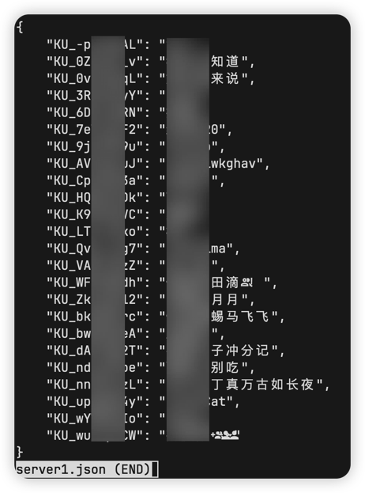
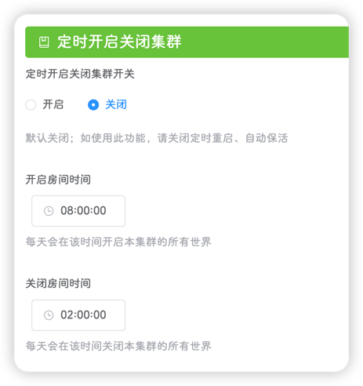

::: tip
该页面位于 **设置-系统**
:::

系统设置分为两部分：**全局设置**和**集群设置**，全局设置影响整个平台的所有集群，仅管理员可修改，集群设置影响当前集群，管理员和拥有对应集群权限的用户可修改

## 全局设置

#### 玩家列表

可配置获取游戏玩家列表的获取频率，单位为秒


::: tip
该功能不可关闭
:::

定义获取频率为`x`秒，平台会获取对应集群的所有**正在运行**的世界，如果有主世界，则在主世界执行获取命令，如果没有，则在所有的世界中执行获取命令，直到执行成功。如果所有世界都执行失败，则获取失败

```lua
screen -S \"" + world.ScreenName + "\" -p 0 -X stuff \"for i, v in ipairs(TheNet:GetClientTable()) do  print(string.format(\\\"playerlist %s [%d] %s <-@dmp@-> %s <-@dmp@-> %s\\\", 99999999, i-1, v.userid, v.name, v.prefab )) end$(printf \\\\r)\"
```

平台会根据上述命令的执行结果，将对应的玩家信息例如：玩家昵称、UI、角色等存入缓存，等待使用，缓存最多存放2880个玩家列表，供**工具-玩家统计**页面使用

重启服务器后，缓存会被清除

::: important
**设置-玩家**中的**玩家列表**功能依赖此设置，如果频率越快(`x`越小)，则玩家信息更新越快，但世界日志会越多，建议保持默认`30`秒
:::

#### 昵称字典维护

该功能可关闭(默认开启)，可设置频率(默认为5分钟)


定义频率为`x`分钟，如果该功能开启，平台会每隔`x`分钟，将游戏中的玩家的玩家昵称和UID写入`dmp_files/uid_map/集群名.json`文件中



`dmp_files/uid_map/集群名.json`文件是一个未经加密的`json`文件，`key`是UID，`value`是昵称

如果玩家的昵称有修改过，则会自动更新昵称字典，如果有新玩家加入游戏，也会将新玩家的UID和昵称写入文件

::: important
该功能影响**设置-玩家**页面中的**管理员**、**黑名单**、**白名单**和**历史玩家**，建议保持默认设置
:::

#### 系统监控

平台会每隔`30`秒获取一次`CPU`、`内存`、`网络上传`和`网络下载`的监控数据，并写入缓存，缓存最大长度为720，即最多6个小时的系统监控


此功能默认开启

::: important
该功能影响**工具-系统监控**页面
:::

#### 自动更新

平台会在指定的时间检查饥荒是否有版本更新，如果没有就不执行任何操作，如果有的话，会执行：

- 提前15分钟发出公告，系统将在15分钟后重启

- 关闭所有集群中的所有世界

- 更新游戏

- 启动所有集群的所有世界


::: warning
目前有点业务逻辑问题，如果你在**集群管理**中关闭了某个集群(目的是为了关闭这个集群，不让它再启动)，但是经过游戏更新后还是会被启动起来，这点后续会进行优化(写这个文档时，饥荒管理平台的最新版本是v2.0.4)
:::

#### 玩家更新模组

如果在游戏中遇到了`服务器需要从Steam创意工坊获得最新版本`的提示，代表有模组需要更新了，这时候是无法进入存档的，存档中的玩家会一直收到这个提示

开启此功能，平台会每隔一段时间(对应设置中的频率)引导游戏中的玩家，输入对应指令

如果玩家输入了该指令，服务器就会重启并自动更新模组

::: tip
即使两个世界运行在不同的虚拟机上，也可以自动重启更新模组
:::


此功能原理：

令检查频率为`x`分钟

1. 平台每隔`x`分钟获取饥荒聊天日志的最后100行，如果出现`服务器需要从Steam创意工坊获得最新版本`关键字则进入<2>，否则不执行任何操作

2. 平台生成一个长度为`7`的更新ID，更新ID由大写字母和数字组成

3. 平台向饥荒服务器发送公告，公告内容为：`饥荒管理平台检测到模组需要更新，本次更新ID为XXXXXXX，请输入ID-LKGX进行模组更新`

4. 每隔60秒检查一次玩家聊天日志，如果捕获到`更新ID-LKGX`关键字，则获取其中的更新ID

5. 校验更新ID是否合法，如果合法则进行公告并在1分钟后重启服务器，否则不执行任何操作

::: tip
因为饥荒的主从世界之间会进行聊天记录的同步，因此对应集群下的所有世界都会重启
:::

## 集群设置

#### 自动重启

在指定时间重启饥荒服务器，此功能主要用于自动更新模组，因为饥荒服务器在启动的过程中，会自动检查启用的模组是否有更新，如果有则会自动下载并更新


该功能默认开启，默认的重启时间为每天`06:47:19`，可按需更改

#### 自动备份

在指定时间，备份当前饥荒服务器


该功能默认开启，默认的备份时间为每天`06:13:57`

生成的备份文件名为`年-月-日-时-分-秒.tgz`，会将该文件保存在`dmp_files/backup/集群名`目录

::: tip
为了方便恢复存档，备份文件中还包含一个数据库文件`DstMP.sdb`
:::

#### 自动保活

该功能会自动恢复异常的饥荒服务器


该功能默认开启，检测频率默认为30分钟

自动保活基于**全局设置**中的**玩家列表**获取功能，平台每隔30分钟会检查一次最近一次成功获取玩家列表的**饥荒服务器时间**，如果本次时间与30分钟前的时间一致，就代表服务器异常，执行对应世界的重启；如果时间不一致，则代表饥荒服务器无异常

::: warning
此功能的运行对**检测频率**十分敏感

---
举个例子，如果设置频率为30分钟，平台在13:00分检测到服务器正常，平台将13:00记录为正常；13:14分服务器崩溃，平台在13:30分进行检测时，会获取到上次正常获取玩家列表的时间为13:14分，13:14≠13:00，因此会判断服务器正常，不会重启服务器，应记录13:14为正常；14:00平台再一次获取玩家列表的时间是13:14，该记录与13:30记录的13:14一致，所以平台会标记当前饥荒服务器为异常，执行重启。

- 上述文字对应的时间线，格式为[实际时间] [饥荒服务器当前状态] [平台标记的正常时间] [平台是否重启饥荒服务器]：
  - [13:00] [<span style="color: #67C23A; font-weight: bolder">正常</span>] [12:30] [**否**]
  - [13:14] [<span style="color: #F56C6C; font-weight: bolder">异常</span>] [13:00] [**否**]
  - [13:30] [<span style="color: #F56C6C; font-weight: bolder">异常</span>] [13:14] [**否**]
  - [14:00] [<span style="color: #F56C6C; font-weight: bolder">异常</span>] [13:14] [**是**]

---

可以看到，将检测频率这是为30分钟的局限性是：服务器13:14分就异常了，但是平台执行重启操作在14:00，中间间隔了46分钟，理论上检测频率为30分钟的最大间隔为59分钟

**如果对饥荒服务器是否正常运行比较在意的同学，可以适当将检测频率调小一点，但注意不要过小(1分钟)，否则会导致异常重启**
:::

#### 定时开启关闭集群

在指定的时间开启/关闭饥荒服务器，此功能默认关闭



#### 64位启动

使用64位/32位的饥荒程序来启动饥荒服务器，默认关闭(即使用32位程序启动)


::: tip
- 64位优势
  - 更高效的CPU指令集（如SSE/AVX）和寄存器利用，提升计算性能（如物理模拟、生物逻辑）
  - 减少内存分页切换，降低延迟（对高负载服务器重要）
- 32位优势
  - 内存占用略低（指针和数据类型更小），但对DST服务器影响微乎其微
:::

#### Tick Rate

该配置共有15、30、45和60四个选项，默认为15


Tick Rate是一个核心参数，直接影响游戏的响应速度、同步精度、网络流量和服务器负载

::: tip
**响应速度与流畅度**
- 高 Tick Rate
  - 动作更即时：玩家操作到服务器响应的延迟更低
  - 战斗更精准：伤害判定、命中检测更细腻
- 低 Tick Rate
  - 可能出现"打中但未命中"的同步问题

---

**网络流量与带宽**
- 高 Tick Rate
  - 数据包更频繁 → 占用更多带宽(每个玩家上行/下行流量增加)；30 tick服务器 vs 60 tick服务器，后者流量接近翻倍
- 低 Tick Rate
  - 节省带宽，适合网络条件差或玩家数量多的场景

---

**服务器性能消耗**
- 高 Tick Rate
  - CPU需更频繁处理游戏逻辑 → 服务器负载更高，可能需更强硬件
  - 若硬件不足，会导致Tick丢失(实际更新率低于设定值)
- 低 Tick Rate
  - 对CPU压力小，低成本服务器也能支持更多玩家

---

**同步精度**
- 高 Tick Rate
  - 玩家间位置、状态同步更实时，减少"瞬移"、"穿墙"等同步问题
- 低 Tick Rate
  - 同步间隔大，高速移动单位可能表现不连贯
:::

::: warning
如果玩家本身的延迟就很高，饥荒服务器的高Tick Rate反而会放大抖动，降低玩家体验
:::

::: tip
Tick Rate还需客户端同步配置，如果服务器为60tick，客户端为15tick，那么将以15tick进行通信
:::

## 保存配置

点击右上角的**提交按钮**按钮即可保存设置，如果没有更改设置内容，点击**提交**后不会触发保存操作

