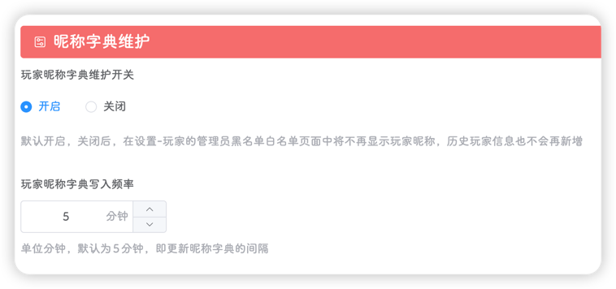
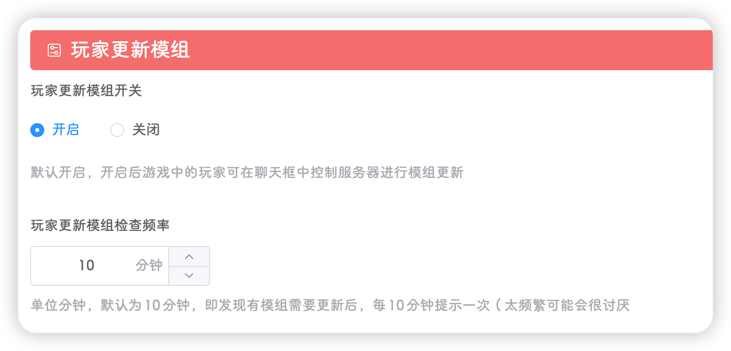

::: tip
该页面位于 **设置-系统**
:::

系统设置分为两部分：**全局设置**和**集群设置**，全局设置影响整个平台的所有集群，仅管理员可修改，集群设置影响当前集群，管理员和拥有对应集群权限的用户可修改

## 全局设置

#### 玩家列表

可配置获取游戏玩家列表的获取频率，单位为秒


::: tip
该功能不可关闭
:::

定义获取频率为`x`秒，平台会获取对应集群的所有**正在运行**的世界，如果有主世界，则在主世界执行获取命令，如果没有，则在所有的世界中执行获取命令，直到执行成功。如果所有世界都执行失败，则获取失败

```lua
screen -S \"" + world.ScreenName + "\" -p 0 -X stuff \"for i, v in ipairs(TheNet:GetClientTable()) do  print(string.format(\\\"playerlist %s [%d] %s <-@dmp@-> %s <-@dmp@-> %s\\\", 99999999, i-1, v.userid, v.name, v.prefab )) end$(printf \\\\r)\"
```

平台会根据上述命令的执行结果，将对应的玩家信息例如：玩家昵称、UI、角色等存入缓存，等待使用，缓存最多存放2880个玩家列表，供**工具-玩家统计**页面使用

重启服务器后，缓存会被清除

::: important
**设置-玩家**中的**玩家列表**功能依赖此设置，如果频率越快(`x`越小)，则玩家信息更新越快，但世界日志会越多，建议保持默认`30`秒
:::

#### 昵称字典维护

该功能可关闭(默认开启)，可设置频率(默认为5分钟)



定义频率为`x`分钟，如果该功能开启，平台会每隔`x`分钟，将游戏中的玩家的玩家昵称和UID写入`dmp_files/uid_map/集群名.json`文件中


`dmp_files/uid_map/集群名.json`文件是一个未经加密的`json`文件，`key`是UID，`value`是昵称

如果玩家的昵称有修改过，则会自动更新昵称字典，如果有新玩家加入游戏，也会将新玩家的UID和昵称写入文件

::: important
该功能影响**设置-玩家**页面中的**管理员**、**黑名单**、**白名单**和**历史玩家**，建议保持默认设置
:::

#### 系统监控

平台会每隔`30`秒获取一次`CPU`、`内存`、`网络上传`和`网络下载`的监控数据，并写入缓存，缓存最大长度为720，即最多6个小时的系统监控


此功能默认开启

::: important
该功能影响**工具-系统监控**页面
:::

#### 自动更新

平台会在指定的时间检查饥荒是否有版本更新，如果没有就不执行任何操作，如果有的话，会执行：

- 提前15分钟发出公告，系统将在15分钟后重启

- 关闭所有集群中的所有世界

- 更新游戏

- 启动所有集群的所有世界


::: warning
目前有点业务逻辑问题，如果你在**集群管理**中关闭了某个集群(目的是为了关闭这个集群，不让它再启动)，但是经过游戏更新后还是会被启动起来，这点后续会进行优化(写这个文档时，饥荒管理平台的最新版本是v2.0.4)
:::

#### 玩家更新模组

如果在游戏中遇到了`服务器需要从Steam创意工坊获得最新版本`的提示，代表有模组需要更新了，这时候是无法进入存档的，存档中的玩家会一直收到这个提示

开启此功能，平台会每隔一段时间(对应设置中的频率)引导游戏中的玩家，输入对应指令

如果玩家输入了该指令，服务器就会重启并自动更新模组

::: tip
即使两个世界运行在不同的虚拟机上，也可以自动重启更新模组
:::



此功能原理：

令检查频率为`x`分钟

1. 平台每隔`x`分钟获取饥荒聊天日志的最后100行，如果出现`服务器需要从Steam创意工坊获得最新版本`关键字则进入<2>，否则不执行任何操作

2. 平台生成一个长度为`7`的更新ID，更新ID由大写字母和数字组成

3. 平台向饥荒服务器发送公告，公告内容为：`饥荒管理平台检测到模组需要更新，本次更新ID为XXXXXXX，请输入ID-LKGX进行模组更新`

4. 每隔60秒检查一次玩家聊天日志，如果捕获到`更新ID-LKGX`关键字，则获取其中的更新ID

5. 校验更新ID是否合法，如果合法则进行公告并在1分钟后重启服务器，否则不执行任何操作

::: tip
因为饥荒的主从世界之间会进行聊天记录的同步，因此对应集群下的所有世界都会重启
:::

## 集群设置