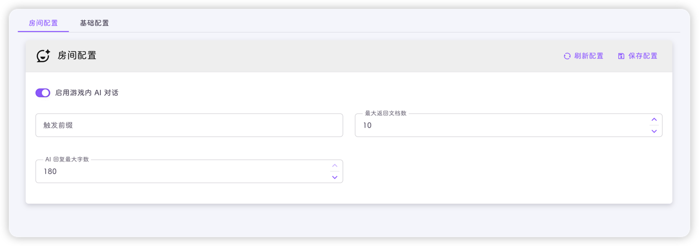
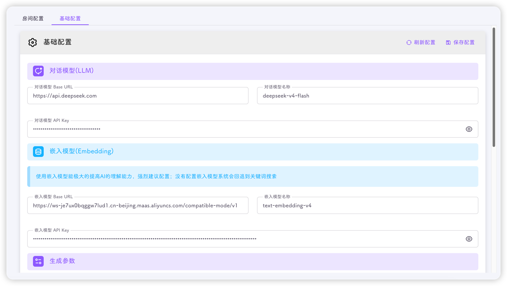
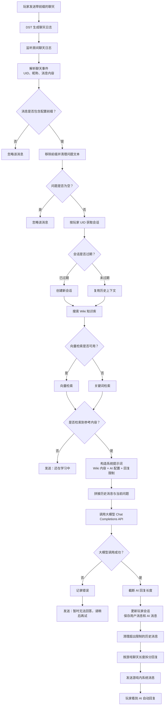
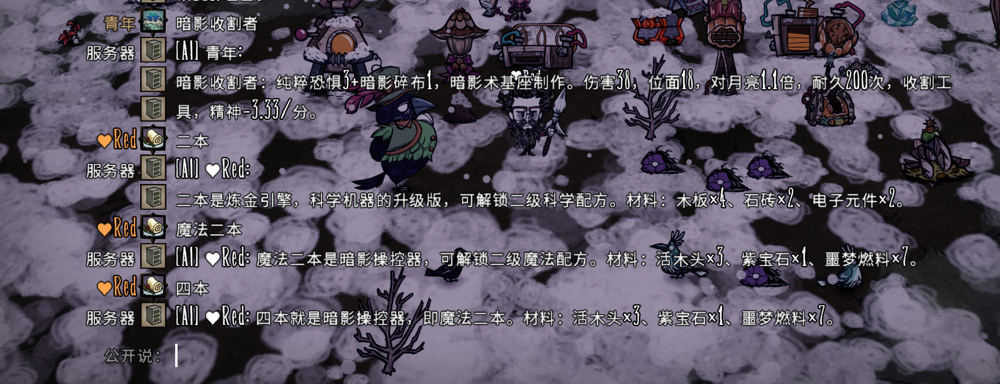
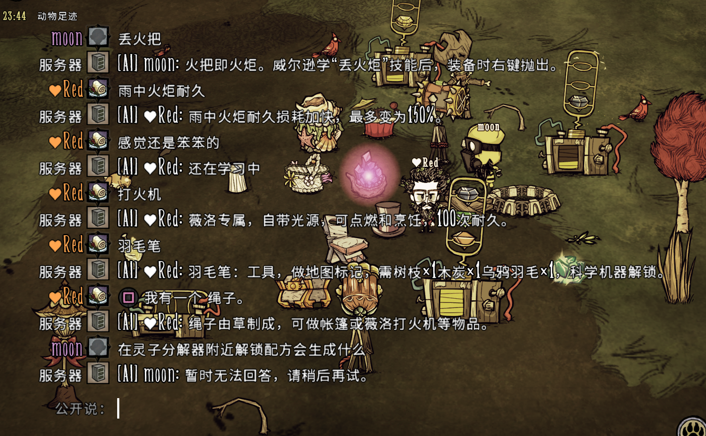

:::info
该功能于`v3.1.7`加入，管理员安装`ai_chat`插件后使用
:::

:::important
使用该功能需要**至少**配置一个LLM，会造成少量的token费用
作者配置了`deepseek-v4-flush`和`text-embedding-v4`，一天下来，API费用大概是3毛钱
:::

## 配置

`ai_chat`插件需要一系列的配置后，才能在游戏中使用，配置分为两类：房间配置和基础配置

#### 房间配置

:::tip
普通用户可修改房间配置
:::

- **启用游戏内AI对话**
  - 关闭后，当前房间不会触发任何AI对话

- **最大返回文档数**
  - 范围1-20
  - 平台通过分析玩家问题后，对知识库进行检索，检索结果可能包含多个文档(如10个)，如果该配置为3，则向LLM提供最相关的3个文档，丢弃后面7个文档
  - 推荐改配置设置为10
  - 例如你在游戏中提问"游戏中提供光源的物品有哪些？"，如设置为3，则只向LLM提供3个文档，因此LLM的回答只有3个
  - 这也算是一个局限性，提供的文档越多，则消耗的token越多

- **AI回复最大字数**
  - 范围1-180

#### 基础配置

:::tip
仅管理员可修改基础配置
:::

- **对话模型Base URL**
  - **必填**
  - 兼容 `OpenAI Chat Completions API` 的服务地址；未以 /chat/completions 结尾时会自动补全

- **对话模型名称**
  - **必填**
  - 即模型的名称，例如`deepseek-v4-flash`、`sol-5.6`等

- **对话模型API Key**
  - **必填**
  - 也就是你的API Key

- **嵌入模型Base URL**
  - 选填
  - 兼容 `OpenAI Embeddings API` 的服务地址，系统会自动追加 /embeddings；不使用向量检索时可留空

- **嵌入模型名称**
  - 选填
  - 即模型的名称，例如`text-embedding-v4`等

- **嵌入模型API Key**
  - 选填
  - 也就是你的API Key

:::tip
使用嵌入模型能极大的提高AI的理解能力，**强烈建议**配置；没有配置嵌入模型系统会自动回退到关键词搜索

**如果配置了嵌入模型，请在保存配置后，点击重建向量索引按钮**
:::

- **系统提示词**
  - 选填，推荐**不填**
  - 即LLM的Role: system
  - 默认为："你是饥荒联机版游戏内的 AI 助手。请根据以上参考文档，用中文回答玩家的问题。回答应简洁、准确，适合在游戏聊天框中显示，坚决不能使用使用 Markdown 格式，回答不能超过{**AI回复最大字数**}个字。"

- **Temperature**
  - **必填**

- **最大输出Token**
  - **必填**

- **请求超时(秒)**
  - **必填**

- **上下文消息上限**
  - **必填**
  - 即保留多少轮会话，让AI有记忆，超过上限的信息会被清理，以释放内存

- **上下文有效期(分钟)**
  - **必填**
  - 在设置有效期外，玩家仍然没有问答，则清理历史聊天信息，以释放内存

## 介绍

AI对话流程如下：

#### 向量检索(配置了嵌入模型)
嵌入引擎计算查询向量与预存文档向量之间的余弦相似度。
会调用embedding模型，对索引文档和查询进行向量化。

:::tip
调用嵌入模型生成索引会消耗大量的token，**>80w**
:::

#### 关键词检索
关键词引擎使用基于解析后 Wiki Markdown 文档构建的字段加权 `TF-IDF` 评分模型

每篇文档被分解为五个部分（分类、描述、制作材料及解锁、如何获取、备注），且每个部分的词项评分均应用不同的权重：

| 字段               | 权重常量                     | 值   |
|------------------|--------------------------|-----|
| Name (标题)        | keywordNameWeight        | 8.0 |
| Category (分类)    | keywordCategoryWeight    | 5.0 |
| Crafting (制作)    | keywordCraftingWeight    | 3.5 |
| Acquisition (获取) | keywordAcquisitionWeight | 3.0 |
| Description (描述) | keywordDescriptionWeight | 2.5 |
| Notes (备注)       | keywordNotesWeight       | 1.0 |

在 TF-IDF 基础评分之上，直接名称匹配将应用额外加分：精确名称匹配加 20.0，部分名称匹配加 8.0，分类匹配加 5.0。这确保了当提问 "火炬"时，即使词频较低，也能优先呈现精确的斧头 Wiki 页面。

## 使用

## 欢迎贡献

首先感谢以下群友对AI聊天知识库的贡献

    
    
    
    
    
    

如果你想为DMP AI 知识库进行贡献，打开[饥荒管理平台AI功能资料收集](https://docs.qq.com/sheet/DRmFOTWptYW5yaHpT?tab=BB08J2)，并申请编辑权限即可

贡献前请**详细阅读**该文档的**贡献指南**(sheet1)
