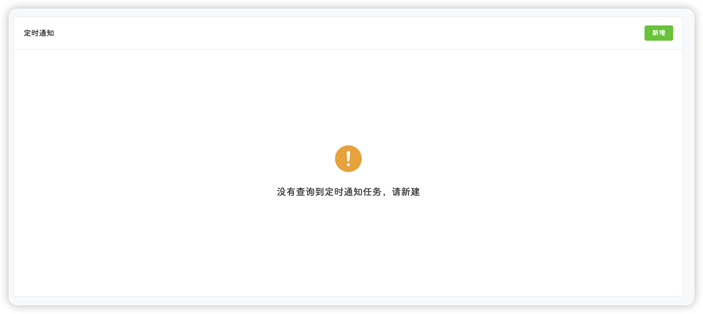
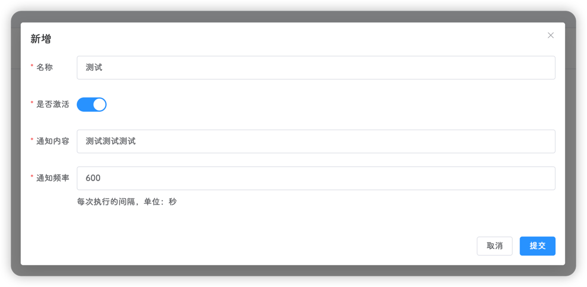
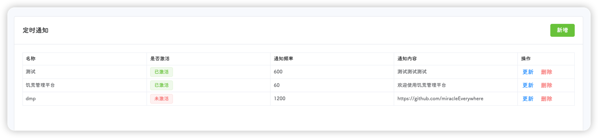

::: tip
该页面位于 **工具-定时通知**
:::

如果没有创建任何定时通知，平台将显示如下页面

点击右上角**新增**按钮，创建一个定时通知任务

**名称**为唯一标识符，不可重复；如果不**激活**，则不会进行通知；**通知频率**为秒；点击提交即可创建

如下图，饥荒管理平台将会每隔600秒，在游戏中发送`测试测试测试`通知

定时通知任务可创建多个

点击通知任务右侧的**更新**、**删除**按钮即可进行对应操作
