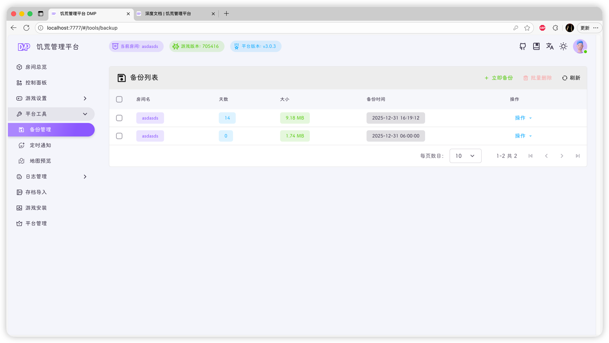
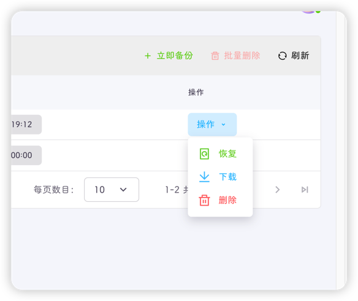

为了进一步的解决熊孩子和游戏坏档的问题，饥荒管理平台提供备份功能

在该页面你可以管理由平台[自动](../setting/room.md#自动备份)或手动创建(立即备份按钮)的备份文件

点击**恢复**即可将游戏回退到创建备份的那一刻

点击**下载**即可将备份文件下载到本地，该文件为zip格式，因此可直接作为存档导入其他的饥荒管理平台

备份删除后无法找回

::: caution
删除房间后，相应的备份文件也会被全部删除
:::

::: important
存档备份保存在`dmp_files/backup/房间ID/备份文件名.zip`下，其中`备份文件名`为`base64`编码，其中包含房间名和天数等信息，`请勿修改`
:::
