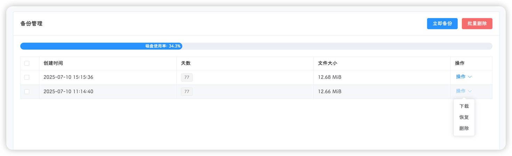

::: tip
该页面位于 **工具-备份管理**
:::

该页面会展示当前集群的所有备份文件，点击右上角**立即备份**按钮即可生成当前时间的存档备份；在系统设置中，定时备份功能生成的备份文件也会展示在此处

可同时勾选多个备份文件，进行**批量删除**

表格上方显示磁盘使用率，如果超过80%，建议进行存档清理

::: warning
饥荒管理平台不会主动删除备份文件，即使是删除集群；请留意磁盘使用率

备份文件的路径：`dmp_files/backup/集群名/`
:::

表格将展示存档备份的**备份时间**，备份时的**存档天数**以及**备份文件大小**

表格右边的操作下拉菜单提供**下载**、**恢复**和**删除**功能

- 下载：点击下载即可将该备份文件下载下来

- 恢复：点击恢复后，平台会执行以下操作
  - 关闭当前集群的所有世界
  - 删除饥荒配置文件和数据文件
  - 将备份文件中的配置文件和数据文件移动到指定目录
  - 更新平台数据库
  - 清理脏数据

- 删除：删除当前备份文件

::: tip
恢复存档后，平台不会自动启动该集群中的世界，请手动启动
:::