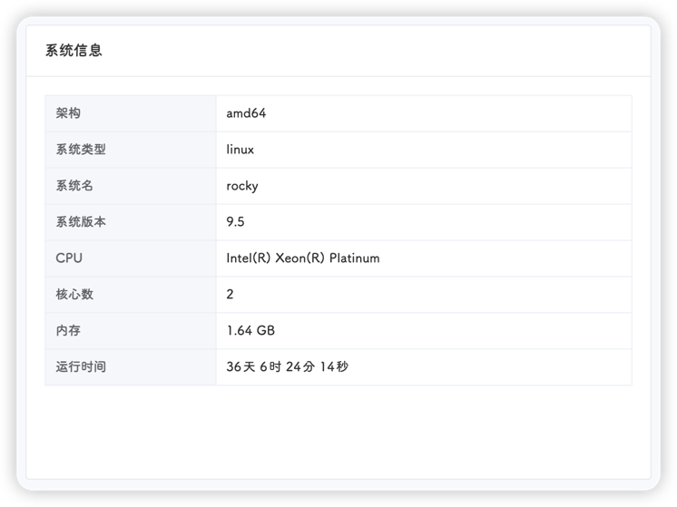
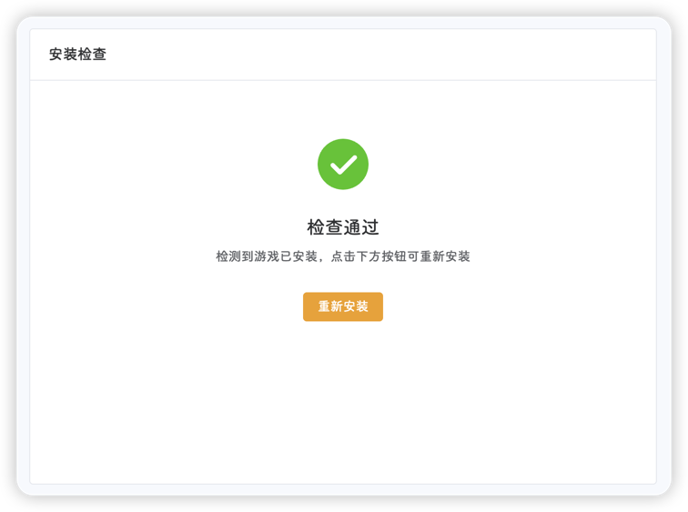

::: tip
该页面位于 **工具-安装游戏**
:::

进入安装游戏页面，会显示左右两部分内容

左侧为当前服务器的配置信息，如CPU、内存、运行时间等信息



右侧为检测结果和安装按钮

如果系统名为`ubuntu`、`centos`、`rocky`其中的一个，即可进行安装

如果平台检测到饥荒已经安装，则会显示重新安装



点击安装或重新安装按钮后，平台会在后台进行安装，并显示进度和当前进行的步骤

平台安装进行的操作：

1. 生成安装脚本

```shell
#!/bin/bash

# 定义变量
STEAM_DIR="$HOME/steamcmd"
DST_DIR="$HOME/dst"
DST_SETTING_DIR="$HOME/.klei"
INSTALL_FAIL="NO"


# 工具函数
function install_ubuntu() {
    dpkg --add-architecture i386 2>&1 > /dev/null
    if (($? != 0)); then
		$INSTALL_FAIL="YES"
	fi
	apt update 2>&1 > /dev/null
    apt install -y lib32gcc1 2>&1 > /dev/null
	apt install -y lib32gcc-s1 2>&1 > /dev/null
    apt install -y libcurl4-gnutls-dev:i386 2>&1 > /dev/null
    apt install -y screen 2>&1 > /dev/null
    if (($? != 0)); then
		$INSTALL_FAIL="YES"
	fi
	apt install -y unzip 2>&1 > /dev/null
	if (($? != 0)); then
		$INSTALL_FAIL="YES"
	fi
}

function install_rhel() {
    yum -y install glibc.i686 libstdc++.i686 libcurl.i686 2>&1 > /dev/null
    yum -y install screen 2>&1 > /dev/null
    if (($? != 0)); then
		$INSTALL_FAIL="YES"
	fi
	yum install -y unzip 2>&1 > /dev/null
	if (($? != 0)); then
		$INSTALL_FAIL="YES"
	fi
    ln -s /usr/lib/libcurl.so.4 /usr/lib/libcurl-gnutls.so.4 2>&1 > /dev/null
}

function check_screen() {
    which screen
    if (($? != 0)); then
        echo -e "0\tscreen命令安装失败\tScreen command installation failed" > /tmp/install_status
        exit 1
    fi
}


# 清空status文件
> /tmp/install_status

# 安装依赖
echo -e "17\t正在安装依赖\tInstalling dependencies" > /tmp/install_status
OS=$(grep -P "^ID=" /etc/os-release | awk -F'=' '{print($2)}' | sed "s/['\"]//g")
if [[ "${OS}" == "ubuntu" || "${OS}" == "debian" ]]; then
    install_ubuntu
else
    OS_LIKE=$(grep -P "^ID_LIKE=" /etc/os-release | awk -F'=' '{print($2)}' | sed "s/['\"]//g" | grep rhel)
    if (($? == 0)); then
        install_rhel
    else
        echo -e "0\t系统不支持\tSystem not supported" > /tmp/install_status
        exit 1
    fi
fi

# 检查screen命令
check_screen

# 下载安装包
echo -e "29\t正在下载Steam安装包\tDownloading the Steam installation package" > /tmp/install_status
cd ~
wget https://steamcdn-a.akamaihd.net/client/installer/steamcmd_linux.tar.gz 2>&1 > /dev/null
if (($? != 0)); then
	$INSTALL_FAIL="YES"
fi

# 解压安装包
echo -e "41\t正在解压Steam安装包\tExtracting the Steam installation package" > /tmp/install_status
mkdir -p $STEAM_DIR
tar -zxvf steamcmd_linux.tar.gz -C $STEAM_DIR 2>&1 > /dev/null
if (($? != 0)); then
	$INSTALL_FAIL="YES"
fi

# 安装DST
echo -e "49\t正在下载Steam\tDownloading Steam" > /tmp/install_status
cd $STEAM_DIR
> install.log
./steamcmd.sh +force_install_dir "$DST_DIR" +login anonymous +app_update 343050 validate +quit | tee -a "install.log" 2>&1 > /dev/null &
PID=$!

while true
do
    ps -ef | grep $PID | grep -v grep
    if (($? == 0)); then
        tail -2 install.log | awk -F'progress: ' '{
          if ($1 ~ /0x61.*\)/) {
            percentage=$2; sub(/ .*/, "", percentage); printf "%.1f\t正在下载饥荒\tDownloading DST\n", 59 + percentage * 0.2 > "/tmp/install_status"
          } else if ($1 ~ /0x61.*\)/) {
            percentage=$2; sub(/ .*/, "", percentage); printf "%.1f\t正在安装饥荒\tInstalling DST\n", 79 + percentage * 0.2 > "/tmp/install_status"
          }
        }'
    else
        rm -f install.log
        break
    fi
    sleep 1
done

cp ~/steamcmd/linux32/libstdc++.so.6 ~/dst/bin/lib32/

# 清理
cd ~
rm -f steamcmd_linux.tar.gz
rm -f $STEAM_DIR/install.log
rm -f $0

if [[ "${INSTALL_FAIL}" == "YES" ]]; then
	echo -e "100\t安装失败\tInstallation failed" > /tmp/install_status
else
	echo -e "100\t安装完成\tInstallation completed" > /tmp/install_status
fi
```

2. 再次检查系统是否支持(0%-17%)

3. 安装对应依赖(17%-29%)

4. 检查`screen`命令(失败直接退出)

5. 下载`steamcmd`(29%-41%)

6. 安装`steamcmd`(41%-49%)

7. 安装`steam`(49%-59%)

8. 下载饥荒联机版(59%-79%)

9. 安装饥荒联机版(79%-100%)

::: tip
安装速度取决于当前的网络环境以及服务器的性能，请耐心等待
:::

::: warning
安装过程中请勿刷新页面或者重复安装
:::

如果出现安装失败，请手动执行`manual_install.sh`脚本

```shell title="manual_install.sh"
#!/bin/bash

# 定义变量
STEAM_DIR="$HOME/steamcmd"
DST_DIR="$HOME/dst"
DST_SETTING_DIR="$HOME/.klei"


# 工具函数
function install_ubuntu() {
	dpkg --add-architecture i386
	apt update
    apt install -y lib32gcc1     
	apt install -y lib32gcc-s1
    apt install -y libcurl4-gnutls-dev:i386
    apt install -y screen
	apt install -y unzip
}

function install_rhel() {
	yum update
    yum -y install glibc.i686 libstdc++.i686 libcurl.i686
    yum -y install screen
	yum install -y unzip
    ln -s /usr/lib/libcurl.so.4 /usr/lib/libcurl-gnutls.so.4
}

function check_screen() {
    which screen
    if (($? != 0)); then
        echo -e "screen命令安装失败\tScreen command installation failed"
        exit 1
    fi
}

# 安装依赖
OS=$(grep -P "^ID=" /etc/os-release | awk -F'=' '{print($2)}' | sed "s/['\"]//g")
if [[ "${OS}" == "ubuntu" || "${OS}" == "debian" ]]; then
    install_ubuntu
else
    OS_LIKE=$(grep -P "^ID_LIKE=" /etc/os-release | awk -F'=' '{print($2)}' | sed "s/['\"]//g" | grep rhel)
    if (($? == 0)); then
        install_rhel
    else
        echo -e "系统不支持\tSystem not supported"
        exit 1
    fi
fi

# 检查screen命令
check_screen

# 下载安装包
cd ~
wget https://steamcdn-a.akamaihd.net/client/installer/steamcmd_linux.tar.gz

# 解压安装包
mkdir -p $STEAM_DIR
tar -zxvf steamcmd_linux.tar.gz -C $STEAM_DIR

# 安装DST
cd $STEAM_DIR
./steamcmd.sh +force_install_dir "$DST_DIR" +login anonymous +app_update 343050 validate +quit

cp ~/steamcmd/linux32/libstdc++.so.6 ~/dst/bin/lib32/

# 清理
cd ~
rm -f steamcmd_linux.tar.gz
rm -f $STEAM_DIR/install.log

# 安装完成
echo -e "安装完成\tInstallation completed"
```
