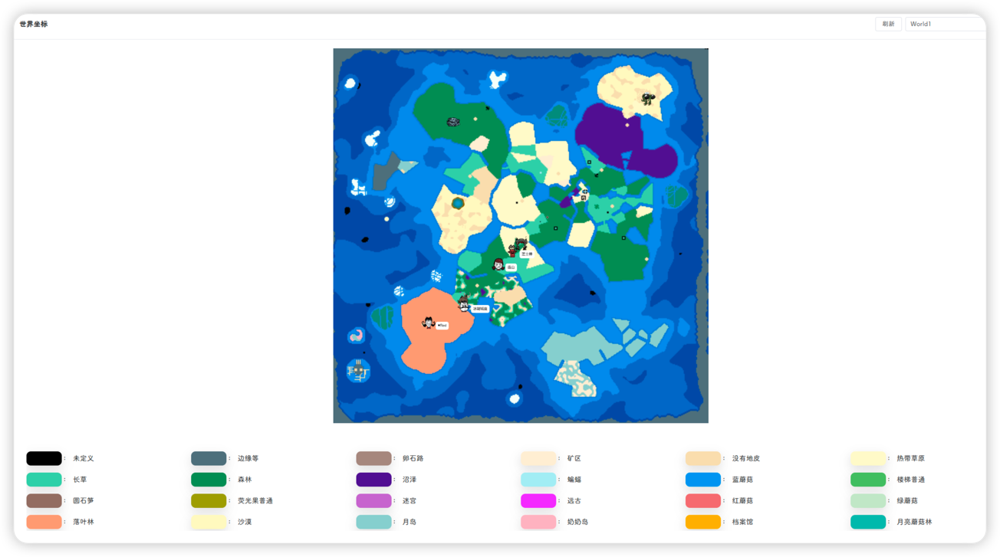
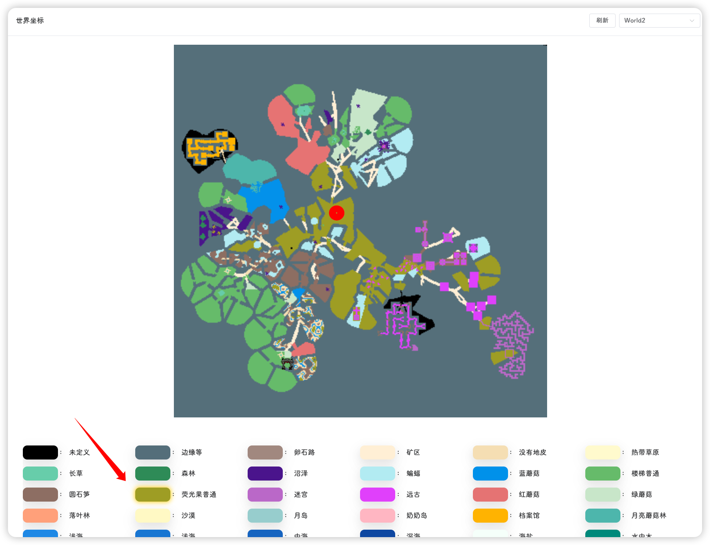
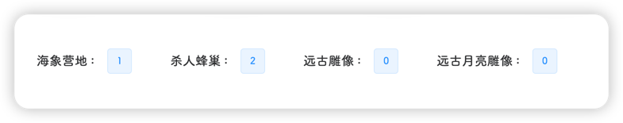
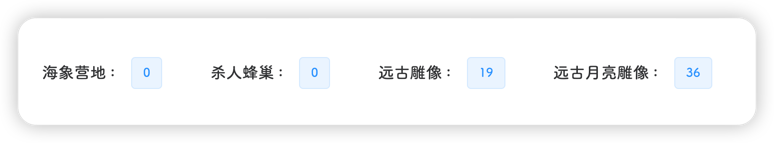

::: tip 
该页面位于 **工具-世界坐标**
:::

该页面会实时渲染一张所选世界的地图，并标记出生门、猪王、月台等特殊物体的坐标

如果当前世界有玩家，则会在对应位置显示玩家角色和玩家名

左上角可以进行刷新和选择其他世界

::: warning
地图、玩家、特殊物体都是通过实时渲染后生成图片，渲染过程中会占用系统资源，请勿频繁刷新
:::

鼠标指到地图上任意位置，下方的图例会自动高亮

图例下方会显示当前世界重要资源的统计信息

::: tip
如果当前世界有玩家正在游戏，则会在页面最下方显示玩家角色和玩家名
:::
