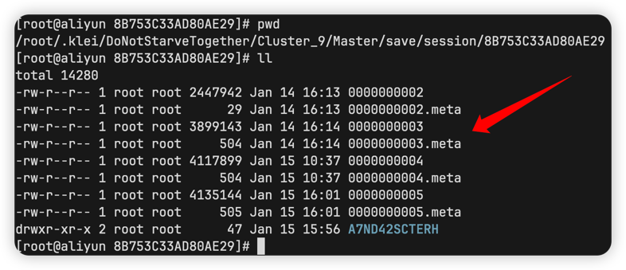
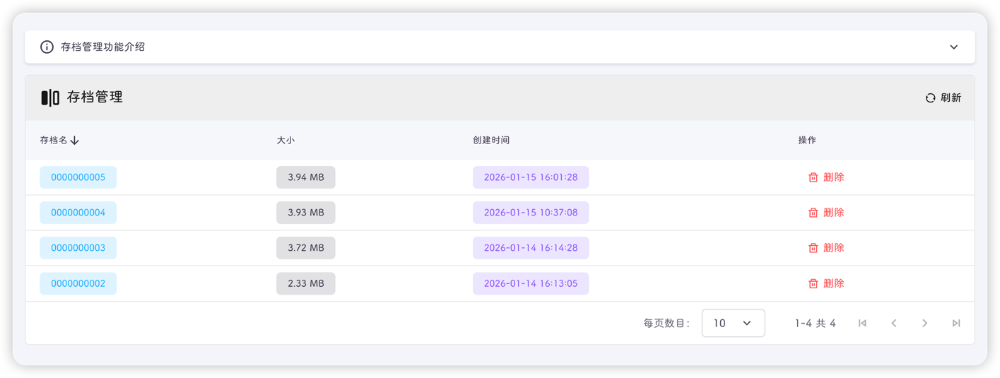
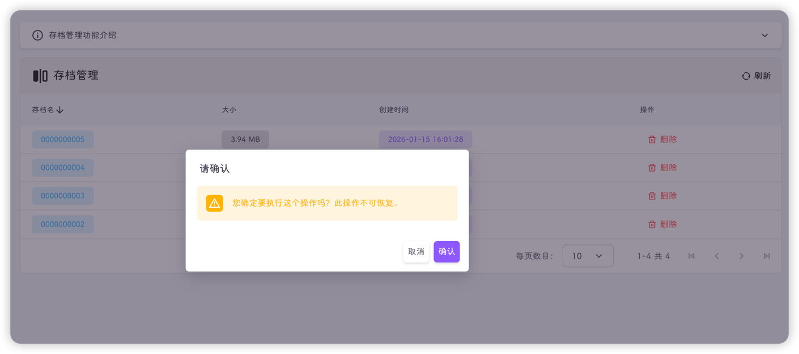

::: info
游戏存档是指饥荒专用服务器生成的存档文件，在每隔一天自动保存时或玩家手动保存时生成
:::

该页面会展示该存档的所有存档文件

::: tip
饥荒的回档功能就是删除最新的1个或多个存档文件
:::

存档文件的路径为：
```text
# 存档路径
.klei/DoNotStarveTogether/Cluster_{ID}/Master(世界名)/save/session/8B753C33AD80AE29(session ID)
```



::: tip
其实饥荒管理平台中，控制页面的房间概览的信息就是从这里获取的，地图预览信息也是从这里获取的。
现在懂了吧，你新开的档还没有保存过，我当然获取不到信息啦
:::

这些文件的文件名只是标记，或者说是序号，并不是天数



::: tip
① 如果你的游戏无法启动，并且不是模组报错，那有可能就是坏档了。
② 你可以删除最新的存档快照文件，来实现回档功能，点击下方删除即可。
③ 删除操作会执行以下步骤：1.关闭游戏(出错会跳过) 2.删除对应的存档文件(出错会返回错误) 3.启动游戏(出错会跳过)。
:::

::: important
① 如果房间中有世界没有部署在当前饥荒管理平台下，请登录对应的饥荒管理平台，同步删除对应的存档文件，保证多台机器下的存档文件一致。
:::



::: info
做个总结就是，这个工具的功能和饥荒的回档功能一致，区别在于：
1. 饥荒回档的前提是游戏正常运行，平台的存档管理不需要
2. 饥荒回档可远程让部署在另一台机器上的世界自动回档，平台的存档管理需要同步操作
:::
