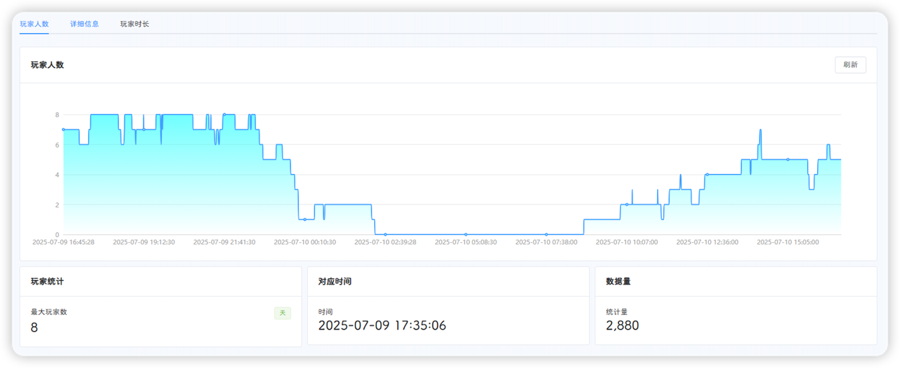
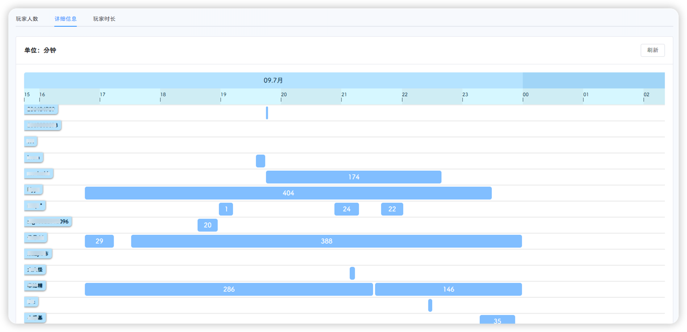
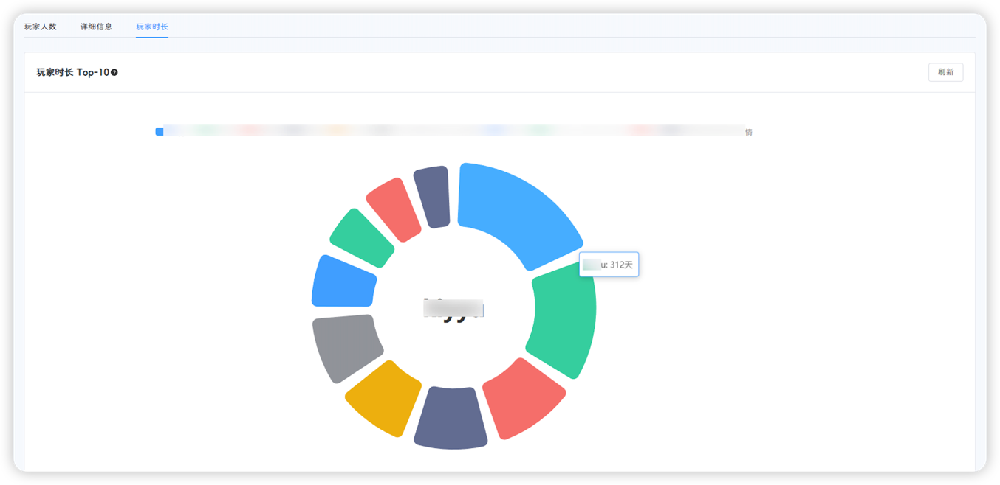

::: tip
该页面位于 **工具-玩家统计**
:::

玩家同届页面共分为三个标签页，分别是**玩家人数**、**详细信息**和**玩家时长**

## 玩家人数

平台会每隔一段时间记录当前存档的在线玩家人数，默认间隔为30秒

该页面会将记录的数据绘制成折线图，横坐标为时间，纵坐标为在线玩家个数



折线图下方会计算出**最大玩家数**，**最大玩家数对应的时间**和**统计数据量**

统计数据量最大值为2880，如果按照默认间隔30秒，则为`30×2880=86400`秒，即1天

如果间隔为60秒则对应为2天；无论修改为多少秒，平台统计量最大值为2880

## 详细信息

详细信息标签页会计算每个玩家的在线时长和在线时段，并显示在时间轴上



**详细信息**的数据量与时间跨度与**玩家人数**标计算一致

## 玩家时长

玩家时长页面会展示游戏时长前10的玩家，并根据游戏时长占比绘制饼图



::: tip
该数据记录从平台启动至今的数据，直到平台重启后清空
:::

## 作者注

玩家统计页面的数据均存储在内存中，每个集群存储一份，占用大小为`2880*集群数量*数据集平均大小`

也是为了空间换时间吧，没有将这些数据写到磁盘，慢且没必要，也占不了多少内存

共有两个`map`存储统计数据

```go title="玩家人数和详细信息共用一个map-STATISTICS"
type Players struct {
	UID      string `json:"uid"`
	NickName string `json:"nickName"`
	Prefab   string `json:"prefab"`
}

type Statistics struct {
	Timestamp int64     `json:"timestamp"`
	Num       int       `json:"num"`
	Players   []Players `json:"players"`
}

// STATISTICS STATISTICS[集群名]
var STATISTICS = make(map[string][]Statistics)
```

```go title="玩家时长map-PlayTimeCount"
// PlayTimeCount PlayTimeCount[集群名][玩家昵称]
var PlayTimeCount = make(map[string]map[string]int64)
```
