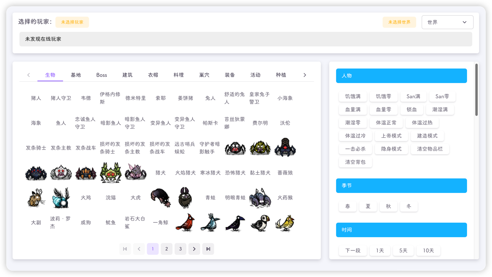
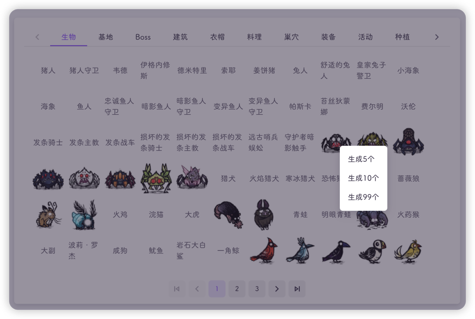
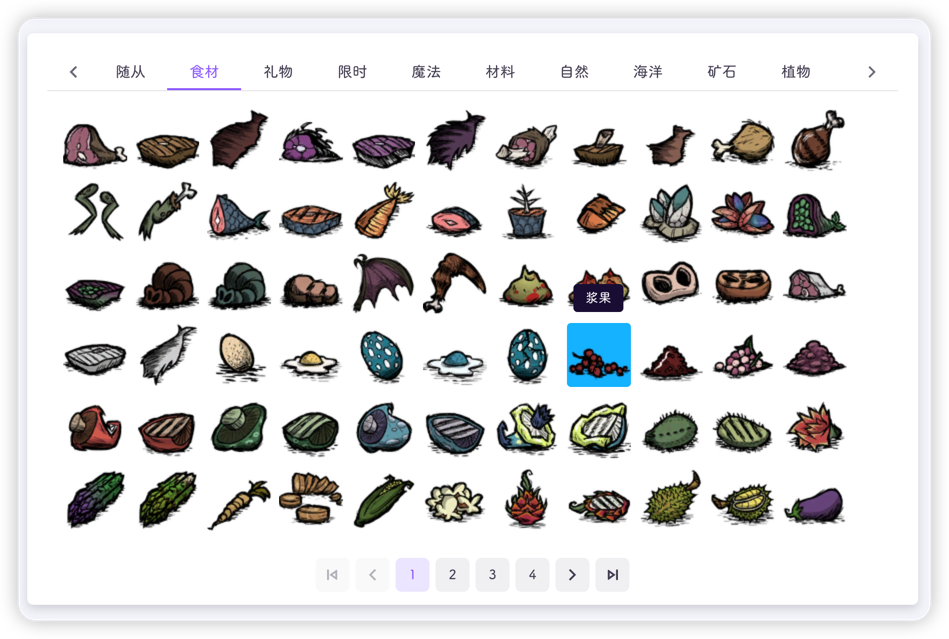
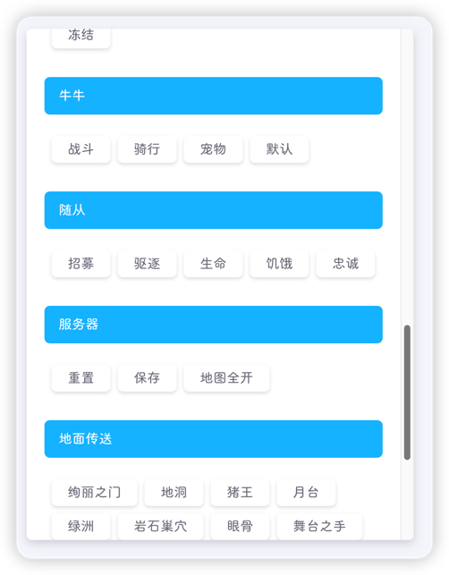

:::info
该功能于`v3.1.6`加入，管理员安装`tmi`插件后使用
:::

此功能类似于游戏中的`Too Many Items`模组(T键)，你可以任意的执行一些游戏命令，为指定的玩家刷一些物品

:::caution
滥用此功能会极大的减少游戏寿命，并可能导致游戏崩溃，请合理使用
:::

使用该功能前，你需要选择一个在线的玩家，并选择一个世界来执行饥荒远程命令

部分命令例如**切换季节**、**切换时间**等无需选择玩家

页面左侧为物品栏，左键点击可以给玩家一个物品，右键可以选择数量

:::tip
部分图片未显示为正常现象
作者能力不足，无法获取tex包中的图片，欢迎pr
:::

你也可以切换标签栏，查看不同种类的物品

右侧则为一些预设的命令，点击即可执行

