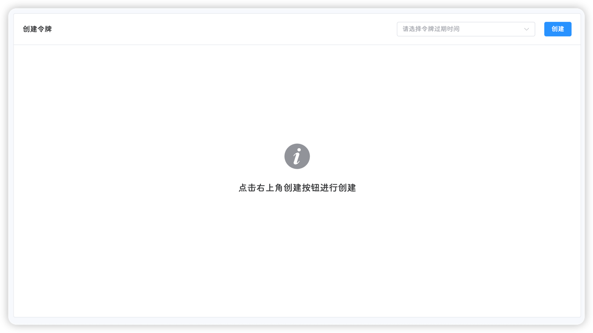
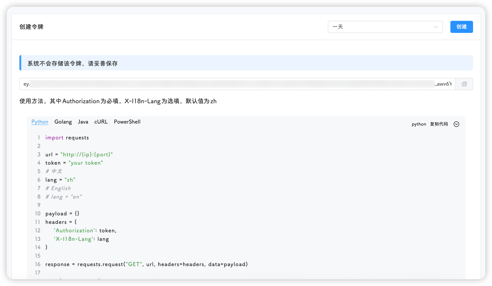

::: tip
该页面位于 **工具-创建令牌**
:::

::: important
请注意，该页面的**令牌**是指平台的权限认证令牌，跟饥荒令牌不是一个东西
:::

有些用户想调用饥荒管理平台的一些功能，但登录自带的令牌有效时间只有24小时，因此作者写了这个功能，方便创建不同有效时长的令牌

令牌为[JWT](https://jwt.io/)，payload为：
```json
{
  "username": "username",
  "nickname": "用户昵称",
  "role": "admin",
  "exp": 1753299635
}
```

其中`exp`为过期时间戳

在右上角选择**令牌过期时间**后，点击**创建**即可



创建完成后，平台会展示该令牌，并给出`Python`，`Go`，`Java`，`cURL`，`PowerShell`的使用方法



::: tip
平台不会保存令牌
:::

::: caution
令牌和登录密码的作用一样，请勿外泄，妥善保存
:::