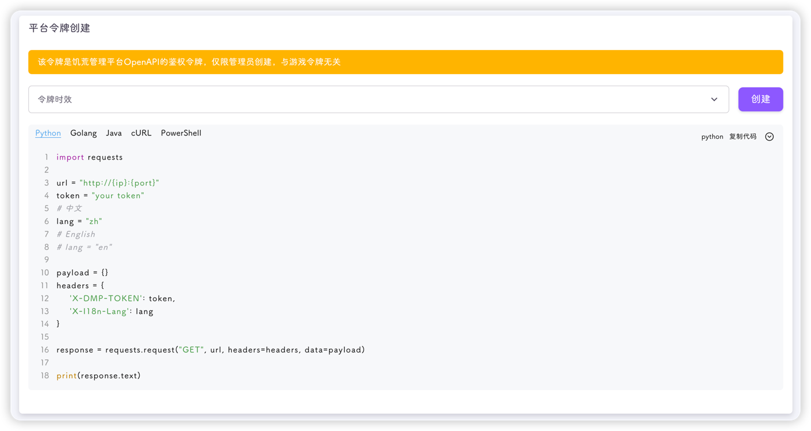

你可以在该页面创建一个指定有效时长的饥荒管理平台令牌



使用该令牌，你可以调用饥荒管理平台所有的后端接口

该令牌的另一个用途就是在**饥荒管理平台App**中使用，详情查看[该页面](../../faq/dmp/app.md)

::: tip
该令牌只有管理员能创建
:::

如果出现了**令牌泄露**，你可以手动修改饥荒管理平台的`jwt_secret`字段，令该令牌失效

操作方法：

::: tip
以下操作需要在终端进行
:::

1. 关闭平台

2. 下载 `sqlite3`

```shell
apt install sqlite3
```

3. 修改`jwt_secret`字段

连接数据库

```shell
sqlite3 data/dmp.db
```

更新数据库

```sqlite
UPDATE system SET value='你的新秘钥(26个字符)' WHERE key='jwt_secret';
```

::: caution
上述`sql`中的`value`必须为**26**个字符，不能多也不能少
秘钥内容包含**大写字母**、**小写字母**、**数字**
:::

4. 启动平台
