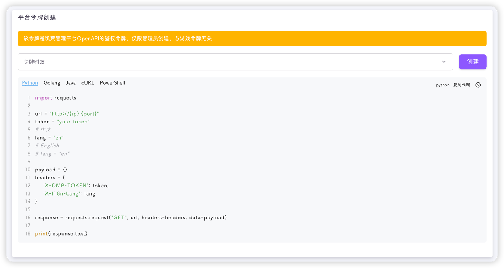

:::info
你可以在该页面创建一个指定有效时长的饥荒管理平台令牌
:::

## 令牌创建

选择令牌时效后，点击创建按钮即可完成创建



## 令牌使用

使用该令牌，你可以调用饥荒管理平台所有的后端接口

#### 饥荒管理平台App

该令牌的主要用途就是在**饥荒管理平台App**中使用，详情查看[该页面](../../faq/dmp/app.md)

::: warning
饥荒管理平台App中所使用的令牌必须由管理员创建
:::

#### Python-SDK

1. 安装sdk

```shell
pip install dmp-sdk-python
```

2. 导入sdk

```python
from dmp_sdk_python import DMPClient
```

3. 初始化客户端

```python
client = DMPClient("http://your-server:80", "your-token")
```

4. 获取数据

```python
users = client.user.list_users()
print(users.rows)

rooms = client.room.list()
print(rooms.rows)

room_info = client.rm.get(room_id=8)
print(room_info)

mods = client.mod.get_enabled(roomID=8, worldID=24)
print(mods)

sys_info = client.pt.os_info()
print(sys_info)

cpu_usage = client.dashboard.get_sys_info()['cpu']
print(cpu_usage)
```

::: tip
详情查看 [源码仓库](https://github.com/miracleEverywhere/dmp-sdk-python)
::: 

## 令牌泄露

如果出现了**令牌泄露**，你可以手动修改饥荒管理平台的`jwt_secret`字段，令该令牌失效

操作方法：

::: tip
以下操作需要在终端进行
:::

1. 关闭平台

2. 下载 `sqlite3`

```shell
apt install sqlite3
```

3. 修改`jwt_secret`字段

连接数据库

```shell
sqlite3 data/dmp.db
```

更新数据库

```sql
UPDATE system SET value='你的新秘钥(26个字符)' WHERE key='jwt_secret';
```

::: caution
上述`sql`中的`value`必须为**26**个字符，不能多也不能少
秘钥内容包含**大写字母**、**小写字母**、**数字**
:::

4. 启动平台
