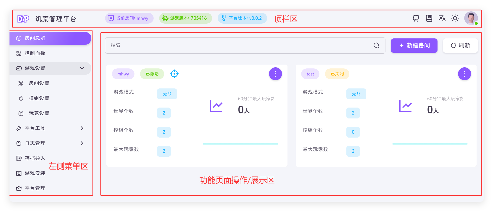
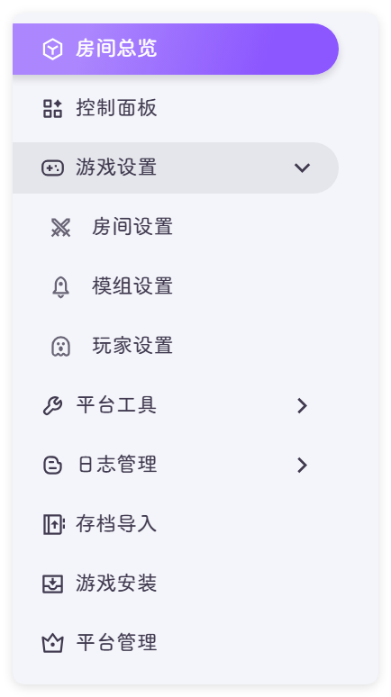

## 平台界面说明
平台页面分区说明，一共分为顶栏区，左侧菜单区，右侧功能操作和展示区

### 顶栏区
顶栏分为左中右展示内容，分别为

- 左
  - 饥荒管理平台logo
- 中
  - 当前房间：当前操作房间展示
  - 游戏版本：服务器上饥荒游戏的版本，游戏版本更新这里会有提示
  - 平台版本：饥荒管理平台的版本
- 右
  - github链接：喜欢的话帮忙点点🌟
  - 文档链接：就是你现在看的东西
  - 中英文切换按钮：你应该用不到
  - 主题亮/暗切换按钮：晚上你会点
  - 用户头像：
    - 个人中心：修改当前用户的一些信息
    - 退出平台：退出当前账号👋

::: warning
要修改房间信息前一定要注意当前这里显示的是否是你要操作的房间
:::

### 左侧菜单区
平台所有功能

- 房间总览：查看所有的房间，并提供简单管理功能，提供选择当前要操作的房间
- 控制面板：可以查看房间的概览、系统信息，提供房间控制、游戏指令和世界信息功能
- 游戏设置：房间相关设置
  - 房间设置：创建修改当前选择的房间信息
  - 模组设置：配置当前房间模组
  - 玩家设置：查看和管理房间的玩家功能
- 平台工具：当前房间的其他管理功能
  - 备份管理：对存档查看、备份、下载、恢复等功能
  - 定时通知：提供间隔性对世界发送通知
  - 地图预览：预览生成的地图 !!**这是作弊啊！**!!
- 日志管理：游戏和平台的日志，出现问题时就要在这里查看
  - 游戏日志：**饥荒的日志，很重要，如果游戏不能启动就是看这里**
  - 聊天日志：当前房间的游戏内聊天内容
  - 下载日志：下载指定的日志
  - **Steam 日志**：Steam 日志，一般不需要关注
  - **请求日志**：平台的访问日志，一般不需要关注
  - **运行日志**：这个目前没啥注意的东西
  - **日志清理**：查看日志大小，和清理上面的日志
- 存档导入：把本地存档导入到平台
- **游戏安装**：安装饥荒
- **平台管理**：房间，用户，平台的管理和系统监控

::: tip
加粗显示为管理员能看到的功能
:::

### 功能页面区

查看其他目录获取对应功能页面的详情说明