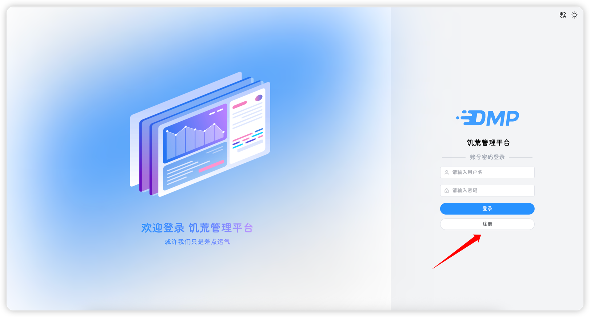

## 用户注册

当安装完饥荒管理平台后，打开登录页面会出现一个注册按钮，点击注册按钮可以进行用户注册

::: warning
每个平台只能注册一次，且登录页面大概率暴露在公网，请在安装完成后尽快注册
:::

注册完成后，该按钮消失，不会再出现

::: tip
通过注册创建的用户默认为管理员角色
:::

## 用户登录

输入用户名和密码，点击登录即可

::: tip
本平台在传输和存储过程中，都使用SHA-512进行加密，且不保存任何明文密码，请放心使用
:::

## 密码修改

用户可点击右上角用户昵称下拉菜单，点击用户信息，即可在该页面进行密码修改，修改需要输入当前密码进行验证

修改完成后，会自动跳转至登录页面

## 忘记密码

1. 关闭平台
 
2. 在[https://www.jyshare.com/crypto/sha512/](https://www.jyshare.com/crypto/sha512/)进行在线加密后，登入服务器

3. 手动修改`DstMP.sdb`文件中对应的`user.password`的字段

4. 启动平台

::: warning
请勿修改`DstMP.sdb`的文件格式，如出现格式异常，会导致平台无法启动
:::

