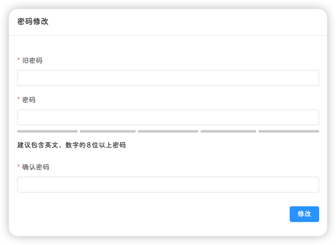
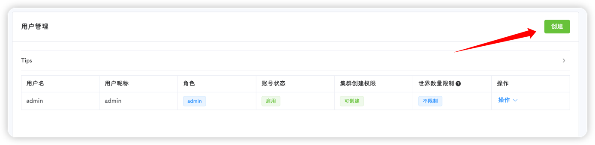
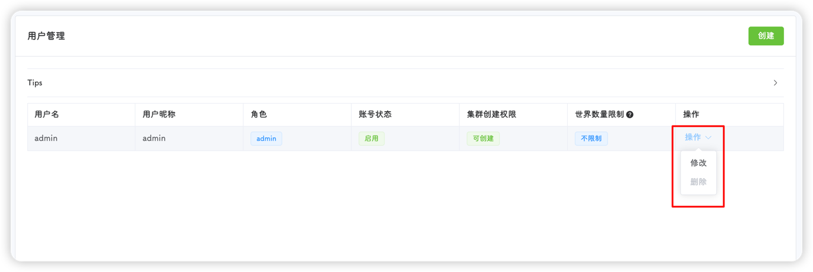

## 用户注册

当安装完饥荒管理平台后，打开登录页面会出现一个注册按钮，点击注册按钮可以进行用户注册

::: warning
每个平台只能注册一次，且登录页面大概率暴露在公网，请在安装完成后尽快注册
:::

注册完成后，该按钮消失，不会再出现

::: tip
通过注册创建的用户默认为管理员角色
:::

## 用户登录

输入用户名和密码，点击登录即可

::: tip
本平台在传输和存储过程中，都使用SHA-512进行加密，且不保存任何明文密码，请放心使用
:::

## 密码修改

用户可点击右上角用户昵称下拉菜单，点击用户信息，即可在该页面进行密码修改，修改需要输入当前密码进行验证

修改完成后，会自动跳转至登录页面

## 忘记密码

1. 关闭平台
 
2. 在[https://www.jyshare.com/crypto/sha512/](https://www.jyshare.com/crypto/sha512/)进行在线加密后，登入服务器

3. 手动修改`DstMP.sdb`文件中对应的`user.password`的字段

4. 启动平台

::: warning
请勿修改`DstMP.sdb`的文件格式，如出现格式异常，会导致平台无法启动
:::

## 用户管理

可在**用户管理**页面进行管理操作

#### 用户创建

1. 点击创建按钮

2. 填写必要的信息

- **用户名**：用户的唯一标识符，不可重复，登录所使用的用户名即为该用户名
- **用户昵称**：登录后显示的用户名，多个用户之间可重复(但不建议)
- **密码**：用户登录的密码，由于本平台可能会直接暴露在公网，因此建议使用强密码(即大写字母，小写字母，数字，特殊字符，长度大于10)
- **集群权限**：用户能访问、修改的集群列表，可选择多个(如果是管理员则无需添加，拥有所有集群权限)
- **世界数量限制**：在某个集群内，用户最多可创建的世界数(管理员不受限制)
- **账号状态**：如果未启用，则该账号无法登录
- **管理员**：是否为管理员
- **集群创建权限**：是否能够新建集群(管理员不受限制)

3. 点击提交即可完成创建

#### 用户修改
点击用户列表右侧的**操作**下拉菜单，即可对用户进行修改或删除

::: tip
管理员不允许被删除
:::
