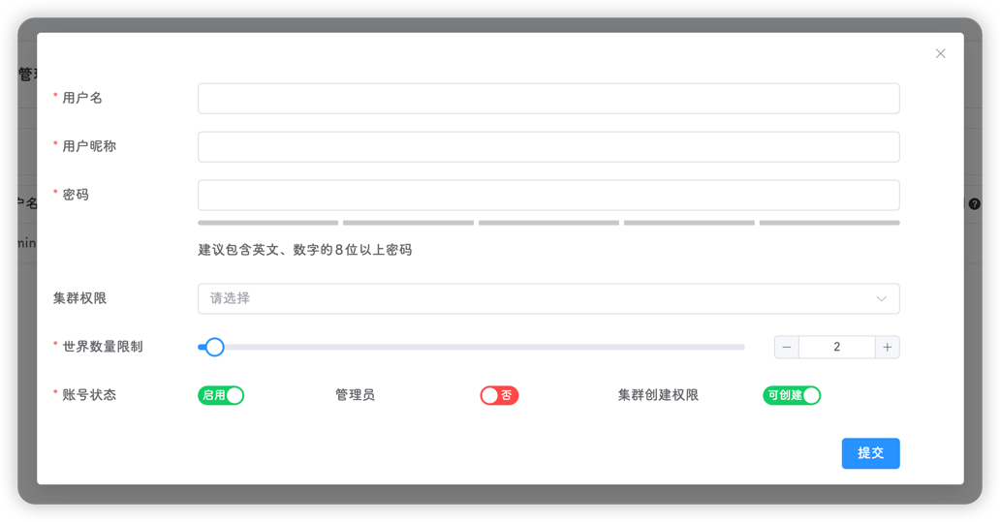

## 用户注册

当安装完饥荒管理平台后，打开登录页面会出现一个注册按钮，点击注册按钮可以进行用户注册

::: warning
每个平台只能注册一次，且登录页面大概率暴露在公网，请在安装完成后尽快注册
:::


注册完成后，该按钮消失，不会再出现

::: tip
通过注册创建的用户默认为管理员角色
:::


## 用户登录

输入用户名和密码，点击登录即可

::: tip
本平台在传输和存储过程中，都使用SHA-512进行加密，且不保存任何明文密码，请放心使用
:::


## 密码修改

用户可点击右上角用户头像下拉菜单，点击 `个人中心`，即可在该页面进行密码修改

输入要更改的密码后，点击页面的 `更新` 按钮进行更新密码操作，更新后会自动跳转至登录页面


## 忘记密码
平台使用 `sqlite` 数据库，要修改密码可以使用图形化工具，也可以使用 Linux 命令，图形化的方式需要在电脑安装特定的数据库管理工具，这里更推荐使用 Linux 命令来更改，操作如下

::: tip
操作需要在终端进行
:::

1. 关闭平台
 
2. 下载 `sqlite3`

```shell
apt install sqlite3
```

3. 更新密码 

```shell
cd ~/data/ && sqlite3 dmp.db "UPDATE users SET password='ba3253876aed6bc22d4a6ff53d8406c6ad864195ed144ab5c87621b6c233b548baeae6956df346ec8c17f5ea10f35ee3cbc514797ed7ddd3145464e2a0bab413';"
```

4. 启动平台

::: warning
更新密码会更改所有用户的密码，更新后的密码是弱密码 `123456`，更改后尽快登录平台修改密码💀
:::

## 用户管理

可在**用户管理**页面进行管理操作

#### 用户创建

1. 点击创建按钮


2. 填写必要的信息

- **用户名**：用户的唯一标识符，不可重复，登录所使用的用户名即为该用户名
- **用户昵称**：登录后显示的用户名，多个用户之间可重复(但不建议)
- **角色**：管理员具有全部功能，普通用户有限的存档创建，没有平台管理功能和游戏安装功能
- **是否禁用**：禁用的用户无法登录饥荒平台
- **头像**：个性化功能，你喜欢哪个用那个
- **密码**：用户登录的密码，由于本平台可能会直接暴露在公网，因此建议使用强密码(即大写字母，小写字母，数字，特殊字符，长度大于10)
- **房间创建**：是否能够新建房间(管理员不受限制)⭐
- **房间权限**：用户能访问、修改的房间列表，可选择多个(如果是管理员则无需添加，拥有所有房间权限)⭐
- **最大玩家数**：在某个房间内，用户最多可设置的玩家数(管理员不受限制)
- **最大世界数**：在某个房间内，用户最多可创建的世界数(管理员不受限制)



1. 点击提交即可完成创建


#### 用户修改
点击用户列表右侧的**操作**下拉菜单，即可对用户进行修改或删除


::: tip
管理员不允许被删除
:::
