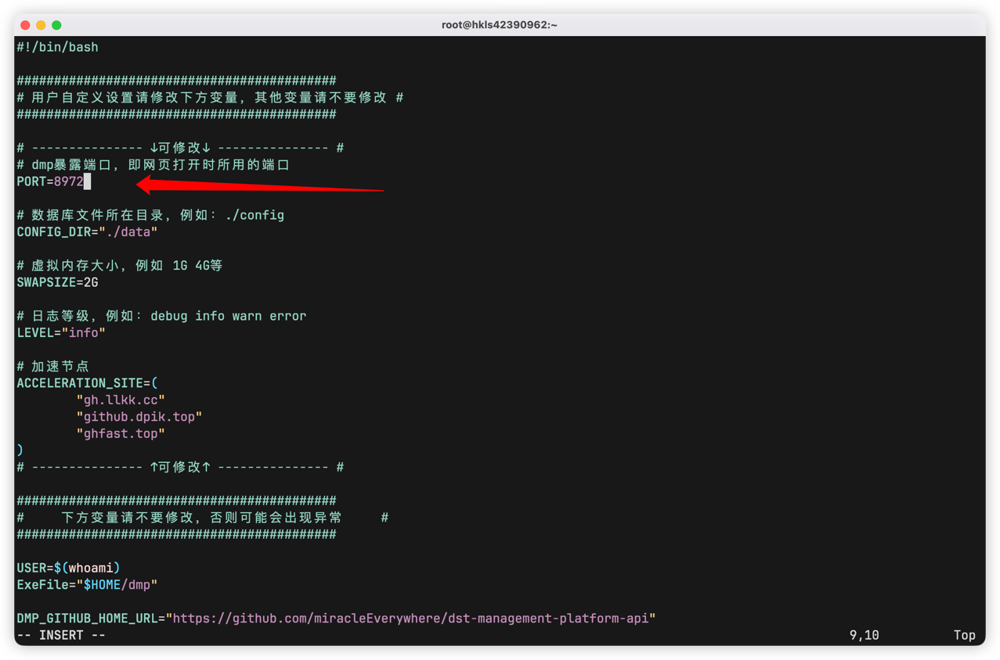
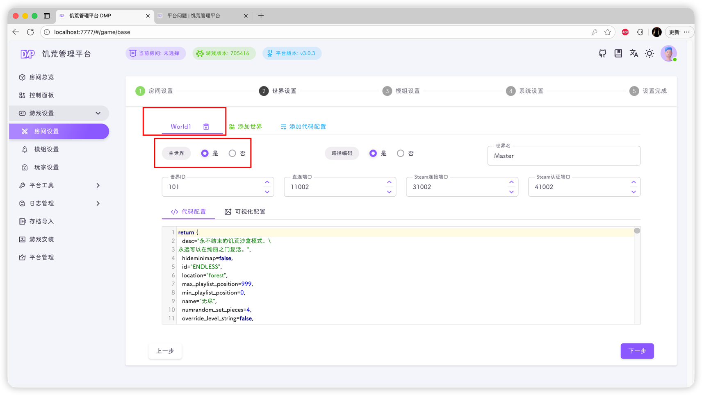
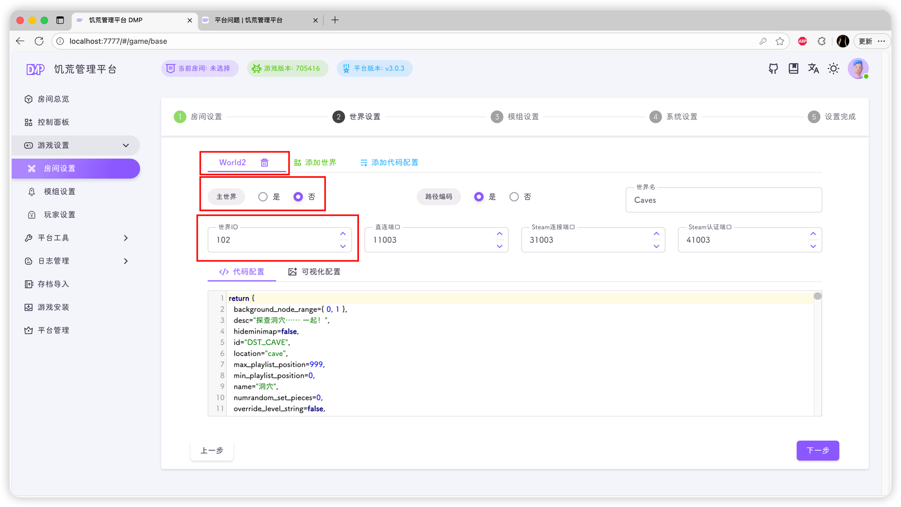

## 更换平台端口

如果你是`启动脚本部署`的饥荒管理平台，其默认端口是`80/tcp`，具体修改方式如下：

打开`run.sh`脚本，找到下图中的那一行，修改后重启平台即可



或者直接执行命令

```shell
sed -i 's/^PORT=.*/PORT=8972/' run.sh
```

即可修改端口为`8972`

`docker部署`的同学可查看[深度文档-安装部署-Docker部署](../docs/install/docker.md)，修改对应的启动端口即可

## 多台云服务器串联

::: important
所有云服都要先安装饥荒管理平台
:::

1. 首先进入房间设置创建只含有一个世界的房间，注意，需要设置房间的世界为主世界

::: info
我们假设这台云服的公网IP为`1.2.3.4`，房间设置中的主世界端口为`21002`，世界认证密码为`qazwsxedc`
:::




2. 接下来打开另一个云服的饥荒管理平台

**主世界IP**设置为主世界的公网IP`1.2.3.4`，**主世界端口**设置为`21002`，**世界认证密码**设置为`qazwsxedc`


创建一个世界，这个世界不能是主世界，世界ID不能与主世界相同



::: tip
如果你该有更多的云服，可以添加第二个从世界，方法和上方一致，但要记得添加多层世界模组
:::
