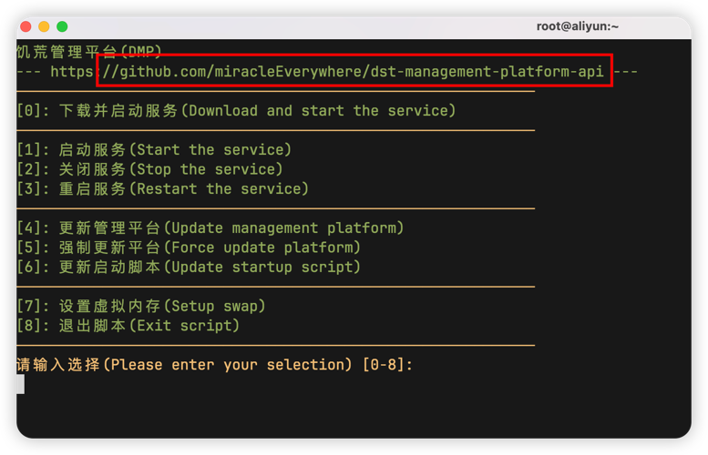

### 下载run.sh失败

原因有很多，99%的概率是当前加速节点异常导致的

如果你是使用这条命令下载失败的话，可以将**.data[0].url**改为**.data[1].url**，使用第二个加速节点，不行就换**.data[2].url**

```shell
cd && rm -f run.sh && curl -o run.sh -L $(curl -s https://api.akams.cn/github | jq -r '.data[0].url')/https://raw.githubusercontent.com/miracleEverywhere/dst-management-platform-api/master/run.sh && chmod +x run.sh && ./run.sh
```

如果还是不行的话，可以加群，使用离线安装进行部署

### 使用run.sh更新DMP失败

大概率还是加速节点的问题，分为两种情况：

如果你运行`run.sh`脚本后，红框中的地址和下图中的地址不一致，那就是第二种情况，脚本被篡改了



- **情况一**：当前akams返回的最优加速节点异常，可以通过以下命令进行更换：
```shell
sed -i s/.data[0].url/.data[1].url/g run.sh
```

- **情况二**：加速节点下载`run.sh`脚本时，擅自修改了脚本的内容

加速节点将 `https://github.com/miracleEverywhere/dst-management-platform-api` 修改成了 `{加速节点地址}https://github.com/miracleEverywhere/dst-management-platform-api` ，从而导致获取最新版本号失败

可以删除`run.sh`脚本后重新下载，也可以加群，进行离线更新
