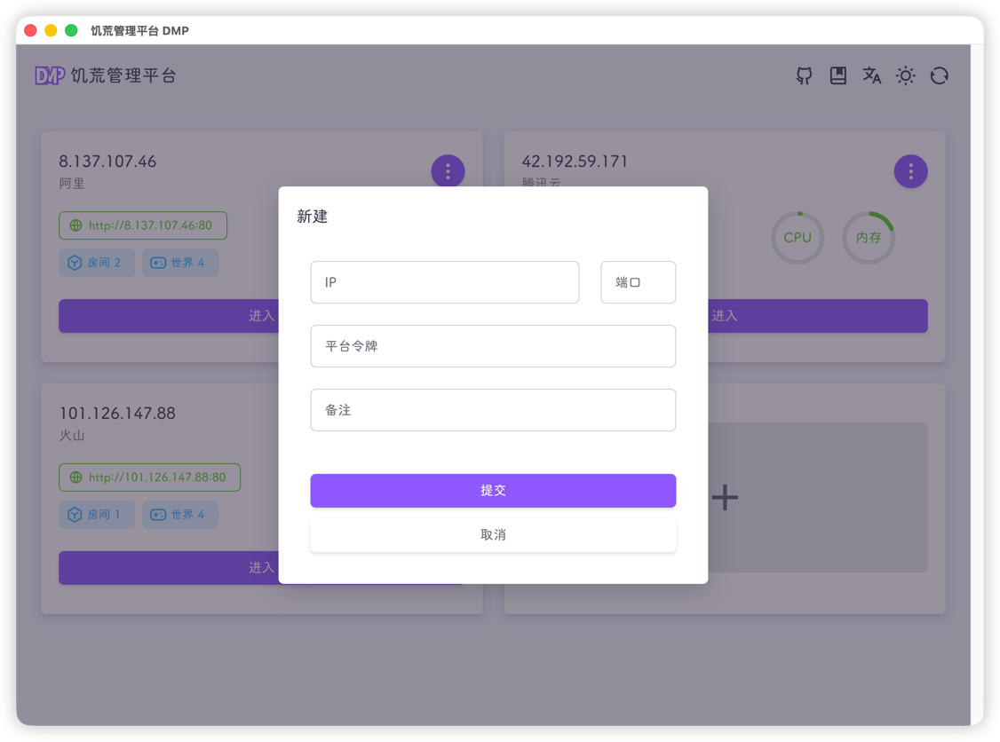

::: tip
使用饥荒管理平台App前，需要先部署饥荒管理平台
:::

#### 下载安装

前往[releases](https://github.com/miracleEverywhere/dst-management-platform-desktop/releases)页面下载安装包

::: tip
所有的安装包均为64位
:::

双击安装包按照提示安装即可

#### 获取饥荒管理平台令牌

登录饥荒管理平台，进入平台工具-平台令牌页面，创建一个令牌

#### 新建DMP

运行饥荒管理平台App

::: tip
如果你是第一次使用App，仅有一个新建按钮
:::

点击 + 新建

IP就输入饥荒管理平台的公网IP，端口也是，默认为80

平台令牌就粘贴上一步创建的令牌

备注可不填

#### 进入

点击进入按钮，即可管理对应的饥荒管理平台，页面与网页版一致

#### App部分功能介绍

#### 退出App

右键点击饥荒管理平台小图标，点击退出即可

::: tip
点击窗口的 `×` 仅为关闭窗口，不会退出
:::
