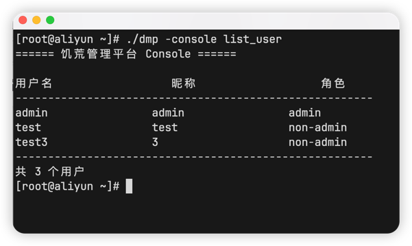

::: tip
因为饥荒管理平台**不存储**用户的**明文密码**，所以只能修改密码
:::

::: info
**v3.1.3** 引入的新功能，旧版本不支持，**v3.1.5** 加密方式升级为`bcrypt`
:::

1. 登入终端，执行以下命令进入重置密码环境

```shell
./dmp -console reset_password
```

2. 输入用户名和新密码

::: tip
输入的密码不会显示
就像你登录Linux时，输入密码也不会显示
::: 


::: tip
如果忘记了用户名，可使用`console`功能列出所有用户
:::

```shell
./dmp -console list_user
```


