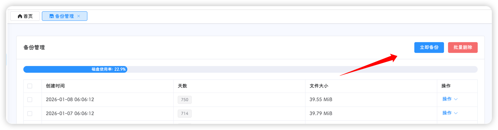
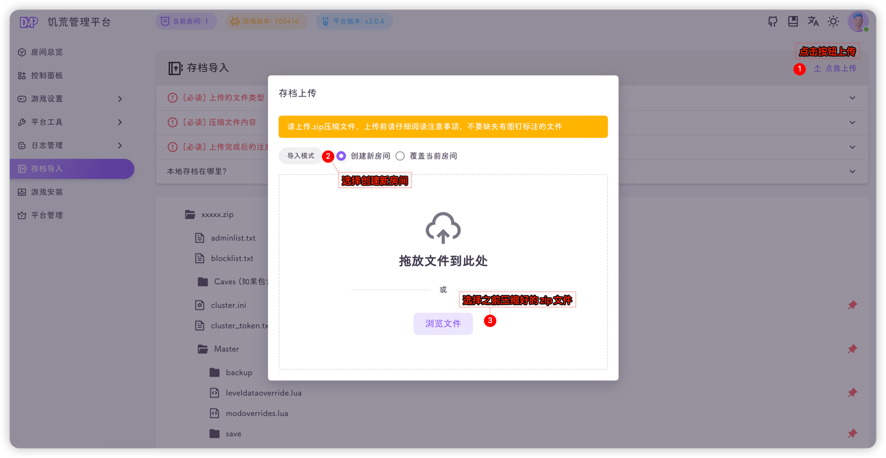

::: tip
目前v2版本已不再维护
:::

迁移方法：

#### 下载旧版本备份

点击立即备份按钮



下载备份文件


#### 将备份文件压缩为zip格式

解压下载好的备份文件


压缩为zip格式


#### 安装v3版本平台

::: tip
- 如果是云服务器，且内部数据不重要，建议直接重装系统(**数据无法恢复，谨慎操作**)

- 不重装系统的话，执行以下命令清理旧版本数据(**数据无法恢复，谨慎操作**)

```shell
# 关闭相关进程
pkill -9 -f dontstarve_dedicated_server_nullrenderer
pkill -9 dmp
# 删除旧平台文件
rm -rf dmp* DstMP.sdb run.sh
# 删除旧存档数据
rm -rf .klei dst/ugc_mods/*
```
:::

按照[部署安装](../../quick-start/install.md)页面安装新版本饥荒管理平台

#### 导入存档

平台和游戏安装完成后，进入[存档导入](../../docs/import.md)页面



等待上传完成


上传完成


#### 模组预下载

前往房间总览选择你导入的存档

然后进入[房间设置-模组设置](../../docs/setting/mod.md)页面的添加模组标签页，点击**预下载**


点击开始下载，等待下载结束


#### 启动游戏

模组预下载完成后，进入[控制面板](../../docs/dashboard.md)页面后，点击**启动游戏**即可


