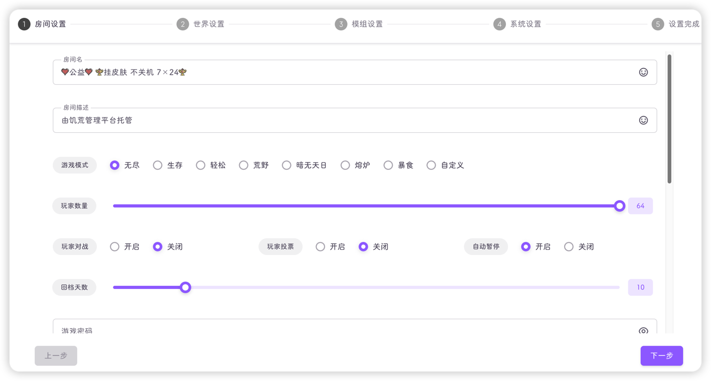
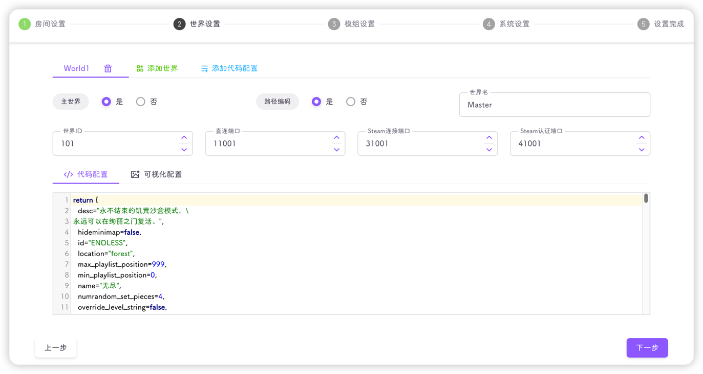
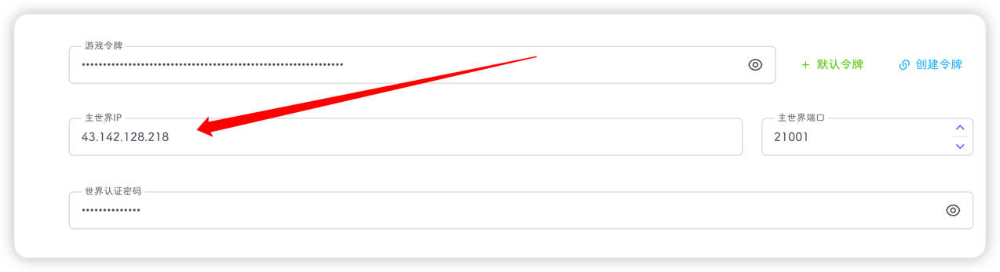
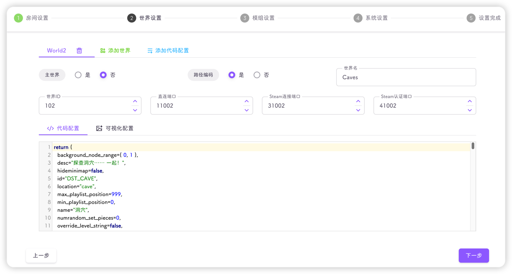
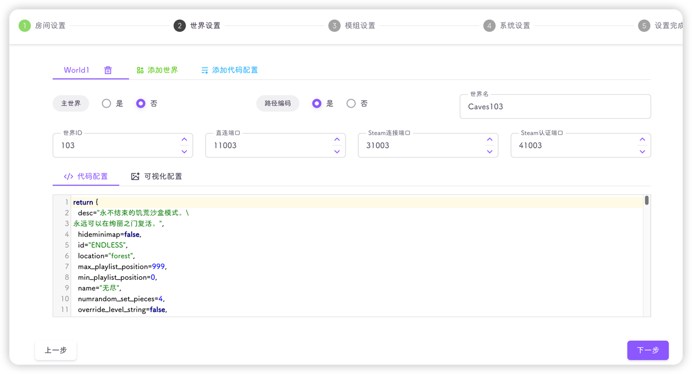

::: info
- 本教程使用3台云服务器，并开启三层世界
- 本教程适合爱折腾、追求性价比的玩家
:::

::: important
**所有服务器都要先安装饥荒管理平台**

需要提前说明：
- **3台云服的房间名、描述、令牌要一致**
- **剩余的配置会在下方教程中提及**
:::

#### 服务器信息

| 服务器名 | 公网IP           | 主节点 |
|------|----------------|-----|
| 腾讯云A | 43.142.128.218 | 是   |
| 腾讯云B | 43.142.134.48  | 否   |
| 腾讯云C | 49.233.145.57  | 否   |

#### 配置主节点-腾讯云A

首先登录`腾讯云A(43.142.128.218)`

新建房间，配置好房间名、令牌等



`主世界IP`、`端口`保持不变，记录随机生成的`世界认证密码`，我们记录一下

| 服务器名 | 公网IP           | 主节点 | 主世界IP     | 主世界端口 | 世界认证密码         |
|------|----------------|-----|-----------|-------|----------------|
| 腾讯云A | 43.142.128.218 | 是   | 127.0.0.1 | 21001 | wkpitceheefiye |

接下来配置世界，只添加一个世界，我们记录`世界名`、`世界ID`、`直连端口`等信息

| 服务器名 | 公网IP           | 主节点 | 主世界IP     | 主世界端口 | 世界认证密码         | 世界名    | 世界ID | 直连端口  | Steam连接端口 | Steam认证端口 |
|------|----------------|-----|-----------|-------|----------------|--------|------|-------|-----------|-----------|
| 腾讯云A | 43.142.128.218 | 是   | 127.0.0.1 | 21001 | wkpitceheefiye | Master | 101  | 11001 | 31001     | 41001     |



接下来我们需要对剩余的两台服务器进行规划

| 服务器名 | 公网IP           | 主节点 | 主世界IP          | 主世界端口 | 世界认证密码         | 世界名      | 世界ID | 直连端口  | Steam连接端口 | Steam认证端口 | 世界类型 |
|------|----------------|-----|----------------|-------|----------------|----------|------|-------|-----------|-----------|------|
| 腾讯云A | 43.142.128.218 | 是   | 127.0.0.1      | 21001 | wkpitceheefiye | Master   | 101  | 11001 | 31001     | 41001     | 地面   |
| 腾讯云B | 43.142.134.48  | 否   | 43.142.128.218 | 21001 | wkpitceheefiye | Caves    | 102  | 11002 | 31002     | 41002     | 洞穴   |
| 腾讯云C | 49.233.145.57  | 否   | 43.142.128.218 | 21001 | wkpitceheefiye | Caves103 | 103  | 11003 | 31003     | 41003     | 地面   |

::: important
- **只能有一个主节点**
- **非主节点的主世界IP均要设置为主节点的IP**
- **主世界端口必须一致**
- **世界认证密码必须一致**
- **世界名不能重复**(饥荒联机版代码有问题，世界名建议跟着我设置，如果有第四个世界，就命名为Caves104)
- **世界设置中的端口均不要重复**
:::

我们继续配置腾讯云A，在模组设置中，我们需要添加多层世界模组

::: tip
如果你只有两个世界，则不需要配置该模组

如果你有≥3个世界，则所有世界的模组配置需一致
:::

```lua
return {
  ["workshop-1754389029"]={
    configuration_options={
      always_show_ui=true,
      auto_balancing=true,
      default_galleryful=32,
      force_population=32,
      gift_toasts_offset=100,
      migration_postern=false,
      migrator_required=false,
      name_button=true,
      no_bat=true,
      open_button=true,
      say_dest=true,
      whirlportal_compatible=true,
      whirlportal_no_suction=false,
      world_config={
				["101"]={galleryful=32, name="世界1"},
				["102"]={galleryful=32, name="世界2"},
				["103"]={galleryful=32, name="世界3"}
			},
      world_prompt=true
    },
    enabled=true
  }
}
```

其中`world_config`配置需要手动改，格式为`["世界ID"]={name="世界名"}`，我这边配置了3个世界，每个世界最多32人，强制分流，展示世界切换按钮等

不懂的可以自己研究下`modinfo.lua`

以下是模组作者给的栗子：

```lua
{
    ["1"] = {
        name = "大观楼"
        -- invisible = true --设置此属性则该世界不在UI中现实
    },
    ["2"] = {
        name = "怡红院",
        category = "建设"
    },
    ["3"] = {
        name = "蘅芜苑",
        category = "建设"
    },
    ["4"] = {
        name = "潇湘馆",
        note = "宝鼎茶闲烟尚绿，幽窗棋罢指犹凉",
        category = "建设"
    },
    ["5"] = {
        name = "沁芳亭",
        category = "其他",
        is_cave = true,
        galleryful = 12, --人数上限
        extra = true --不作为分流目的地
    },
    ["51"] = {
        name = "栊翠庵",
        category = "其他",
        is_cave = true,
        galleryful = 12, --人数上限
        extra = true --不作为分流目的地
    }
}
```

然后就是一路下一步，保存，启动游戏

#### 配置从节点-腾讯云B

登录`腾讯云B(43.142.134.48)`

创建一个房间，房间的基础配置与`主节点-腾讯云A`一致


主世界IP设置为`腾讯云A`的IP



设置`从节点-腾讯云B`的洞穴世界

::: important
注意要按照我们之前规划的表格进行设置
:::



模组配置复制`主节点-腾讯云A`的模组配置即可，也就是说三台云服的模组配置均一致

然后就是一路下一步，保存，启动游戏

#### 配置从节点-腾讯云C

登录`腾讯云C(49.233.145.57)`

C节点的配置与B大同小异，只是我们需要添加一个地面世界



然后就是配置模组，一路下一步，保存，启动游戏

至此，我们的多服务器开多层世界就完成了

!!再也不想写教程了，2026年10月09日!!
