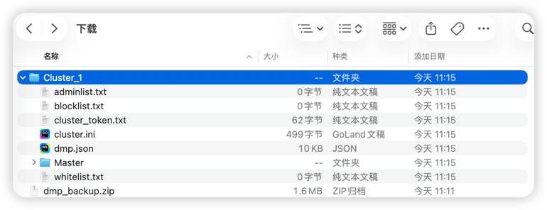

::: info
饥荒管理平台也提供存档迁移功能，你可以将存档任意的迁移到另一台DMP或本地
:::

## 迁移到DMP

1. 首先进入平台工具-备份管理页面，点击立即备份

2. 点击最新备份的操作按钮，选择下载，等待下载完成

3. 打开新DMP，进入[存档导入](../../docs/import.md)页面，导入下载的文件即可

::: tip
导入完成后记得到模组页面预下载模组
:::

## 迁移到本地

执行上面的步骤1与步骤2，并将下载的文件解压

将解压的文件夹移动到指定的目录

- Windows: `文档/Klei/DoNotStarveTogether`
- MacOS: `文稿/Klei/DoNotStarveTogether`
- Linux: `$HOME/.klei/DoNotStarveTogether`

即可在游戏中找到该存档
