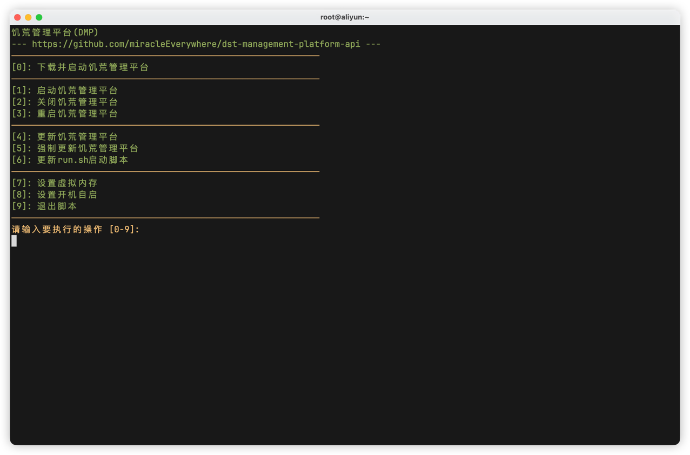

::: important
如果你的内存够用，请不要开启虚拟内存

虚拟内存(SWAP)会产生以下问题
- **性能差异巨大**：传统硬盘（HDD）的访问速度比RAM慢1000倍以上，即使是SSD也比RAM慢10-100倍
- **随机访问性能差**：当系统频繁交换时，磁盘寻道时间成为主要瓶颈
- **增加I/O负载**：大量交换会导致磁盘I/O竞争，影响整个系统性能
- **内存压力时的卡顿**：当物理内存不足，系统开始频繁交换时，会出现明显卡顿
- **不可预测的延迟峰值**：突然的内存需求可能导致长时间磁盘I/O等待
:::

虚拟内存开启方法：

1. 进入终端

2. 运行`run.sh`脚本

```shell
./run.sh
```



3. 输入`7`，点击回车键即可

::: tip
虚拟内存设置完成后即时生效，无需重启等操作
:::

